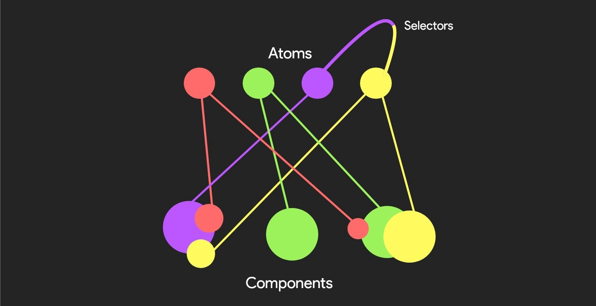

import Snack from '../../../src/components/shared/Snack';
import YoutubeVideo from '../../../src/components/shared/YoutubeVideo';

The complexity of your app grew consistently. To keep things organized, you split your code into small, reusable components. Now you have hundreds of them. It becomes more challenging to manage the state of your app. Multiple components, from all over the place, depend on the same data. You start extracting these shared data to the closest common parent, and from there you drill the data from one component to another, until it reaches the component that depends on that data. It quickly gets unmanageable, and you realize that...

## You need global state management!

From your research on the topic "The best global state management library", you conclude that you need to integrate [Redux](https://redux.js.org/). The only thing you remember about Redux is the time you took a course on React or React Native, and there was a module about Redux. At the time it felt pretty clear, but after a week, you knew as much about Redux as I do about Regex.

I cannot deny the popularity, the scale, and the maturity of Redux, but man it is overcomplicated. Actions, Action Creators, Reducers, Selectors, Saga, Thunk 🤯

An easier alternative is the Context API. It is easy to learn, it comes out of the box and it gets its job done. It is a great and easy solution that works well for small projects.

On the other hand, Context API was developed for things that do not change often (ex: theme, options, preferences). It is not very optimal when it comes to data that changes very often.

Then what is the alternative?

# Recoil.js

> Recoil works and thinks like React!

[Recoil.js](https://recoiljs.org/) is an experimental library developed by the Facebook team with simplicity and compatibility in mind. It was developed specifically for React, and that makes it super easy to get started and integrate it into your React or React Native project. It feels native because they kept the API, semantics, and behavior as Reactish as possible.

In recoil, there are 2 main building blocks: atoms and selectors.

**Atoms** are the shared state; individual units of the state.

**Selectors** are pure functions, that consume atoms (or other selectors), process the data, and return it. They are used to create derivative data.

Data flows from _atoms_ through _selectors_ down into React component.



## Atoms

As previously mentioned, **Atoms** are units of the state. They're updatable and subscribable: when an atom is updated, each subscribed component is re-rendered with the new value.

Atoms are created using the atom function:

```jsx
const fontSizeState = atom({
  key: 'fontSizeState',
  default: 14,
});
```

To read and write an atom from a component, we use a hook called `useRecoilState()`. It's just like React's `useState()`, but now the state can be shared between components:

```jsx
const [fontSize, setFontSize] = useRecoilState(fontSizeState);
```

## Selectors

A **selector** is a pure function that accepts atoms or other selectors as input. When these upstream atoms or selectors are updated, the selector function will be re-evaluated. Components can subscribe to selectors just like atoms, and will then be re-rendered when the selectors change.

Selectors are used to calculate derived data that is based on state.

From the point of view of components, selectors and atoms have the same interface and can therefore be substituted for one another.

Selectors are defined using the selector function:

```jsx
const fontSizeLabelState = selector({
  key: 'fontSizeLabelState',
  get: ({ get }) => {
    const fontSize = get(fontSizeState);
    const unit = 'px';

    return `${fontSize}${unit}`;
  },
});
```

Selectors can be read using `useRecoilValue()`, which takes an atom or selector as an argument and returns the corresponding value.

```jsx
const fontSizeLabel = useRecoilValue(fontSizeLabelState);
```

# Time to practice

Theory aside, let's have a look at how we can integrate Recoil into a real project.

We are going to build a [Fantasy sport](https://en.wikipedia.org/wiki/Fantasy_sport) app, similar to the [UEFA Games](https://gaming.uefa.com/en/uefaeuro2020fantasyfootball/create-team). Users will be able to create their dream team, by selecting the players from a list.

The user stories of the app are: "As a user, I want to...

- see all available players
- filter the players based on the position they play
- be able to add/remove players to my team
- see my team on the field
- see the number of players, and the available budget to buy players

This is a perfect use case to implement Recoil, as there is a lot of shared state between components.

If you prefer video format, this project was developed from scratch, step-by-step, Live on my channel.

<YoutubeVideo id="u_C3GBilvv8" />

## Starting point

I have prepared the UI for our app, so we can focus only on Recoil. I suggest you open the bellow snack on [snack.expo.io](https://snack.expo.io/@vadinsavin/uefa-ui), to be able to browse all the components that it is made of.

The important components that we are going to work with are:

- **components/Field** displays the field with all MY Players on their positions
- **components/PlayerListItem** renders the information about one player, in the list of all players
- **components/Filters** renders player position filters
- **components/TeamStats** the statistics about the team that you can see on top of the screen (number of players, remaining budget)

<Snack snackId="@vadinsavin/uefa-ui" height={700} />

## Install and setup Recoil

To install recoil, simply run `yarn add recoil` or `npm install recoil`

If you are working on the above snack, you can add it directly in the `package.json` file as `"recoil": "^0.3.1"`

### RecoilRoot

Components that use recoil state need `RecoilRoot` to appear somewhere in the parent tree. A good place to put this is in your root component (`App.js`). I created and exported a separate `RecoilApp` component to be able to wrap my app with the `RecoilRoot`

```jsx
export default function RecoilApp() {
  return (
    <RecoilRoot>
      <App />
    </RecoilRoot>
  );
}
```

## Players data

The data about All players will be the shared state that we need to implement.

In a new file `atoms/Players.js`, let's create our players state using the **atom** function.

```js
import { atom } from 'recoil';

import players from '../assets/players';

export const allPlayersState = atom({
  key: 'allPlayersState',
  default: players,
});
```

To consume this data, we will use the `useRecoilValue()` function to retrieve the value of the state.

```jsx
// App.js
import { useRecoilValue, RecoilRoot } from 'recoil';
import { allPlayersState } from './atoms/Players';

function App() {
  const players = useRecoilValue(allPlayersState);

  return (
    ...
  )
}
```

## Filters

The filters will be implemented similarly, but here we will also have to change the state value when we select a filter.

As we will be able to select multiple positions, we will implement the position filter as an array of values, that will hold the selected positions.

```js
// atoms/Players.js

export const positionFilterState = atom({
  key: 'positionFilterState',
  default: [],
});
```

Now, let's consume this state in the `component/Filter.js` using the `useRecoilState`. This is very similar to the normal `useState` from React.

If the position is selected (is included in the filter array), we will display it with a different color in the UI.

When clicking on a position filter, we will check if we have to add it to the array or remove it.

```js
// components/Filter.js

import { useRecoilState } from "recoil";
import { positionFilterState } from "../atoms/Players";

const Filters = () => {
  const [positionFilter, setPositionFilter] =
    useRecoilState(positionFilterState);

  const onFilterPress = (position) => {
    setPositionFilter((curPositionFilter) => {
      if (curPositionFilter.includes(position)) {
        return curPositionFilter.filter((pos) => pos !== position);
      } else {
        return [...curPositionFilter, position];
      }
    });
  }

  const isSelected = (position) => {
    return positionFilter.includes(position);
  }

  return (
    ...
  )
```

## Filtering the players

In order to display the filtered players in the list, based on the selected filters, we will use a recoil **selector**. The filtered players is a derived data, that will depend on the 2 atoms: `allPlayersState` and `positionFilterState`.

```js
// atoms/Players.js
import { atom, selector } from 'recoil';

export const filteredPlayers = selector({
  key: 'filteredPlayers',
  get: ({ get }) => {
    const players = get(allPlayersState);
    const filters = get(positionFilterState);
    return players.filter(
      (player) => filters.length === 0 || filters.includes(player.position),
    );
  },
});
```

Now, we can replace the `allPlayersState` atom with the `filteredPlayers` selector in the App.js to display the filtered players in the list.

```jsx
// App.js
import { allPlayersState, filteredPlayers } from './atoms/Players';

function App() {
  const players = useRecoilValue(filteredPlayers);
  ...
}
```

## My team

To be able to pick players and add them to the team, we will create a new atom `MyPlayersState`. This is going to be an array of players.

We will also need a state for the formation, to limit the number of players we can pick on the same position.

The last thing that we need here, is a helper selector, that will consume the `MyPlayersState` atom, which is an array, and will return the players grouped by their position. This will help us display them on the field.

```js
// atoms/MyTeam.js

import { atom, selector } from 'recoil';

export const myFormationState = atom({
  key: 'myFormation',
  default: {
    FWD: 3,
    MID: 3,
    DEF: 4,
    GCK: 1,
  },
});

export const myPlayersState = atom({
  key: 'MyPlayersState',
  default: [],
});

const positions = ['FWD', 'MID', 'DEF', 'GCK'];

export const myPlayersByPosition = selector({
  key: 'myPlayersByPosition',
  get: ({ get }) => {
    const players = get(myPlayersState);
    const formation = get(myFormationState);

    const groupedPlayers = {};

    positions.forEach((position) => {
      groupedPlayers[position] = players.filter((p) => p.position === position);
      // fill with null values, up to the amount of expected players from formation
      for (
        let i = groupedPlayers[position].length;
        i < formation[position];
        i++
      ) {
        groupedPlayers[position].push(null);
      }
    });

    return groupedPlayers;
  },
});
```

### Add/Remove Players to my team

To add and remove the selected players in my team, we will update the `PlayerListItem` component that renders one player in the list of ALL players.

We will consume the recoil state that holds all selected players: `const [myPlayers, setMyPlayers] = useRecoilState(myPlayersState);`

Let's implement an `onPress` function, that will modify the state accordingly. If the clicked player is already in my team, then we will want to remove it from the state. Otherwise, we want to add it to the team, but before adding it, we should also make sure there is an empty spot for the player in the team. For example, if we press on a Defender, and our formation is 3-3-4, meaning that we can have a maximum of 4 defenders, we will be able to add the player only if there are fewer than 4 defenders already selected.

Don't forget to replace the root `View` of the component with a `Pressable` and attach the `onPress` event. Also, by adding this conditional style `{ backgroundColor: isSelected ? '#d170db' : 'white' },` to the `Pressable`, the row will become purple if the player is selected.

```jsx
// components/PlayerListItem.js
import { useRecoilState, useRecoilValue } from 'recoil';
import { myFormationState, myPlayersState } from '../atoms/MyTeam';

const PlayerListItem = ({ player }) => {
  const [myPlayers, setMyPlayers] = useRecoilState(myPlayersState);
  const myFormation = useRecoilValue(myFormationState);

  const numberOfPlayersOnPos = myPlayers.filter(
    (p) => p.position === player.position,
  ).length;

  const onPress = () => {
    setMyPlayers((curPlayers) => {
      if (curPlayers.some((p) => p.id === player.id)) {
        return curPlayers.filter((p) => p.id !== player.id);
      }
      // CHECK if it's possible to add
      if (numberOfPlayersOnPos < myFormation[player.position]) {
        return [...curPlayers, player];
      }
      return curPlayers;
    });
  };

  const isSelected = myPlayers.some((p) => p.id === player.id);

  return (
    <Pressable
      onPress={onPress}
      style={[
        styles.container,
        { backgroundColor: isSelected ? '#d170db' : 'white' },
      ]}
    >
      ...
    </Pressable>
  );
};
```

With this implemented, you should be able to open the list with all players, press on them and see the rows become purple, which means that the player has been successfully added to the team. Also, you should not be able to select more players, than specified in your formation.

### Display my players on the field

Let's combine the above feature of selecting players in my team, with displaying the selected players on the field. We will edit the `components/Field.js` file and will replace the local `players` dummy object with the value of `myPlayersByPosition` selector.

```jsx
// components/Field.js
import { useRecoilValue } from "recoil";
import { myPlayersByPosition } from "../atoms/MyTeam";

const Field = () => {
  const players = useRecoilValue(myPlayersByPosition);

  return (
    ...
  );
};
```

In order to display the player name on the field, we will add the next conditional render in the `FieldPlayer.js`, line 22.

```jsx
{
  player ? player.name : position;
}
```

With these changes, we should see the selected players added on the field, with a purple shirt and their name.

### Team stats

The last step is to calculate and render some statistics about the team. We will focus on 2 values: number of players, the total value of the players;

We will calculate these 2 values using 2 **selectors** that we will add to `atoms/MyTeam.js`

```jsx
// atoms/MyTeam.js

export const numberOfPlayers = selector({
  key: 'numberOfPlayers',
  get: ({ get }) => {
    return get(myPlayersState).length;
  },
});

export const valueOfPlayers = selector({
  key: 'valueOfPlayers',
  get: ({ get }) => {
    return get(myPlayersState).reduce((acc, player) => acc + player.price, 0);
  },
});
```

With that implemented, we can consume these values in `components/TeamStats` component. We will display the number of players in the team, and the remaining budget ($100m - total value of the players);

```jsx
// components/TeamStats.js
import { useRecoilValue } from "recoil";
import { numberOfPlayers, valueOfPlayers } from "../atoms/MyTeam";

const TeamStats = () => {
  const nofPlayers = useRecoilValue(numberOfPlayers);
  const value = useRecoilValue(valueOfPlayers);

  return (
    ...
    <Text style={styles.value}>{nofPlayers} / 15</Text>
    ...
    ...
    <Text style={styles.value}>
      ${((100_000_000 - value) / 1_000_000).toFixed(1)}m
    </Text>
    ...
  );
};
```

# Demo

Here is the result of everything we implemented. You can open [the snack here](https://snack.expo.io/@vadinsavin/uefa-recoil) to be able to browse and see all the final components.

<Snack snackId="@vadinsavin/uefa-recoil" height={700} />

# Conclusion

This is everything you have to know in order to get started with Recoil. The next recommended step is to get into [Asynchronous Data Queries](https://recoiljs.org/docs/guides/asynchronous-data-queries) with recoil. If you are interested in a post about it, shoot me an [email](mailto:vadim@notjust.dev).

The full source code of the above app can be found on my [github](https://github.com/Savinvadim1312/UEFA2020).

Check the video version of this post on my [youtube channel](https://www.youtube.com/watch?v=u_C3GBilvv8&t=306s).

And lastly, stay hydrated and write clean clone!
