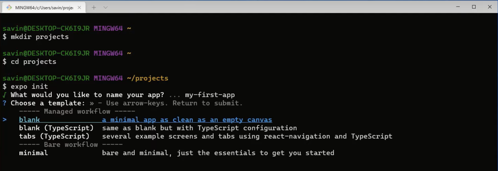
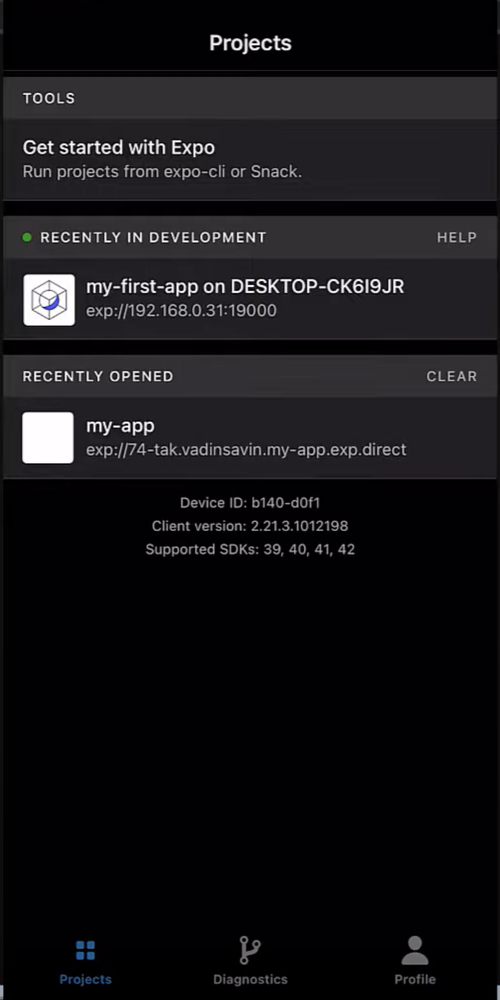

import YoutubeVideo from '../../../src/components/shared/YoutubeVideo';

In general, there are two ways to get started with React Native - using **Expo CLI** or **React Native CLI**. Both ways have their own strengths and weaknesses but even React Native's official documentation is suggesting to get started with Expo CLI if you are new to mobile development. Therefore, in this guide we will go through all the steps needed to setup Expo development environment for your first React Native project using Windows.

<YoutubeVideo id="f6TXEnHT_Mk" />
If you chose to follow the guide, then let's roll!

## Installing Windows Terminal

First and foremost we need to install Windows Terminal (later: terminal) if you don't have one as it is going to be used quite often. To do this you can use Microsoft Store by searching "Windows Terminal" and installing it.

After installing and launching it, you can test if everything works by typing `ls` in the terminal, which should display the list of files and folders in that path.

## Installing Git

Git is going to be used for source control management, which will help us to track changes in the code and make development easier. Also, Git comes with Git Bash that we will make use of.

To download the latest version of Git you can go to their [website](http://git-scm.com/downloads) and select Windows OS. Once the download is complete, we can start the installation process.

On the first window we can read **GNU General Public License** and click **Next** button. But let's be honest, nobody reads that, so you can click **Next** right away.

 

In the next window you should select the path that you want Git to be installed in and click **Next**.

 

Now in this window I would suggest checking '_Add a Git Bash Profile to Windows Terminal'_ box and then clicking **Next**.

 

In the next two windows you can make changes if you want but I would suggest leaving everything like it is and clicking **Next**.

 

In this window select '_Override the default branch name for new repositories_' and type 'main' in the input box. We do that because this is the new naming convention and everybody is encouraged to follow it. After making changes click **Next**.

 

Next step is based solely on your preference, if you know what you are doing, then select whichever option you would like to, otherwise keep the default one and click **Next**.

 

For the next few windows leave everything on default unless you know what you are doing.

Once the installation is finished, let's make Git Bash our default choice.
To do that open terminal, click on the arrow icon in the top bar and select **Settings**.

In the settings screen click on **Default profile** dropdown, select **Git Bash** and save it.

After that, re-open the terminal and it should open Git Bash now.

Last but not least, let's test if Git is installed correctly. In the terminal write `git --version`, which should display the version of Git that is installed. If it did, then you have installed Git successfully.

## Installing NodeJS

NodeJS is an open-source Javascript runtime environment that will help us run React Native applications. It also comes with npm which is a package manager that helps to install various packages in our applications.

To download NodeJS go to their [website](https://nodejs.org/en/) and select the LTS (long term support) version.

During the installation leave everything on default except for the window below. It is very important to tick this box in order to install necessary tools automatically, otherwise you will have to do that manually.

Once the installation is finished click **Finish**. That should automatically open terminal if you ticked the mentioned box above. In that terminal press any key to start the installation. Keep in mind that terminal will close automatically after installing everything. This step will take some time, so you can take a well deserved break and refill your coffee cup ☕.

To test if node was installed correctly open the terminal and type `node --version`, which should display the version that was installed. To test if npm was installed correctly type `npm --version`, which accordingly will display the npm version.

## Installing Expo CLI

By this step we have already installed all of the dependencies that Expo needs. Now it's time to install Expo CLI itself!

To install Expo CLI, you simply have to open the terminal and type `npm install --global expo-cli`. That's it, it's that easy! On a side note, we need to add _--global_ in order to install Expo CLI globally.

Now we can create our first React Native project!

## Initialise Your First Project

In order to create a new Expo project, in the terminal we can simply type `expo init`. You will be asked a few questions in order to finalise the initialisation.

First of all, you will need to provide the name of your application. As it is our first application, let's name it 'my-first-app'.

After that, you will have to choose a template that you would like to use for your application. In this step you can choose whatever you like, but for demonstration purposes we chose **blank** template.

After answering these two simple questions Expo will install all dependencies and prepare your project.

To run the application you will have to type `cd my-first-app` in the terminal, which will go to your project's folder and then type `npm start` to start the development server.

You might be asked to allow access to NodeJS, allow it.

 

After allowing access, Expo will automatically open new browser window called **Expo Developer Tools** like in the image below. If it does, that means everything is installed correctly.

## Running The Application

Now it's time to run the application on your device. But in order to do that, we still need a little bit of setting up.

First things first, if you don't have an Expo account yet, we should create one on their [website](https://expo.dev/signup).

After creating an Expo account, you should be able to login by typing `expo login` in the terminal and providing your username or email as well as password. If provided credentials were correct, you should see a success message.

You can also test if you have logged in successfully by typing `expo whoami`, which will display your username.

### Setting Up Expo Go Mobile Client

Okay, now it will get a little bit more exciting. Grab your phone and install **Expo Go** application from the [App Store](https://apps.apple.com/us/app/expo-go/id982107779) or [Google Play Store](https://play.google.com/store/apps/details?id=host.exp.exponent).

After installing the application, launch it, login with the account you have just created and launch the application that's located under **RECENTLY IN DEVELOPMENT** tab.

 

Side note, if you don't see your application under **RECENTLY IN DEVELOPMENT** tab, just restart your server by pressing CTRL + C in the terminal that's running your development server and type `npm start` again.

Now you should see in your **Expo Developer Tools** browser tab that it's building the Javascript bundle. After that, **Expo Go** will automatically launch your application on the device!!

You can also run the application on your phone by scanning the QR code in the terminal or **Expo Developer Tools**. On android phones you can scan the QR code directly from the **Expo** application. On the iOS however, you have to do that from the Camera app. This is especially useful when you are trying to run someone else's application.

## Installing Visual Studio Code

There are plenty of IDE's to choose from and if you have one already, then you can skip this step and start writing your code there. But in our humble opinion, we think Visual Studio Code fits our needs the best.

If you decided to go with Visual Studio Code as well, then you can download it from their [website](https://code.visualstudio.com/).

During the installation, you can make changes if you know what you are doing, otherwise I suggest leaving everything on default except for the window below. In here, tick all of the boxes under **Other** tab.

 

Now we can open our application on Visual Studio Code by navigating to the folder where you have created your 'my-first-app' project, then clicking right mouse button anywhere on the white space and clicking **Open with Code**.

 

You might be asked to verify that you trust the authors of the files in this folder. Check the box '_Trust the authors of all files in the parent folder_' and click **Yes, I trust the authors** button.

 

Now you can select the theme of Visual Studio Code that you prefer and run the project. Visual Studio Code has a lot of very useful extensions for React Native developers that will make you code faster, cleaner, prevent bugs and in general make coding a lot more enjoyable. If you want to see what are those extensions and learn how to add them to your Visual Studio Code I recommend watching [TOP 10 VSCode Extensions for React/React Native Developers (2021)](https://www.youtube.com/watch?v=jCzJYyknKGg).

To run the project, just open the terminal in Visual Studio Code by clicking CTRL + \` (that little button in the top left of your keyboard below the 'esc' button, you are welcome 😉) and just type `npm start` which will start the project and open **Expo Developer Tools** window in the browser.

## Now you can start coding!!! 🥳

But in order to start learning React Native the right way, I highly encourage you to visit [notJust.dev Youtube Channel](https://www.youtube.com/channel/UCYSa_YLoJokZAwHhlwJntIA) where you will find plenty of free projects and tutorials to follow, which will most certainly increase your React Native knowledge and skill!

I would recommend you to start with the [Tesla Clone](https://www.youtube.com/watch?v=iQ_0Fd_N3Mk), which is a beginner friendly tutorial that will cover all the basics and get you up and running with your first React Native project.

I hope this guide was clear, comprehensive, and helped you to easily install as well as setup everything that you need in order to start working on your first React Native application.

Good luck on your software engineer journey!!
