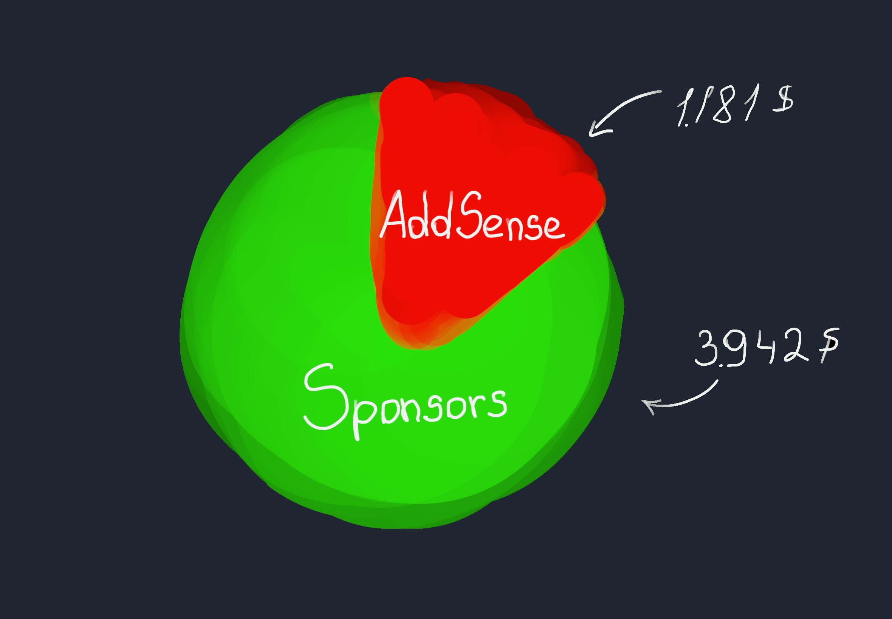

I’ve been following the trend of building in public. Building in public is the idea of openly sharing the process of growing and developing a project. It’s about sharing both ups and downs, wins and losses, on the way with the goal to either inspire others or learn from the mistakes.

What I find interesting is the idea of being fully transparent about the financial part. I get inspired by the success stories of people I look up to that are building in public. This includes Pieter Levels ([@levelsio](https://twitter.com/levelsio)), Josh W Comeau ([@JoshWComeau](https://twitter.com/joshwcomeau)), Florin Pop ([@Florinpop1706](https://twitter.com/florinpop1705)) to name a few.

Even though money has been a taboo topic in my environment and I feel a bit weird sharing this stuff, I decided to start openly sharing my monthly income statements. It is mostly to be able to look back at the beginnings of [notJust.dev](https://notJust.dev) and to see how it progresses over time. Moreover, if I can inspire at least one person to start doing something great, that would be a huge win for me.

## TL;DR

Revenue: **$5,124.61**

Expenses: **$2,342.23**

Profit: **$2,782.38**

### Income sources

AdSense: **$1181.90**

Sponsorships: **$3942.71**

## AdSense

> AdSense is the revenue that YouTube is paying me for displaying ads when people are watching my videos.

My AdSense revenue has been pretty stable for the last 9 months ($1000-$1500). For the size of my channel (35k subs), this is quite a good revenue. In my opinion, this relates to my long-format videos of 3-5 hours, which people on average watch for more than 50%.

AdSense revenue gives me the possibility to work full-time on [notJust.dev](https://notjust.dev) as it already covers my personal monthly expenses.

## Sponsorships

Sponsorships are a substantial revenue source for [notJust.dev](https://notjust.dev) at the moment. It gives me the possibility to grow the team and to create even more educational content for you guys.

I am very picky when choosing the brands that we work with and I am trying to work with brands that I would use myself and that I think will be useful to you in your full-stack development journey.

# The team is growing 🚀

2 months ago I was doing everything myself. From coding, live-streaming, video editing, thumbnail design, community management, social media, copyrighting, and marketing. Well, I still do a lot of these things, but I realise that if I want to take [notJust.dev](https://notjust.dev) to the next level, I need to bring people on board.

During the last 2 months, our team grew to 6 people.

Olanrewaju Olatunde is helping me with community management on discord (the one who is helping everyone there @momojomo) and with chat moderation during our weekly livestream.

Darshan and Yashi are helping with video editing for both YouTube channel and for the [notJust.dev Academy](https://academy.notJust.dev). Video editing was taking a lot of time for me, and moreover, I wasn’t particularly good at it neither did I enjoy doing it. It’s a win-win for everyone.

Sasha has joined the team as a YouTube manager, but she is doing much more than just YouTube management. She is helping me with idea generation, project management, planning and structuring our processes.

Lukas is helping me with the technical side of the project. He has been preparing the project-based tutorials that will come in future on the channel. Maybe we will see him in front of the camera as well, who knows 🤷‍♂️. Lukas is as well helping with the [notjust.dev](https://notjust.dev) website, both with content and development.

And of course, Alex, who is listening to all my crazy ideas and keeping me with my feet on the ground. She is the one that pushes me when I have unproductive days. Also, thanks for drawing the diagrams for this article instead of watching Game of Thrones.

# Plans for November 📅

In November my main focus will be working on the [Full-stack mobile developer course](https://academy.notJust.dev). I plan to finish shooting the UI module so that the editors can start working on it.

The weekly Live streams on my [YouTube channel](https://www.youtube.com/c/notjustdev) every Friday at 3PM GMT is already a rule, so I will try to keep them coming consistently. Also, we are working on something special on the channel: notJust Squid Game. It’s coming soon. Very hyped about it.

That's it for this time. Let me know what part of running and growing [notJust.dev](https://notjust.dev) are you most interested in so I could talk about it next month.

Take care 🤗 stay hydrated 🚰 and write clean code 👨‍💻
