import YoutubeVideo from '../../../src/components/shared/YoutubeVideo';

In general, there are two ways to get started with React Native - using **Expo CLI** or **React Native CLI**. Both ways have their own strengths and weaknesses, but if you are a beginner, I would highly suggest you to start with [Expo CLI](https://www.notjust.dev/blog/2021-11-04-expo-development-environment-setup-for-first-react-native-project-windows) because the setup is a lot easier and faster. Of course, if you are up for a bit bigger challenge, this guide is perfect for you, because we will cover all the steps needed to setup React Native CLI development environment for your first React Native project using Windows.

If you prefer, you can always follow the instructions in the video below instead:
<YoutubeVideo id="oorfevovPWw" />
If you chose to follow the guide, then let's roll!

## Installing Windows Terminal

First and foremost, we need to install Windows Terminal (later: terminal) if you don't have one as it is going to be used quite often. To do this you can use Microsoft Store by searching "Windows Terminal" and installing it.

After installing and launching it, you can test if everything works by typing `ls` in the terminal, which should display the list of files and folders in that path.

## Installing Git

Git is going to be used for source control management, which will help us to track changes in the code and make development easier. Also, Git comes with Git Bash that we will make use of.

To download the latest version of Git you can go to their [website](http://git-scm.com/downloads) and select Windows OS. Once the download is complete, we can start the installation process.

On the first window we can read **GNU General Public License** and click **Next** button. But let's be honest, nobody reads that, so you can click **Next** right away.
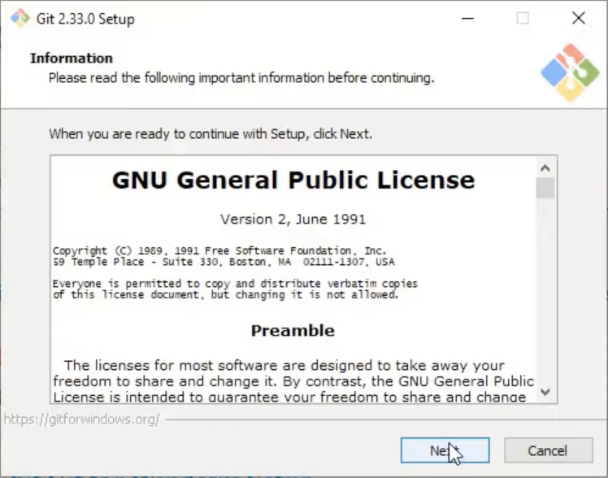
 

In the next window you should select the path that you want Git to be installed in and click **Next**.
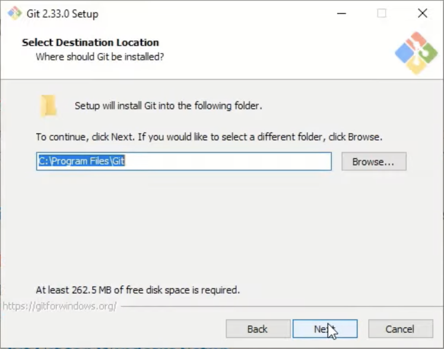
 

Now in this window I would suggest checking '_Add a Git Bash Profile to Windows Terminal'_ box and then clicking **Next**.
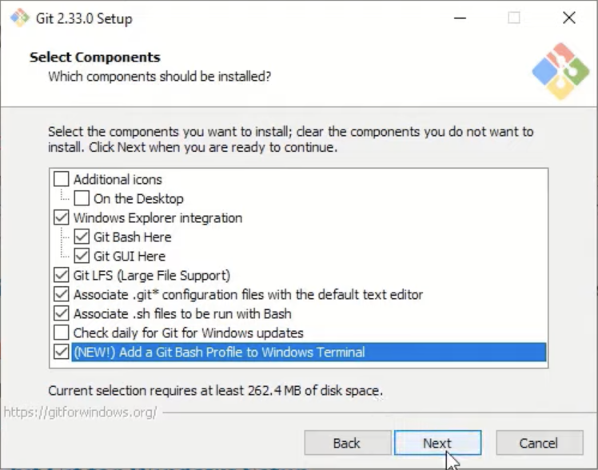
 

In the next two windows you can make changes if you want, but I would recommend leaving everything like it is and clicking **Next**.
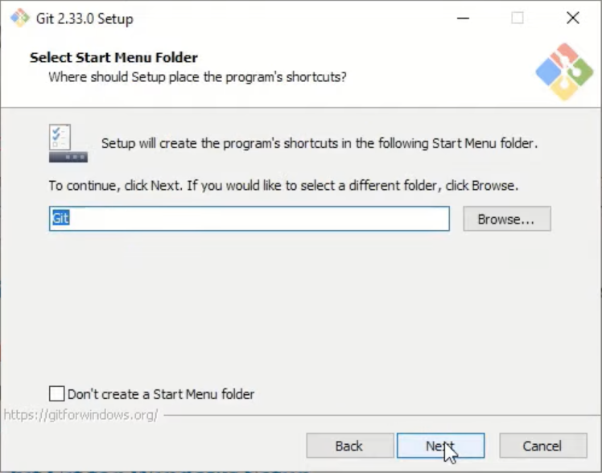

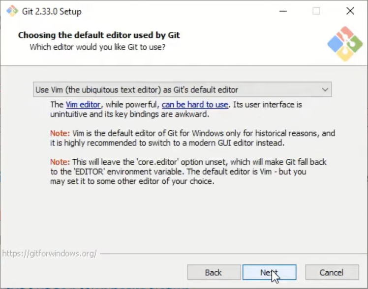
 

In this window select '_Override the default branch name for new repositories_' and type 'main' in the input box. We do that because this is the new naming convention and everybody is encouraged to follow it. After making changes click **Next**.

 

Next step is based solely on your preference, if you know what you are doing, then select whichever option you would like to, otherwise keep the default one and click **Next**.
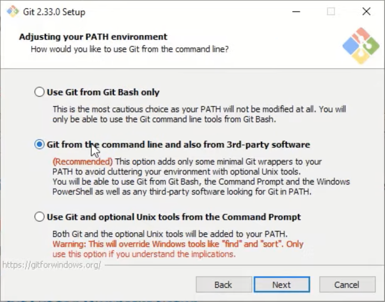
 

For the next few windows leave everything on default unless you know what you are doing.

Once the installation is finished, let's make Git Bash our default choice.
To do that open terminal, click on the arrow icon in the top bar and select **Settings**.

In the settings screen click on **Default profile** dropdown, select **Git Bash** and save it.
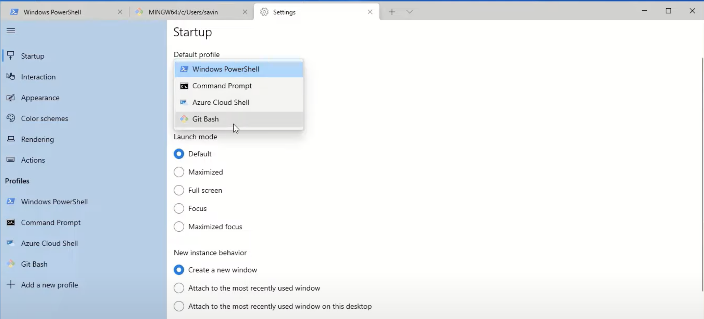

After that, re-open the terminal, and it should open Git Bash now.

Last but not least, let's test if Git is installed correctly. In the terminal write `git --version`, which should display the version of Git that is installed. If it did, then you have installed Git successfully.
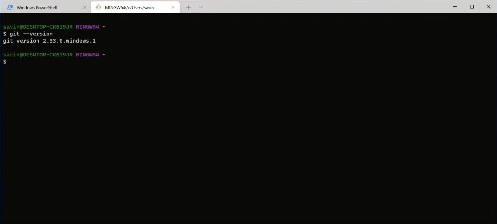

## Installing NodeJS

NodeJS is an open-source JavaScript runtime environment that will help us run React Native applications. It also comes with npm which is a package manager that helps to install various packages in our applications.

To download NodeJS go to their [website](https://nodejs.org/en/) and select the LTS (long term support) version.

During the installation leave everything on default except for the window below. It is very important to tick this box in order to install necessary tools automatically, otherwise you will have to do that manually.

Once the installation is finished click **Finish**. That should automatically open terminal if you ticked the mentioned box above. In that terminal press any key to start the installation. Keep in mind that terminal will close automatically after installing everything. This step will take some time, so you can take a well deserved break and refill your coffee cup ☕.

To test if node was installed correctly open the terminal and type `node --version`, which should display the version that was installed. To test if npm was installed correctly type `npm --version`, which accordingly will display the npm version.
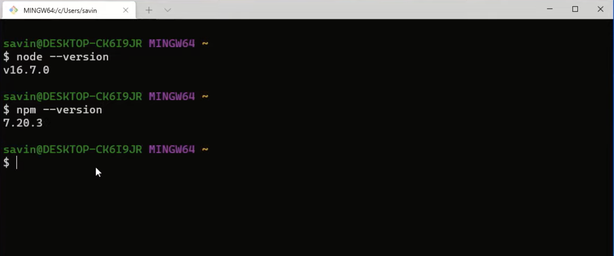

## Installing Java SE Development Kit (JDK)

React Native requires **Java SE Development Kit (JDK)**, which can be easily installed using **Chocolatey**. If you followed the NodeJS installation guide above, **Chocolatey** should've been installed automatically. To install **JDK** open terminal as an administrator and type `choco install -y openjdk8`.

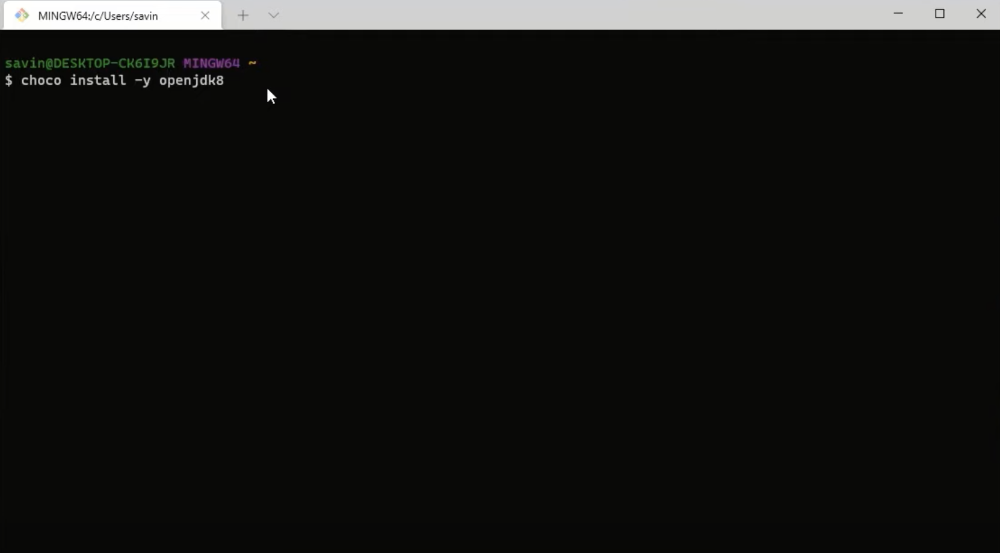

We are one step closer to the finish line, let's keep up the good work!

## Installing Android Studio

In order to download **Android Studio** we can go to their [website](https://developer.android.com/studio?gclid=Cj0KCQiAtJeNBhCVARIsANJUJ2G3CKuFt6fhUQOU5oaMTxxKiTGapHAhO6zAETMAIxAWcdxVIimIkTMaAsvVEALw_wcB&gclsrc=aw.ds) and click big green "Download Android Studio" button in the middle of the screen.

Once the download is finished, we can open the file and start the installation process.
On the first window you won't have to do much, you can read what it says and click **Next**.
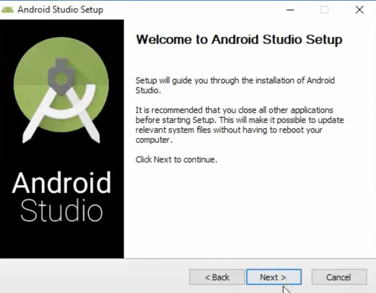

Second window on the other hand is very important. In **Select Components To Install** box you HAVE to select **Android SDK**, **Android SDK Platform** and **Android Virtual Device**.
Side note, you might see only a few of these options, so select as many as you are able to and click **Next**.

On the next few windows leave everything on default and after finishing the installation open **Android Studio**.

If a window pops up asking to import some settings select **Do not import settings** and click **OK** if you don't have any settings to import.

Most likely you will also see another pop-up asking to send usage statistics to google. Usually I accept it because that's what lets them improve, but you can choose whatever fits you better.

You might be asked to update some plugins as well, do that.
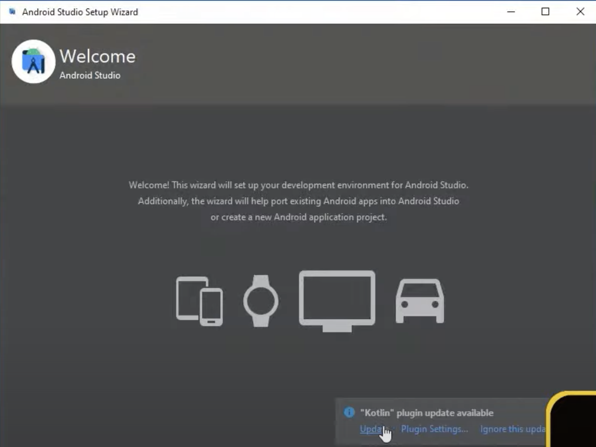
Once the updates are installed, you will see a pop-up asking to restart the Android Studio, click **Restart** and wait a little bit until Android Studio reopens.

### Setting Up Android Studio Environment

Now you should see a **Welcome** window with some text explaining what are the next steps going to be about. After reading that (or not), we can click **Next** and continue setting up our Android Studio Environment.
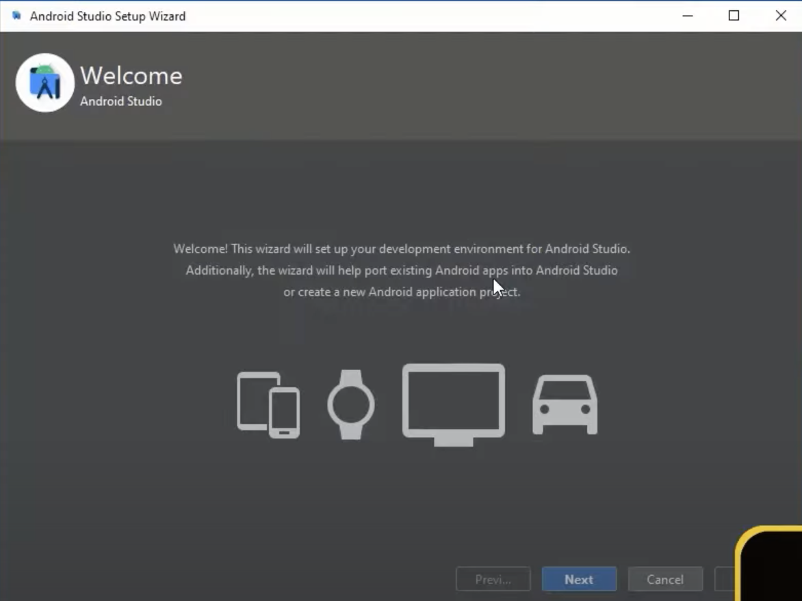

Here, in order to make sure that everything is installed correctly and everything fits our needs, let's select **Custom** setup type and click **Next**.

In this step, if you followed the guide and did everything like it said, then leave it on default. If you changed the installation paths and they do not match with what you see in the box, then change the path accordingly.
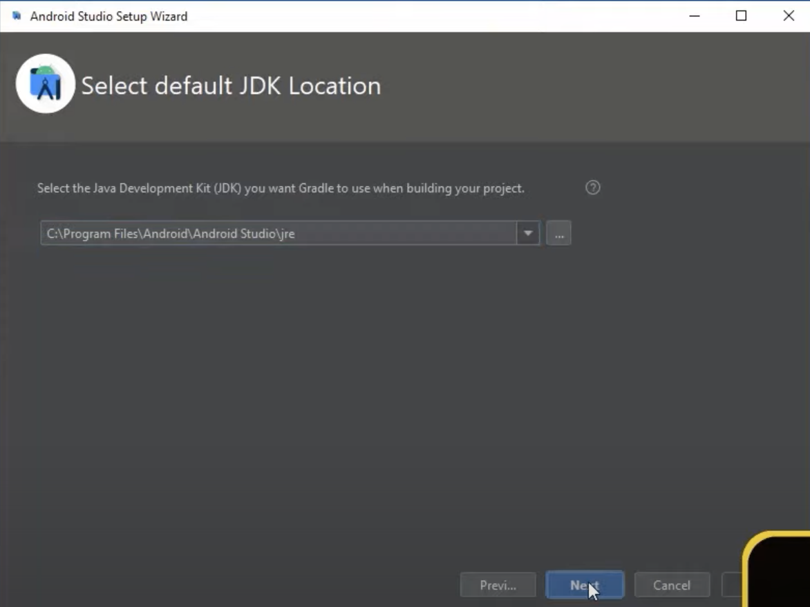

Now just choose whichever UI theme you prefer. _Not sure if it's just a myth or not, but people are talking that dark theme increases your programming skills :)_
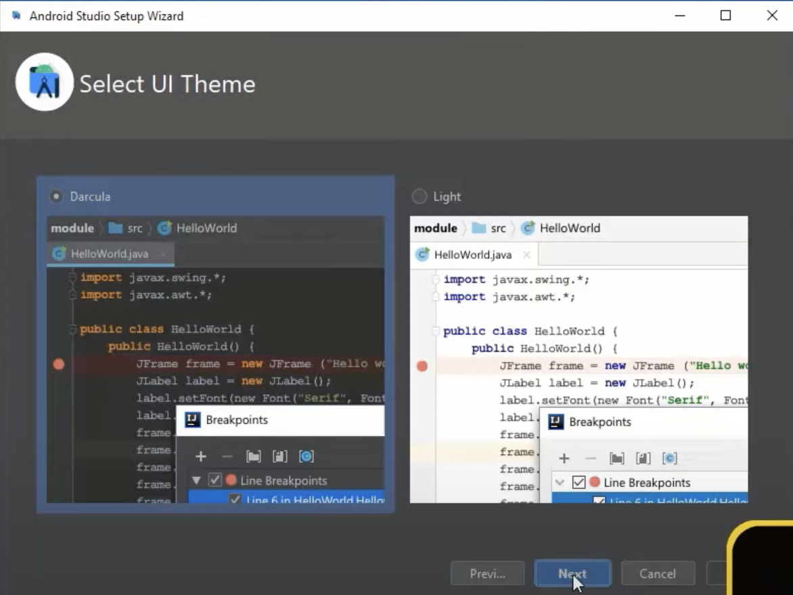

On this window make sure that **Android SDK**, one of **Android SDK Platforms** and **Performance** (this one is not mandatory) is selected or says _installed_ like **Android Virtual Device** in the example below and click **Next**.
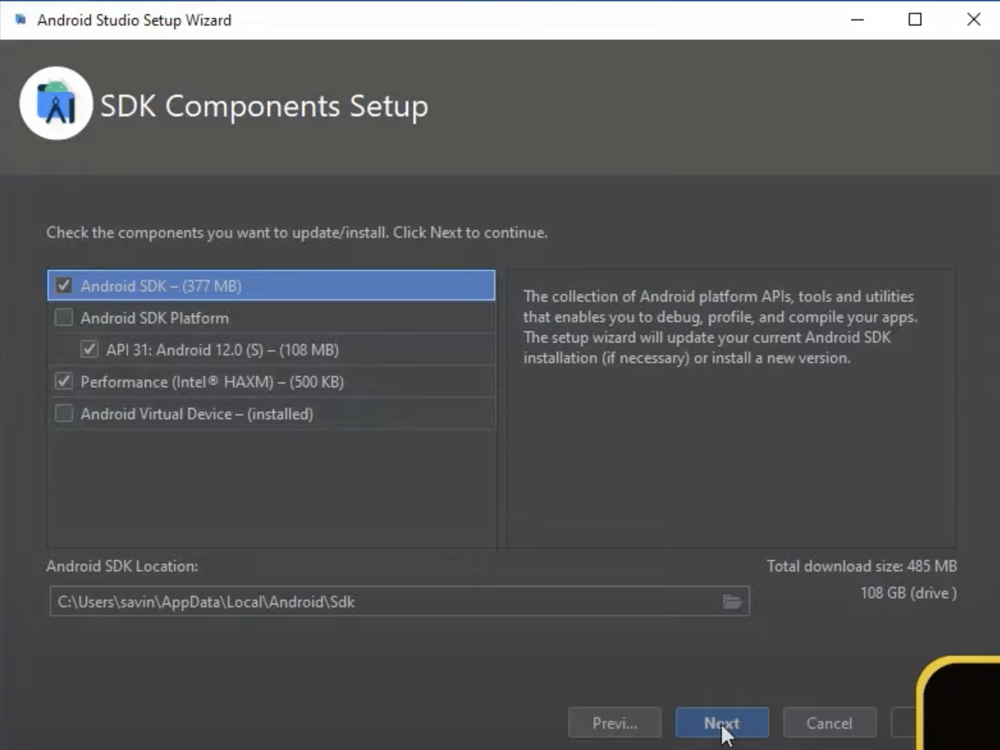

If your system can run the Android emulator in an accelerated performance mode, you will see one more window in which you will have to set the minimum amount of RAM available for the **Intel Hardware Accelerated Execution Manager (HAXM)** to use. I can't tell which option is best for you, so if you are not sure what you are doing here, I would suggest leaving it on **Recommended** option and clicking **Next**.

Now just finish the installation, and we are another step closer!

## Installing Android SDK

Android Studio installs the latest Android SDK by default. However, in order to build React Native applications we need **Android 10 (Q) SDK** in particular.

To do that, from the **Welcome to Android Studio** window let's click **More Actions** and select **SDK Manager**, which will open system settings.
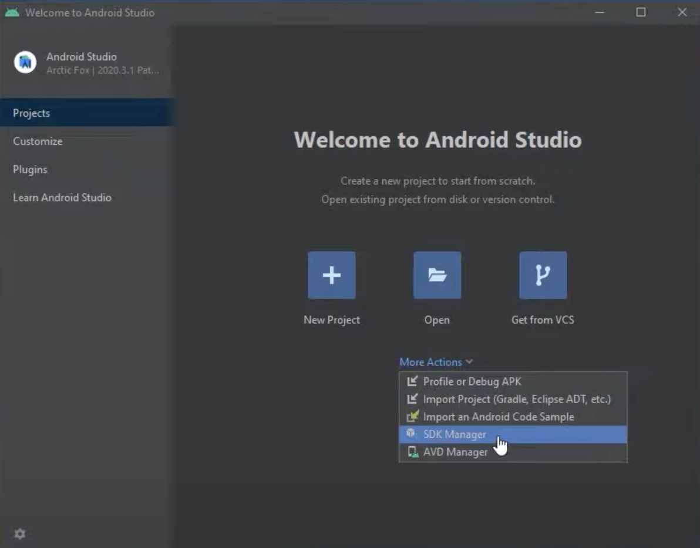

In this window, let's select **Android 10.0 (Q)** just like it is required in the official React Native documentation and click **Apply** to install it.

After clicking **Apply** you should get a pop-up asking to confirm the changes, click **OK** in order to confirm the installation of selected components.
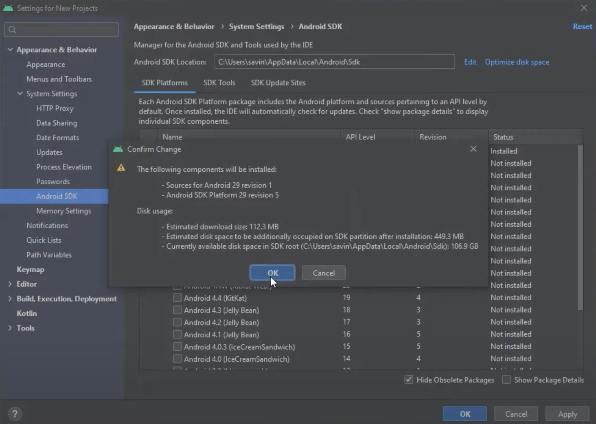

Now we need to accept terms and conditions to finally start the installation.

Once the installation is finished we can click **Finish**, which will automatically close the installation window.

We still have to install a few things before the next step. In the **Android SDK** section under **System Settings** tab that we opened previously make sure to tick the **Show Package Details** box in the bottom right corner.
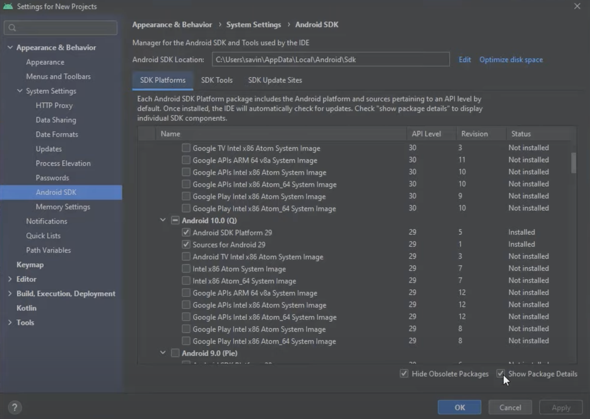

After ticking that box you should see more options. Make sure that **Android SDK Platform 29** and **Intel x86 Atom System Image** or **Google APIs Intel x86 Atom System Image** under **Android 10.0 (Q)** is installed. If it is not, then select them and click **Apply** to install.
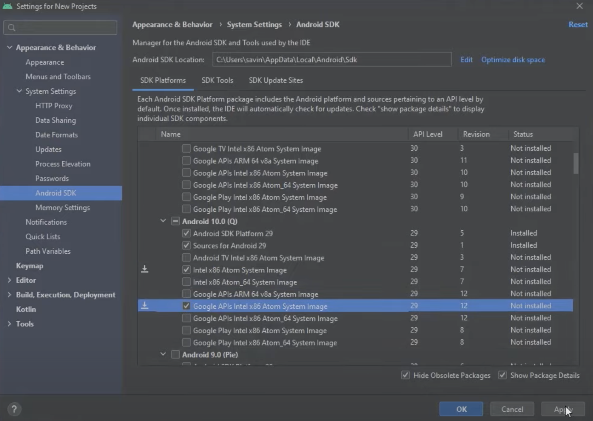

The same confirmation window from before should pop up in which you should click **OK** to continue. Also, you will have to accept the terms and conditions in the next window just like we did before and once the installation is finished, click **Finish** to close the window.

Now we have to install some **SDK Tools**. In order to do that, in the same system settings page click on **SDK Tools** tab.
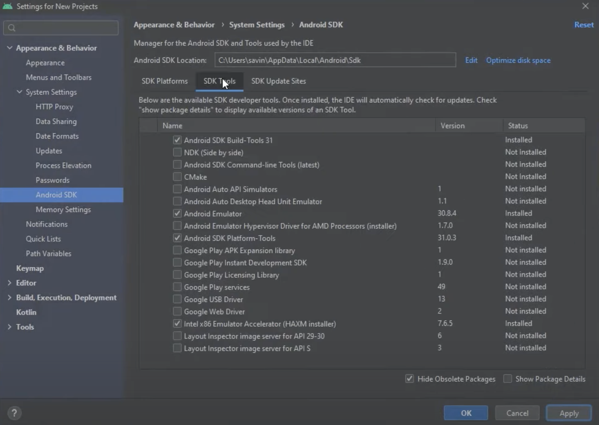

Here we have to tick **Show Package Details** box in the right bottom corner like we did before and expand **Android SDK Build Tools** in the list. In the expanded section select **29.0.2** and click **Apply** to install it.

You will be asked to confirm the installation again, click **OK** in order to start the installation and once it is done click **Finish** to close the window.

## Configuring Environment Variables

In order to build apps with native code, React Native tools require to set up some environment variables.

At first, we need to find and copy the location of our Android SDK, which is conveniently displayed on the top of system settings window where we made all of our previous changes.

Now we can open **Windows Control Panel**, go to **User Accounts** and then go to **User Accounts** again.
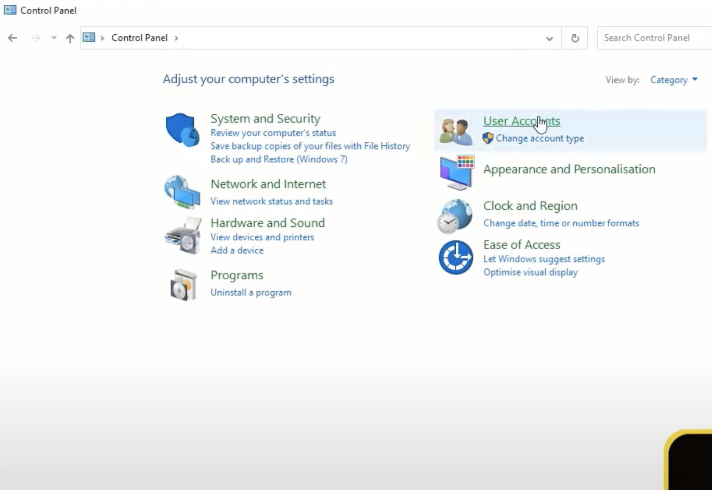

In here select **Change my environment variables**, which will open a new window with your environment variables.
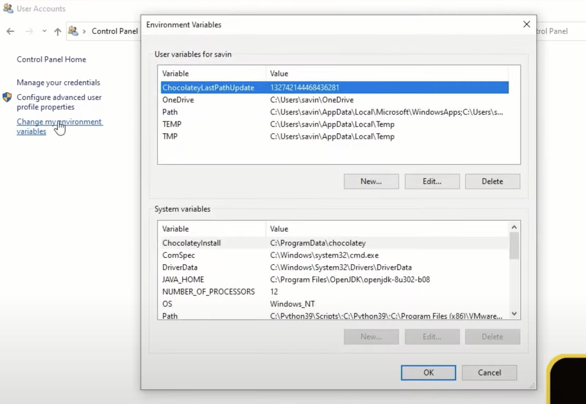

Let's click **New...** under **User variables for X** to add a new environment variable.

In this window under **Variable Name** type **ANDROID_HOME** and under **Variable Value** paste the Android SDK path that we have copied a few minutes ago.
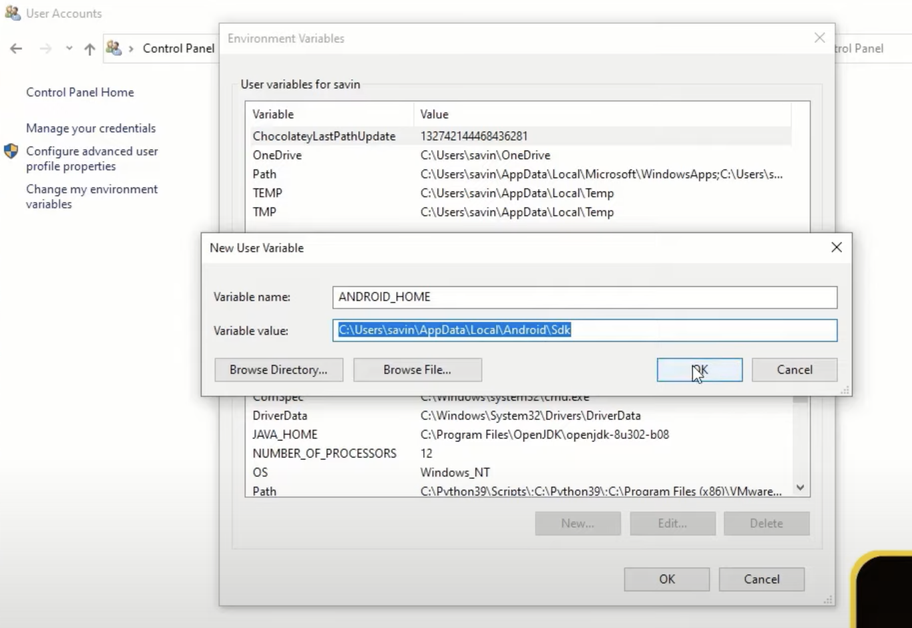

There is one more environment variable that we need to add and to do that double-click **Path** variable to open a new window.
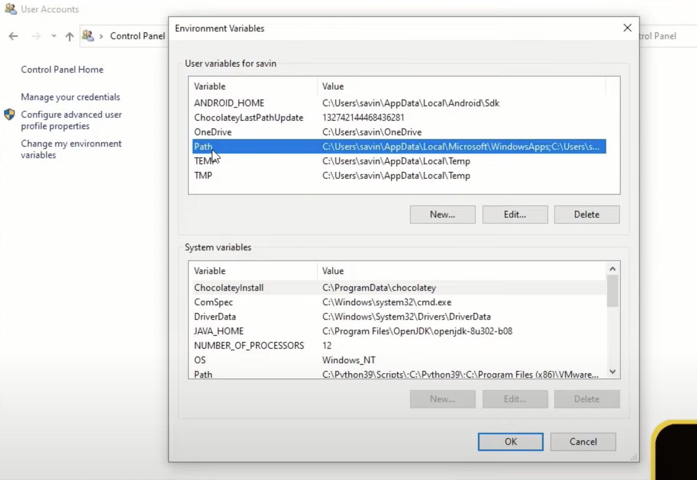

In here click **New**, in the field that appeared paste the Android SDK path that we have copied before and add `\platform-tools` at the end just like in the image below. After that click **OK**, which will save the variable and close the window.

Now we can click **OK** to save all of our newly added environment variables and close windows control panel.

Before continuing let's quickly test if we managed to set **ANDROID_HOME** variable successfully by opening **Windows PowerShell** and typing `Get-ChildItem -Path Env:\`, which should display something like in the image below with **ANDROID HOME** name and path value.
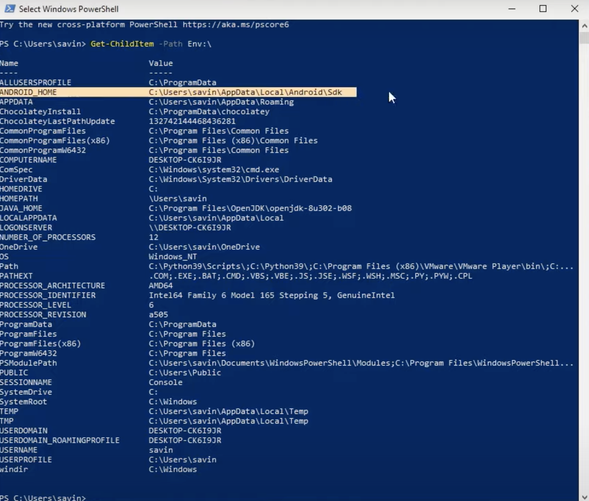

To test if platform tools variable was added successfully just open Windows Terminal and type `adb`, which should display the list of commands like in the image below.

## Installing React Native CLI

We did amazing until now, I think we deserve a short break! Drink a cup of water to stay hydrated and take a few deep breaths before continuing...

Ready? Lets goo!

React Native's official documentation suggests instead of installing and managing a specific version of the CLI globally, just use `npx` to access the current version at runtime, so let's do just that.

In order to download and install the current stable version of the React Native CLI we need to open Windows Terminal and type `npx react-native`, which should ask you to install _react-native_ package. Press _y_ button on the keyboard and the installation should start automatically.

## Initialize Your First Project

In order to create a new React Native project, in the terminal we can simply type `npx react-native init` and the project name at the end, for this example let's call our application **RNFirstProject**. This will create a new project with the latest React Native version. _Keep in mind that at the time of writing this guide the latest React Native version is 0.65_.
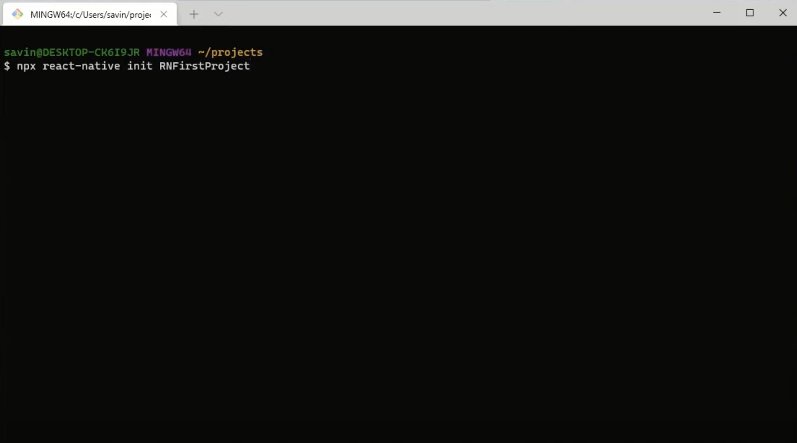

While React Native is preparing and building our new project, we can create a new android virtual device on which we will run the applications.

## Creating New Android Virtual Device

To create a new android virtual device we need to open **Android Studio**, in the main window click **More Actions** and select **AVD Manager**, which will open a new window.
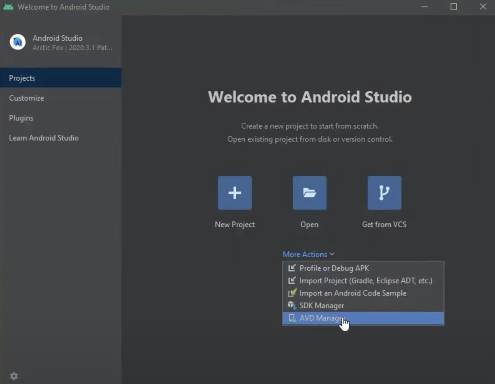

In the window that was opened click **Create Virtual Device...**, which will open a window with different hardware selections.

Here we need to select **Phone** under **Category** tab and any virtual device from the list that you like. In our example below we chose **Pixel 4** just because it has **Play Store**. After selecting the device, click **Next** to continue the setup.

Now we need to select a system image, let's select **Release Name Q** and click **Next**. _Side note, you might need to download version **Q** again if you chose a device with Play Store. If you do need to download it again, just click **Download** near the name, and it will download as well as install it automatically_

In the last step you can do some more changes if you know what you are doing, but in our example we just changed the **AVD Name** and clicked **Finish**, which will create a new virtual device and close the setup window automatically. _Side note, you can untick a box near **Enable Device Frame** to increase the performance by a little bit. This might be helpful if your computer is not that powerfull._
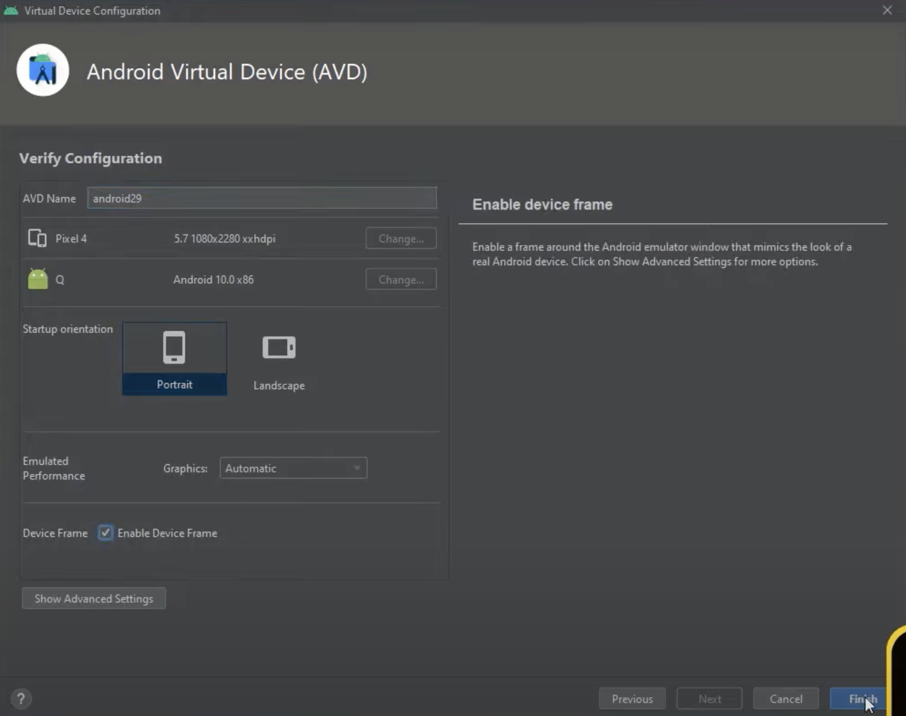

Once the setup is done, we can run our virtual device by clicking _Play_ icon under **Actions** tab.
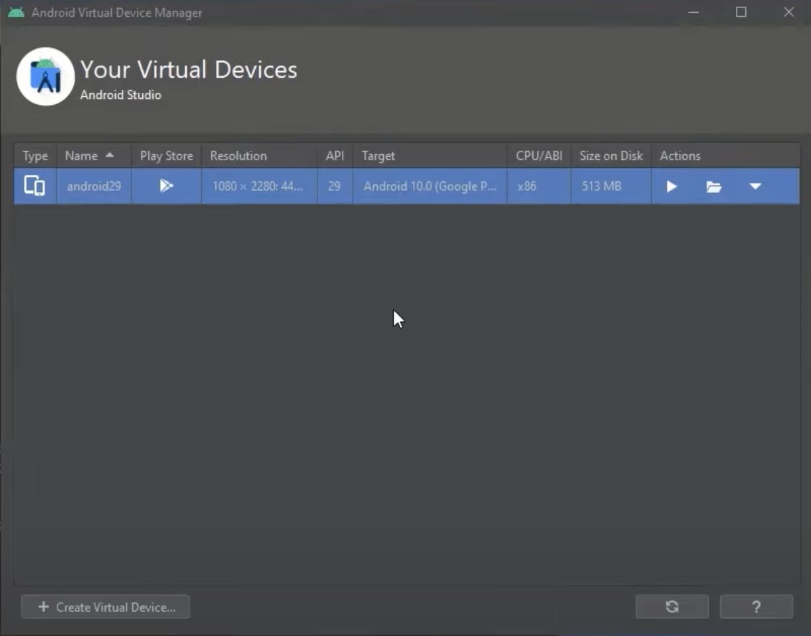

Keep in mind that it can take a little bit longer when opening a newly created virtual device because it has to set up everything.

## Running The Application

We are almost there!!

To run the application, in the terminal where you have initialized your project simply type `cd` and the project name at the end, which in our case is `cd RNFirstProject`. This command will go to your project's folder, and then you can type `npm start` to start the development server.

You might be asked to allow access to NodeJS, allow it.

 

Now we need to open a new terminal tab by clicking on a **+** on the top.
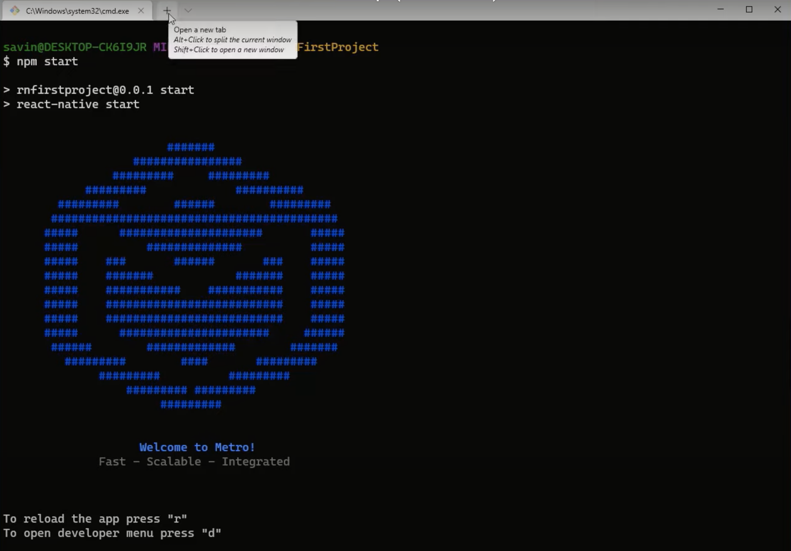

In this new terminal tab we need to go to our project's folder, which we already learned how to do before, by simply typing `cd RNFirstProject` (RNFirstProject being our project's name that we gave when initializing). And then typing `npm run android` to build and run the application on android emulator.

This part should take some time, but after it's finished you should have your first application up and running on an emulator, how exciting is that?!

## Installing Visual Studio Code

There are plenty of IDE's to choose from and if you have one already, then you can skip this step and start writing your code there. But in our humble opinion, we think Visual Studio Code fits our needs the best.

If you decided to go with Visual Studio Code as well, then you can download it from their [website](https://code.visualstudio.com/).

During the installation, you can make changes if you know what you are doing, otherwise I suggest leaving everything on default except for the window below. In here, tick all of the boxes under **Other** tab.

 

Now we can open our application on Visual Studio Code by navigating to the folder where you have created your 'RNFirstProject' project, then clicking the right mouse button anywhere on the white space and clicking **Open with Code**.

 

You might be asked to verify that you trust the authors of the files in this folder. Check the box '_Trust the authors of all files in the parent folder_' and click **Yes, I trust the authors** button.
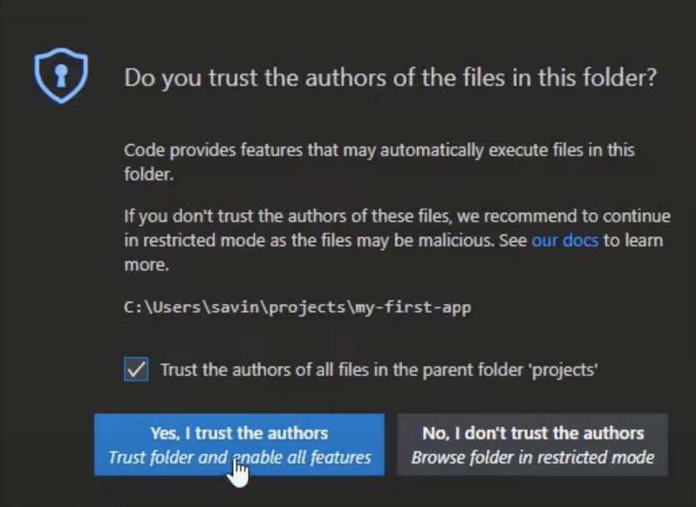
 

Now you can select the theme of Visual Studio Code that you prefer _(don't forget the story about UI themes that I told you before)_ and run the project. Visual Studio Code has a lot of very useful extensions for React Native developers that will make you code faster, cleaner, prevent bugs and in general make coding a lot more enjoyable. If you want to see what are those extensions and learn how to add them to your Visual Studio Code I recommend watching [TOP 10 VSCode Extensions for React/React Native Developers (2021)](https://www.youtube.com/watch?v=jCzJYyknKGg).

To run the project, just open the terminal in Visual Studio Code by pressing CTRL + \` (that little button in the top left of your keyboard below the ESC button, you are welcome 😉) and just type `npm start` which will start the development server. Then you should open a new terminal window by pressing CTRL + SHIFT + \` (same little button under ESC) and in the new terminal typing `npm run android`, which will build and run your application on the android virtual device.

## Now you can start coding!!! 🥳

But in order to start learning React Native the right way, I highly encourage you to visit [notJust.dev YouTube Channel](https://www.youtube.com/channel/UCYSa_YLoJokZAwHhlwJntIA) where you will find plenty of free projects and tutorials to follow, which will most certainly increase your React Native knowledge and skill!

I would recommend you to start with the [Tesla Clone](https://www.youtube.com/watch?v=iQ_0Fd_N3Mk), which is a beginner-friendly tutorial that will cover all the basics and get you up and running with your first React Native project.

I hope this guide was clear, comprehensive, and helped you to easily install as well as setup everything that you need in order to start working on your first React Native application.

Good luck on your software engineer journey!!
