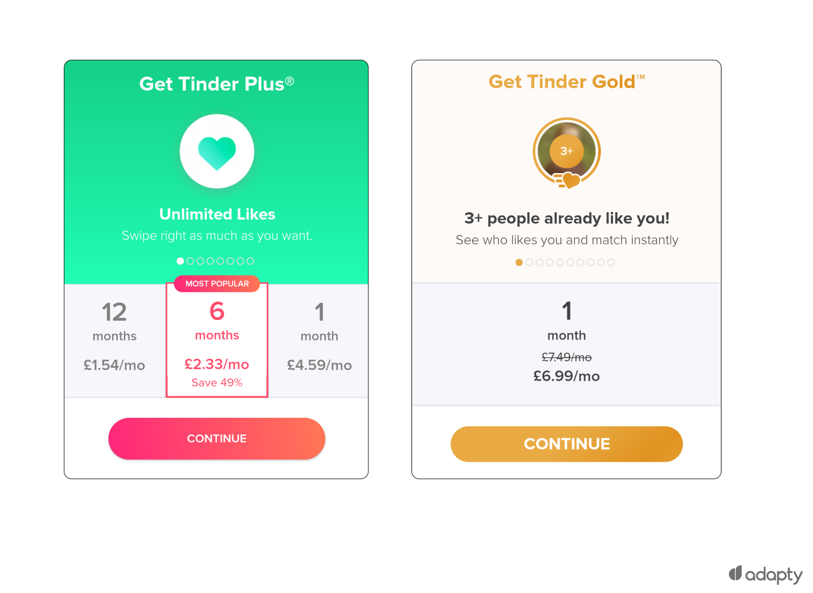

import YoutubeVideo from '../../../src/components/shared/YoutubeVideo';

In this article, we are going to cover 5 different ways you can monetize your mobile application so you can start earning money by doing what you love.

If you prefer a video format, here it is 👇
<YoutubeVideo id="kLfsuIsyTs4" />

## Paid app

The easiest way to monetize your application is to charge a one-time payment before the user downloads the app. This can be easily done on the Play Store and Appstore, by setting the price of your application.

The biggest disadvantage of this strategy is that you put a very high wall in front of the user before they even had a chance to try your application. Without first showing the value of the app, it is quite hard to sell it to a new user.

Another approach I saw some companies take, is to publish 2 separate applications on market: one free application and one pro paid application. This solves the issue I was mentioning before, however, there is a better way to have the same approach, without the need to create 2 separate applications.

An alternative approach to the paid app model is the freemium model. In the freemium model, you let people download the app for free, you provide them value first, and only after that do you charge the user.

## In-app purchases (freemium)

One of the strategies to monetize your freemium application is offering digital goods in your application. These digital goods that users can buy from your app are called **In-app purchases**.

This model works amazingly for a lot of applications and also games, where people can buy digital currencies, lives, items, gems, and so on.

A good example of a successful game that made a killing using IAPs is Pokemon Go. Users can buy premium items in the shop in exchange for PokeCoins. You can either earn these PokeCoins or you can buy them. In the first 2 years after the release of Pokemon Go, they generated over 2B

In-app purchases can also improve the user experience by providing extra benefits to pro users.

## Subscription

Another monetization strategy for freemium applications is the subscription model. This model is quite similar to the In-app purchases, but the only difference is that the user is charged based on a period of time that can be every week, month, year.

The most common use-case for subscriptions is to provide extra features to the pro users.

A good example of a successful subscription model, that a lot of you know, is Tinder. Tinder offers most of its features for free, but if you want to send that super like, you gotta pay a monthly subscription fee.

**Pros:**

- Stable and predictable monthly revenue
- Little effect on the user experience
- Can significantly drive engagement.

**Concerns**

- requires a lot of investment to create a great product and a seamless experience to get users to part with cash.

Subscriptions and In-app purchases have to be managed through the specific platform from where the user downloaded the application. For android users, the transactions should be handled through Google Play, and for ios through Apple Appstore. This is their business model because these platforms take a cut of your revenue (15-30%).

To add subscriptions or in-app purchases to your application, you first have to create and set up them on the Play Market and/or App Store, and then, using their SDK, integrate them into your application.

Integrating with their SDKs is quite challenging, and it involves a lot of code from our side. Especially if you are building a cross-platform application for ios and android, for example using react native, flutter, or other cross-platform frameworks, it becomes even harder to manage subscriptions and IAPs. You have to integrate with both SDKs, and manage a lot of edge cases, for example, what will you do if a user buys a subscription on android from the play market, and then wants to use your application on ios.

## RevenueCat

[RevenueCat](https://www.revenuecat.com/) comes to help us to solve these issues. RevenueCat makes it easy to implement and manage in-app subscriptions, analyze customer data, and grow recurring revenue on iOS, Android, and the web.

I have integrated [RevenueCat](https://www.revenuecat.com/) in my previous Startup [Fitenium](https://fitenium.com/) to manage subscriptions, and it was one of the best decisions. Instead of having to integrate both Apple and Google play SDK for subscriptions, with [RevenueCat](https://www.revenuecat.com/) I simply integrated their SDK, which is well documented and much easier to work with. Everything else is magically managed by [RevenueCat](https://www.revenuecat.com/) behind the scenes, to properly handle the payments, users, and analytics.

As your single source of truth for customer purchase data across every platform, [RevenueCat](https://www.revenuecat.com/) provides deep understanding of revenue, retention, and churn across every platform out of the box.

## Ads

One of the most popular monetization strategies for mobile applications is running ads in your application.

Over the last decade, digital advertising has become a hot topic.

According to eMarketer, [75% of the digital advertising budget is spent on mobile apps](https://www.forbes.com/sites/johnkoetsier/2018/02/23/mobile-advertising-will-drive-75-of-all-digital-ad-spend-in-2018-heres-whats-changing/?sh=70edc81d758b). The year 2021 saw more than $**295** billion go to mobile ads.

Integrating ads in your application is quite easy using Ads providers like Google AdMob. After you install and set up one of these ad providers, they will automatically display ads specifically targeted to the user that is using your application

There are a lot of types of ads you can integrate based on your application. **Banner Ads, Interstitial Ads, Native Ads, Reward ads.**

**Pros:**

- Easy to set up and get started

**Cons:**

- You need a lot of users/traffic to generate significant income
- can affect the app experience

## Sponsorship and Partnerships

Sponsorships and partnerships monetization strategy is a good choice for niche applications. If you have a very targeted niche of users that is using your application, you can approach directly companies that are working in that niche for a partnership.

This method is harder to realize because you have to deal directly with companies and negotiate a good deal. However, if your app is a niche app, for example, if you are building an app that displays all local farmers in your city where you can buy fresh products and it is used by 10k users every month. You can approach some of these farmers and in exchange for a monthly fee, they will be displayed on top of the list. If you monetize the same application with ads, you will make very little because your local app won’t be used by millions of people.

## Best practices

As you can see, there are a lot of ways you can monetize your application. Your job is to use the one that suits your application the best.

In most situations, combining different monetization strategies will improve user experience and maximize your revenue.

For example, you can have a freemium application that will display ads to users on the free plan, and offer a subscription that would hide the ads and include also other benefits. This approach is working very well for Duolingo.

So, get creative, test different methods but don't forget about your users and prioritize a good user experience over money at all cost. A good user experience goes a long way.
