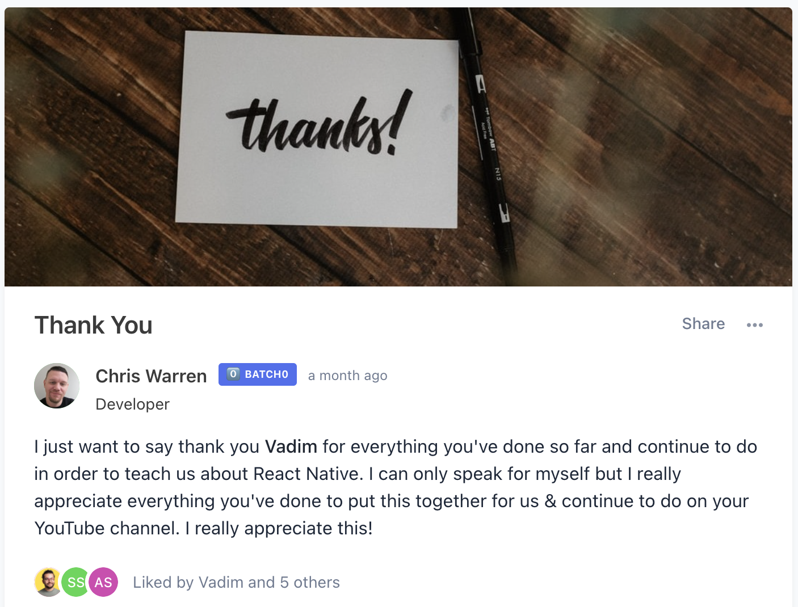

import Button from '../../../src/components/shared/Button';
import CountdownTimer from '../../../src/components/shared/CountdownTimer';

Hey notJust Developers 👋

I am so excited to announce that we are very close to opening the doors for a new batch 🎉 **#Batch1**

I've been working full-time for the last 8 months on this course.

I've realized that creating a good course, that will actually help you get closer to your goals as a full-stack mobile developer, is very hard. It required a lot of planning when it comes to the structure of the course, keeping in mind the end product that you will build. Thanks to the notJust.dev team, and the feedback from Batch0, we managed to build a course I am proud of.

I made sure to cover a very wide set of skills that would help you with the whole process of developing a mobile application starting from building a complex Frontend UI, designing and building the backend infrastructure to deploying your application to production to Play Market and AppStore.

## What will you learn

We have 7 core modules ready, and now I am working on the next 2.

### 1. Intro

Get started and onboard on our educational platform and the private community.

### 2. Project Setup

Setup your system and the new project with all the tools that you will need.

### 3. UI

Build the complex UI of the Instagram app and learn how to work and style the primary React Native components like Images, Text, Views, FlatList. As well learn how to structure your project with scalability and maintainability in mind.

### 4. Navigation

Use [React Navigation V6](https://reactnavigation.org/) to setup the navigation in our app. We cover

- Stack Navigators
- Bottom Tab Navigators
- Top Tab Bar Navigators and much more
- Deep links

### 5. Getting started with AWS Amplify

Get an overview of AWS and AWS Amplify and then setup your AWS account from scratch. You will also learn how to secure your account and setup Billing alarms to prevent unexpected bills. The next step is to setup the CLI, initialize the project using Amplify Studio UI and connect our project to the backend.

### 6. Authentication

Add an authentication layer to your app using Amazon Cognito. Let users sign up with their email or with their **social providers (Facebook, Google)**. In this module, we cover both working with the out-of-the-box authentication flow, as well as building our own UI and connecting it with the Auth API for all the flows: sign up, sign in, confirm account, forgot and reset password.

### 7. API

A lot of creators will just launch this module as an individual course. It is _soooo_ packed with value and it covers a wide variety of features. We start with learning about **GraphQL** and how does **AppSync** works. Then we learn how to design the data model of our application and all the relationships between them, after which we build it with Amplify. We then implement all the **CRUD operations** for all the models (users, posts, comments, likes, etc.). You will learn how to use **Apollo Client** to interact with the GraphQL API and also to cache all the data for _better performance_.

### 8. Storage (In progress...)

Implement the storage layer for our images and videos, and link it to our database models.

### 9. Production (In progress...)

Prepare the app for production. This will include:

- preparing all the marketing assets
- setting up production environment on Amplify
- building your application
- setting up the app page on both stores (AppStore and Play Market)
- **CI/CD: automatically deploying the app to stores**

### And there is more coming

More modules that will cover advanced features like Following System, Notification System, and other important topics are already on our whiteboard.

The good thing is that you will have access to them when they are ready for no additional costs.

## It wouldn't have been possible without #Batch0

Back in August 2021, **201 people** 🤯 saw the value of the course I was planning back then, and trusted me enough to join the course as an early student. I am very thankful to all of them because....

The Batch0 members were crucial in shaping this course. They gave me constructive feedback and suggestions that helped me improve the course and bring it to the next level.

Don't take my word for it, see what Chris Warren, a student from Batch0, has to say:

## Vadim, WHEN?

Ok, ok, I also can't wait 🤩

The launch date is..... \*ba dum tsss\*:

### 25th April 🎉

<CountdownTimer endDateStr={"2022-04-25T00:00:00Z"} />

I will come with more details in the following weeks.

Stay tuned, and sign up for the [wait list](https://academy.notjust.dev/), if you are not already there. People on the wait list will get a good offer.

<Button title="Join the wait list" href="https://academy.notjust.dev/" target="_blank" />
