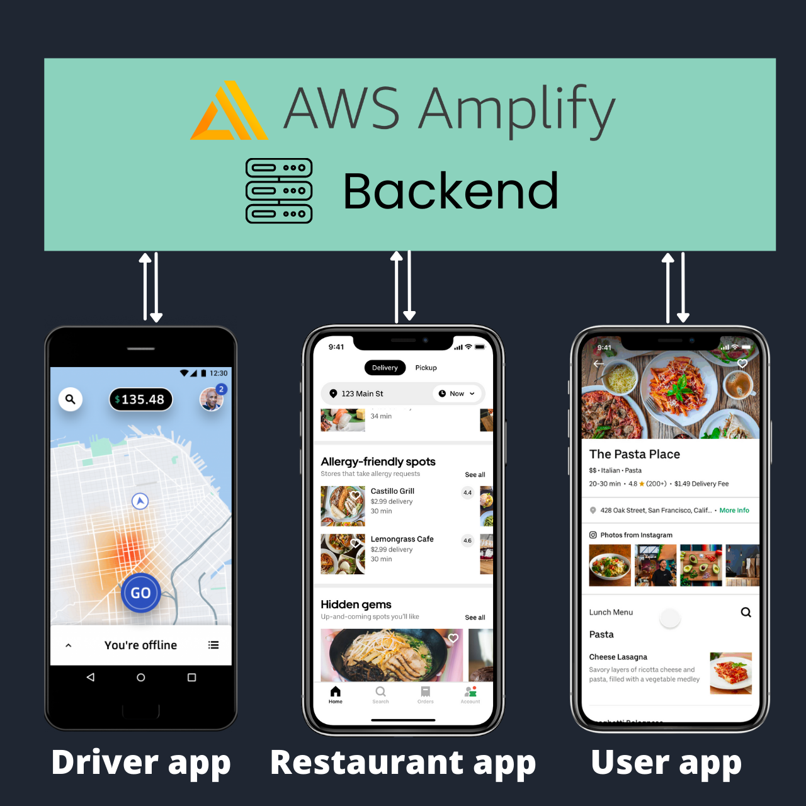

import Button from '../../../src/components/shared/Button';
import YoutubeVideoMock from '../../../src/components/shared/YoutubeVideoMock';
import OptInForm from '../../../src/components/shared/OptInForm';
import YoutubeVideo from '../../../src/components/shared/YoutubeVideo';

Hey notJust Developers 👋

I am so excited to announce our first **Intensive 5 DAYS coding challenge!** 🚀🚀🚀

We have started preparing this challenge 6 months ago, and we made sure it's packed with value.

By the end of the 5 Days challenge, you will walk away more confident in your skills of building complex, full-stack, end-to-end projects with [React Native](https://reactnative.dev/) and [AWS Amplify](https://aws.amazon.com/amplify/).

<YoutubeVideo id="zh9XCdk7atY" />

## What will we build?

We will build not 1, not 2, but 3 React Native applications and we will connect them together using one common backend.

## Reserve your spot

The entrance is free, but make sure to reserve a spot bellow.

<OptInForm formId={"f3e28ec974"} formSrc={"https://awesome-teacher-1065.ck.page/f3e28ec974/index.js"} title="👇 Reserve a FREE spot" />

## Schedule

### Day 1

In the first day we will build the UI of the **User side app**.

<YoutubeVideoMock 
  title="Day 1: Build a full stack UBER EATS clone 🔴" 
  description="Join the challenge and build a Full-stack Uber Eats clone, including 2 React Native apps and their backend in just 5 DAYS." 
  url="https://youtu.be/ZPNHWlMk6_E"
  imageUri="/images/posts/2022-03-24-uber-eats-5-days-challenge/thumbnail.png"
/>

### Day 2

In the second day we will create the backend with **AWS Amplify** and connect you user app to it.

We will cover:
✨ Authentication
✨ Data modeling
✨ API and data querying
✨ Storage

<YoutubeVideoMock
  title="Day 2: Build a full stack UBER EATS clone 🔴"
  description="Join the challenge and build a Full-stack Uber Eats clone, including 2 React Native apps and their backend in just 5 DAYS."
  url="https://youtu.be/WFo_IxhBxF4"
  imageUri="/images/posts/2022-03-24-uber-eats-5-days-challenge/thumbnail.png"
/>

### Day 3

During the third day we will build the \*_Driver side app_. This build will focus on UI and on Maps feature.

<YoutubeVideoMock 
  title="Day 3: Build a full stack UBER EATS clone 🔴" 
  description="Join the challenge and build a Full-stack Uber Eats clone, including 2 React Native apps and their backend in just 5 DAYS." 
  url="https://youtu.be/eTNvx8kdslk"
  imageUri="/images/posts/2022-03-24-uber-eats-5-days-challenge/thumbnail.png"
/>

### Day 4

During the fourth day, we will connect the **Driver app** to the backend. The focus will be on syncing data between the driver app and the user app, so that the user always knows where is the driver on the map.

<YoutubeVideoMock
  title="Day 4: Build a full stack UBER EATS clone 🔴"
  description="Join the challenge and build a Full-stack Uber Eats clone, including 2 React Native apps and their backend in just 5 DAYS."
  url="https://youtu.be/gunuloenCpU"
  imageUri="/images/posts/2022-03-24-uber-eats-5-days-challenge/thumbnail.png"
/>

### Day 5

The last day will be focused on creating and connecting the **Restaurant side app** to the whole system.

The dashboard will be created using ReactJS. This is a great way to see how multiple apps are connected together.

<YoutubeVideoMock 
  title="Day 5: Build a full stack UBER EATS clone 🔴" 
  description="Join the challenge and build a Full-stack Uber Eats clone, including 2 React Native apps and their backend in just 5 DAYS."
  url="https://youtu.be/Os49oPTfzuU" 
  imageUri="/images/posts/2022-03-24-uber-eats-5-days-challenge/thumbnail.png"
/>

## Sharing is caring

Share your progress online using the hashtags **#notJustDev** and **#5DaysUberEats** and help spread the word about the challenge.

<Button title="🐦 &nbsp;&nbsp;Share on twitter" target="blank" href="https://twitter.com/intent/tweet?text=Build%20a%20full-stack%20Uber%20Eats%20clone%20during%20the%205%20days%20challenge%20organized%20by%20%40VadimNotJustDev%20%0A%0ANow%20is%20the%20time%20to%20master%20full-stack%20mobile%20development%20%20with%20React%20Native%20and%20AWS%20Amplify%0A%0AReserve%20your%20FREE%20spot%20%F0%9F%91%87%0A%0Ahttps%3A%2F%2Fbit.ly%2F3JsSBD5%0A%0A%23notJustDev%20%235DaysUberEats" />&nbsp;&nbsp;&nbsp;<Button title="🧑‍💼 &nbsp;&nbsp;Share on LinkedIn" target="blank" href="https://bit.ly/3rjDVjA" />
