import YoutubeVideo from '../../../src/components/shared/YoutubeVideo';

So, finally after a long time of developing your application you are ready to take it to the next step and publish it to the Apple's App Store, CONGRATULATIONS! But we still have to go through a few more steps before we can start celebrating, and I will try to guide you through them as clearly as I can. Let's buckle up and start working!

During this guide, we will use **Expo Application Services** because it makes everything SOOO much easier and faster that I think you will enjoy using it as well! 😊

Quick side note, if you prefer following video tutorial instead, you can watch the video below.
<YoutubeVideo id="LE4Mgkrf7Sk" />
If you chose to follow the guide, then let's roll!

## Creating Apple Developer Account

First and foremost, we have to create an **Apple Developer Account** so that we could publish our application to the Apple's App Store.

To do that, simply go to their [website](https://developer.apple.com), click **Account** in the top menu bar and then click **Do not have an Apple ID? Create yours now.** In register page provide all the information that Apple is requiring and click **Continue**. After that you will be asked to confirm your email address by entering the code that they've sent you and later also confirming the phone number that you've provided in the same way.

### Enrolling to Apple Developer Program

In order to be able to manage your application and most importantly publish it to the App Store you need to enroll to the **Apple Developer Program**, and it costs 99$ a year which is pretty steep compared to Google Play but there is no way around it if you want to have your application on the App store.

To enroll, simply click the gray box on the bottom of the dashboard.
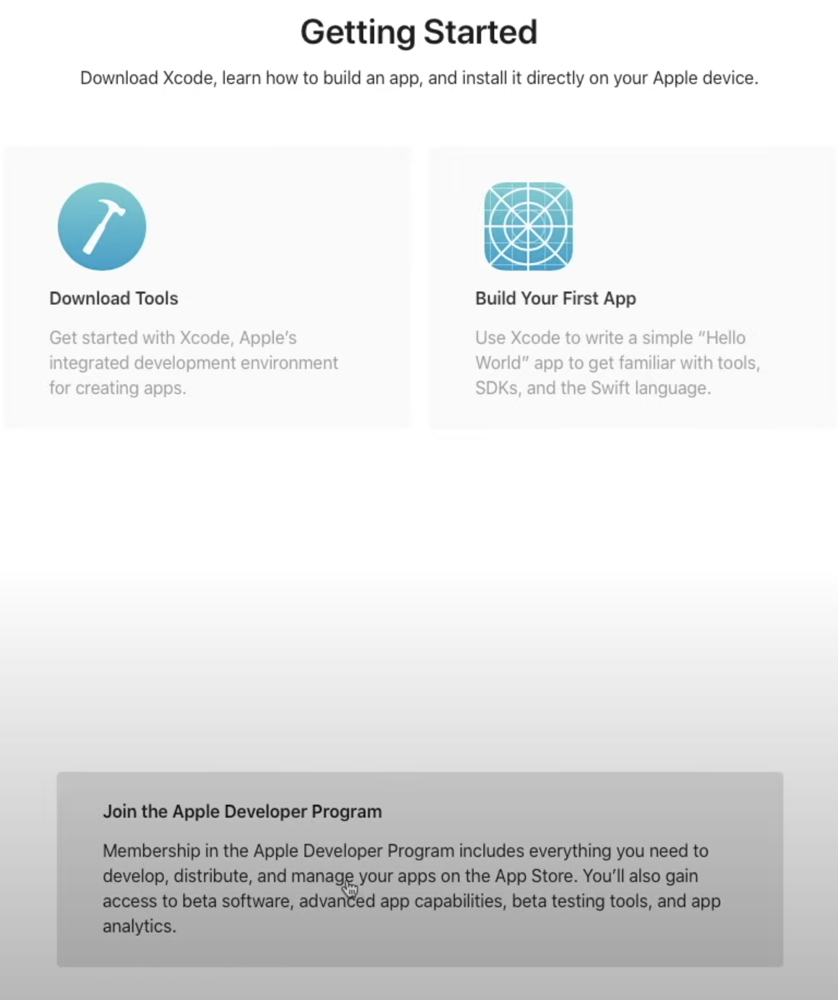 
In the next page you can read a bit about the benefits of the program and click the tiny blue **Enroll** button on the top right side of the page.
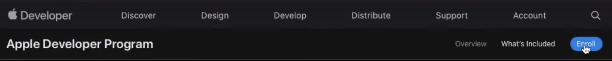
Now in this page you can read a bit on what you need in order to enroll either as an individual or organization. When you are finished reading, scroll down to the bottom of the page and click **Start Your Enrollment**.

Then provide the necessary personal information, click **Continue** and in the following page select if you are developing applications as an individual or organization, after which you can click **Continue** again and in the last registration page simply review as well as confirm that you accept Apple's **Developer Program License Agreement** and click **Continue**.

Now in the last step you will have to pay those 99$ that I've told you about earlier in order to complete your enrollment. After the payment, you will be redirected to the main dashboard, and we will be able to continue!

## Creating Expo Account

We will need an expo account to use **Expo Application Services**. So, in order to create your expo account go to their [website](https://expo.dev), click **Sign Up** button in the top right corner and complete the registration process. After that, confirm your email address and we are ready to go!

## Creating First Build

### Adjusting Application Settings

Before we can create our first build, we need to adjust some information about our application. To do that, open your code editor (in my case it is **Visual Studio Code**) and navigate to your **app.json** file. In here we will have to change the *name*, which will be the name of your application and the *slug*, which is a piece of URL that represents your application.
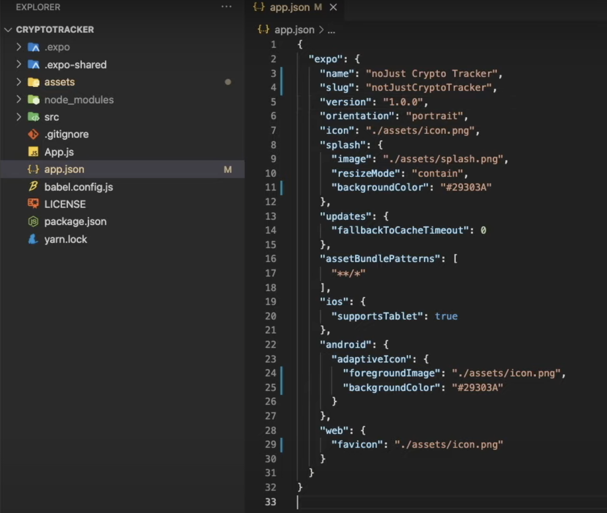

### Installing Expo Application Services

Before we can start using **Expo Application Services** we need to install it by opening the terminal and typing `npm install -g eas-cli`.
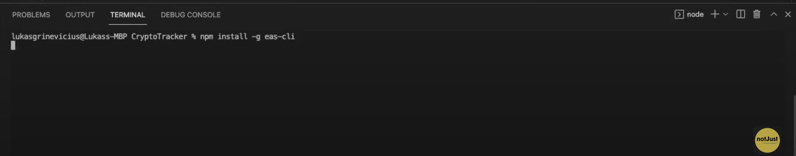

Once the installation is finished, we can login to our expo account by typing `eas login` in the same terminal and providing the username as well as the password of the expo account that we have created earlier. *(You can test if you logged in successfully by typing `eas whoami` in the terminal, which should display your username).*
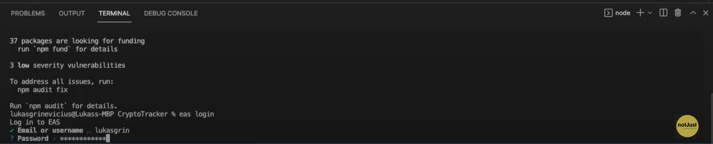

### Configuring The Project

The last step before we can start creating our first build is to configure the project. We can simply do that by running `eas build:configure` in the terminal, and choosing iOS as our platform. This command will create *eas.json* file in your project, which we will adjust a bit later.

### Creating The Build

Finally we can create our first build! So let's not waste any time and start doing that by running `eas build --platform ios` command in the terminal, after which we will have to go through a few more questions.

Firstly we need to provide application *bundle identifier* which is a unique string that identifies your application.
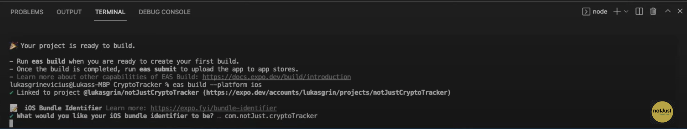

The next step is to login to your **Apple Account** that we have created earlier in the tutorial.

Now we will have to generate a new **Apple Distribution Certificate**. This certificate identifies you and allows you to submit your application to the App Store, so in a nutshell it ensures that the application code originates from the organization or individual who signed the app and has not been altered since.

After that, we will have to generate a new **Apple Provisioning Profile** as well.

And last but not least, you will have to select if you want to set up **Push Notifications** for your project, after which EAS will start building your application!

To track the progress of your build simply click on the *build details* link in the terminal, which will open a new tab in your browser with all the details.

Once the status of the progress changes to **Finished**, it means that finally we have our application build, and we can close the tab because we won't need it for now.
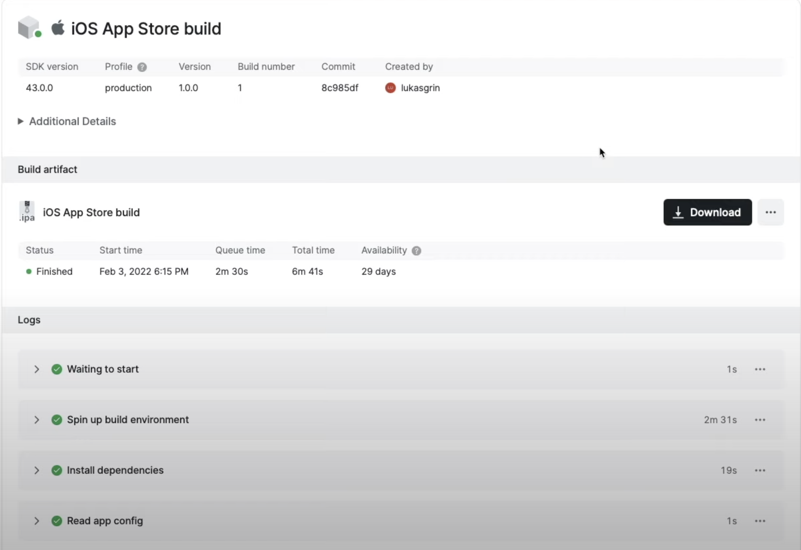

## Creating And Setting Up The Application On The App Store Connect 

Before we can submit our application for **Apple Review** we have to create it as well as set it up on the **App Store Connect**. Therefore, our first step here is to login to their [website](https://appstoreconnect.apple.com/login) with the same credentials as your **Apple Developer Account** that we have created earlier.

After that, click on the **My Apps** icon.
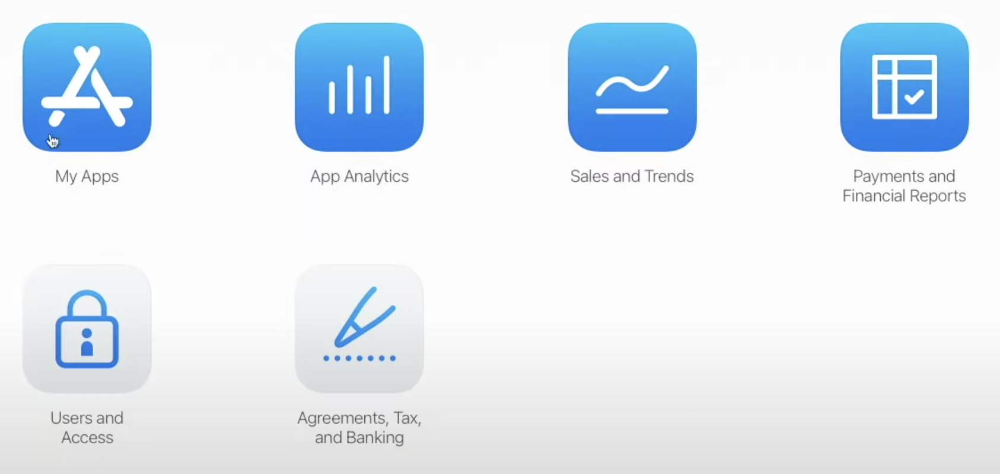

Then click on a **+** symbol next to the **Apps** title and select **New App** to start creating your application.

Now you should see a pop-up card where we will have to provide some information about the application.
- Platforms - Because we are releasing this application only for *iOS*, that's what we will choose.
- Name - Provide the name of your application that users will see on the App Store.
- Primary Language - Provide the main language of your application.
- Bundle ID - Here you should select the bundle ID that we have created while creating our first build.
- SKU - This is a unique ID for your application, you can make it the same as Bundle ID.
- User Access - Here you can choose what access certain roles have, but more times that not you will choose **Full Access**, especially as an individual.

After providing all of the necessary information, click **Create** and wait a minute before reloading the page, which should display your application!
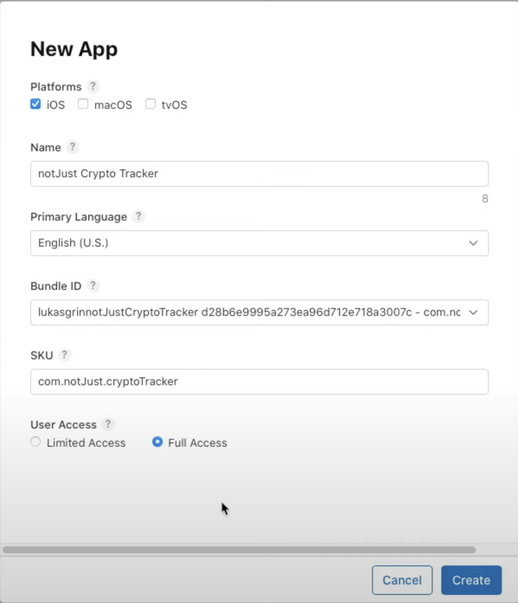

If your application appeared, click on it and now the real "fun" begins 😄

### General Application Information

Let's start by uploading application screenshots. We will need at least one screenshot for:
- 6.5-inch iPhone Display
- 5.5-inch iPhone Display
- 12.9-inch iPad Pro (3rd Gen) Display
- 12.9-inch iPad Pro (2nd Gen) Display

You can simply take these screenshots from the simulator. To upload them, click on the screen size that you are uploading for and then click **Choose File**, after that select the screenshots from your computer.

Now let's scroll a bit down and provide:
- Promotional Text - This will always appear above the description, so one good sentence about your application should be good here.
- Description - Think about this very well because it's pretty important to give a good idea to the users about your application.
- Keywords - Also very important, create good keywords that suite your application if you want your app to appear better in the search results.
- Support URL - If you already have, you can paste the URL either to your website or your privacy policy. If you don't have either of them, don't worry, I will show you how to get your privacy policy URL a bit later in the tutorial.
- Version - Pretty self-explanatory, you should provide the version of your app, most likely it's going to be 1.0.0 as it is your first release.
- Copyright - Who owns the copyright to the application.

Then scroll down even more, and we will have to provide some **App Review Information** for the testers.
- Sign-In Information (Optional) - If your application has an authorization screen, then you will have to provide login details to your application for the tester. If your application doesn't have any authorization screen, then simply uncheck **Sign-In required** box.
- Contact Information - Provide your first name, last name, phone number and email in case a tester needs to contact you.
- Notes (Optional) - If you need to, you can provide some notes for the tester.
- Attachment (Optional) - If you need to, you can attach some attachments for the tester.

And lastly in this page we will have to select **Version Release** approach.
- Manually release this version - After the application approval, you will have to go to the dashboard and release the application yourself.
- Automatically release this version - After the application approval, your application will be release automatically right away.
- Automatically release this version after App Review, no earlier than - You can specify the date at which you want your application to be released automatically.

Now we can scroll to the top of the screen and click **Save** button in the top right corner to save the information.

After that, click **App Information** under **General** on the left side menu.
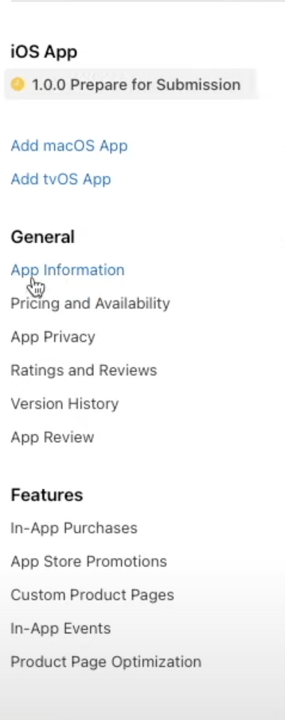

And here we will see that some fields are already populated automatically, but some are still empty, we have to fix that:
- Subtitle (Optional) - If you want, you can add a subtitle to your application.
- Category - Select which category fits your application the best. *You can also select secondary category*
- Content Rights - Click **Set Up Content Rights Information**, and if your application contains, shows or access any third-party content, then select **Yes** in the pop-up, otherwise select **No** and click **Done**.
- Age Rating - Click **Set Age Rating Across All Platforms**, and go through the questionnaire, which will according to the answers automatically generate an age rating for your application.

Now scroll to the top of the page and click **Save**.

After that, click **Pricing and Availability** under **General** on the left side menu.
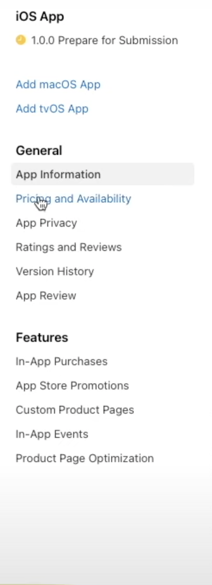

In here, we simply need to select the price of your application. Most likely it is going to be free, but we still need to specify that by clicking on a dropdown list and selecting the price. Most likely you will want to leave the rest of the information in this page on default settings. After making the changes, click **Save** in the top right corner of the screen.

Now let's set up our application privacy. Click **App Privacy** under **General** on the left side menu.
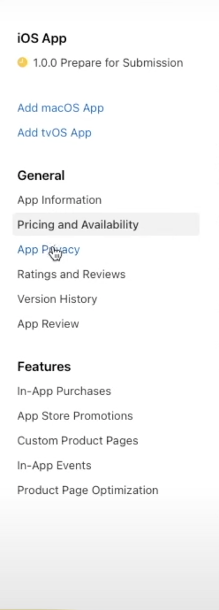

Privacy policy is very important, but it takes too much time to write it from scratch, therefore I did some research and managed to find a website that will help you to generate your privacy policy at least for now. Open the [website](https://app.privacypolicies.com/wizard/privacy-policy) and go through the questionnaire. After you are finished with that, your privacy policy URL will be generated, so just copy it and go back to the **App Store Connect**.

In the dashboard, click on the **Edit** button near the **Privacy Policy** title.

Simply paste the URL under **Privacy Policy URL** and click **Save**. *(Don't forget to paste this URL under **Support URL** that we left empty earlier in the tutorial)*
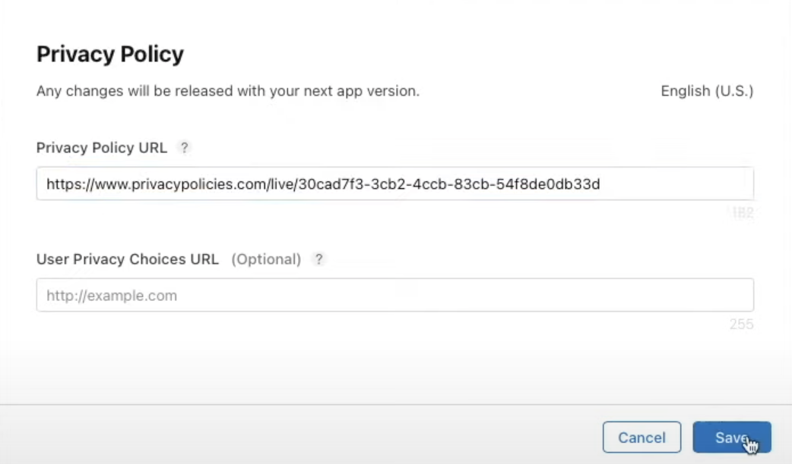

While we are still in this page, we can set up our data collection practices. To do that, simply click **Get Started** button in the gray box below and answer to a few questions.
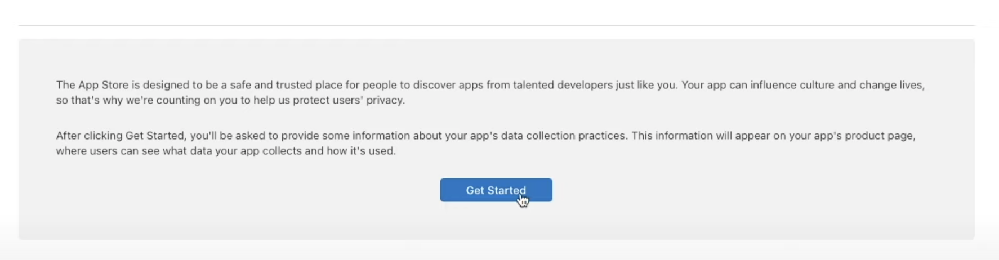

Lastly, we need to save all of this information by clicking **Publish** in the top right corner.
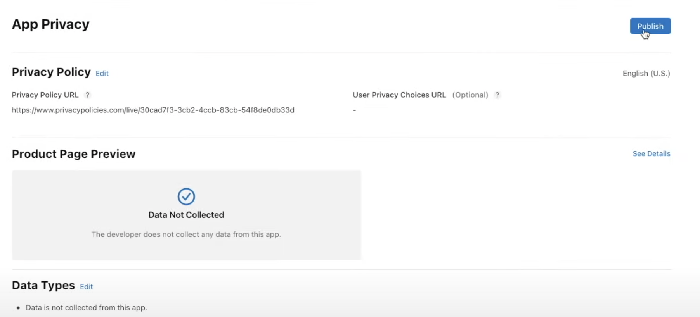

Perfect, we have finished the longest part of the guide, I think you deserve a short break!

## Submitting Build To The App Store Connect

We are almost done, only a few more steps left! 💪

In order to submit our build to the App Store Connect, we have to go back to the code editor and set some more things up as well as run some more commands, so let's do that!

In your project open **eas.json** file that we have generated earlier and add:
- "appleId" - Your email that you use to login to the **App Store Connect** and **Apple Developer Account**.
- "ascAppId" - Your application ID that you can find by going to the **App Store Connect** and navigating to the **App Information** tab on the left side menu under **General** and copying the **Apple ID**.

- "appleTeamId" - Your team ID that you can find by going to the **Apple Developer Account** and navigating to the **Membership** tab on the left side menu under **Program Resources** and copying **Team ID**.

After the changes, your **eas.josn** file should look something like this:
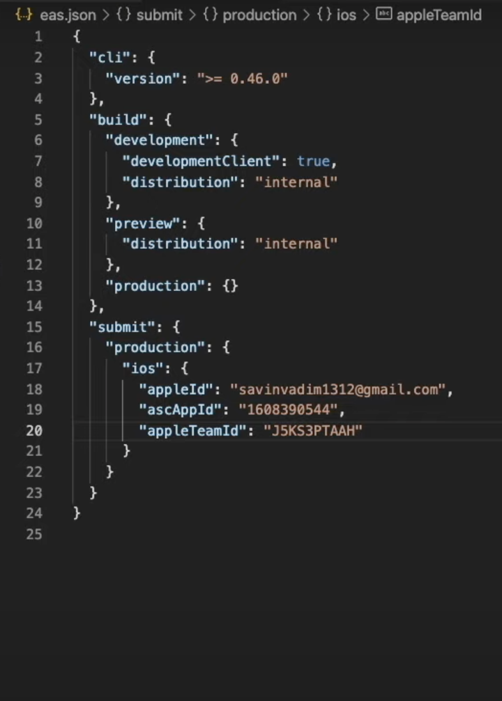

Now the only thing that's left here is to run `eas submit -p ios --latest` command and select **Add a new ASC API Key** after which we will have to confirm that we want to generate a new key.

EAS will also ask you to login to your Apple Developer Account like before, so do that and that's it, your application will be scheduled for iOS submission! You can click on the **Submission Details** link in order to track the progress and after it is finished we will be able to continue.

Once the submission is completed, we can go back to the **App Store Connect** dashboard and navigate to the **TestFlight** tab in the top bar menu.
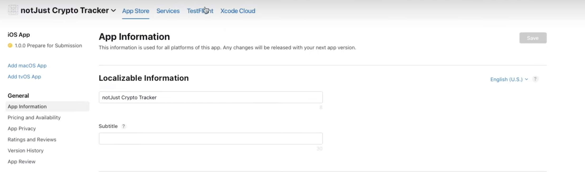

In here, navigate to **Builds** -> **iOS** on the left side menu, and you should see your first build. *(It may take some time to show up and for processing to finish, so give it around 10 minutes)*
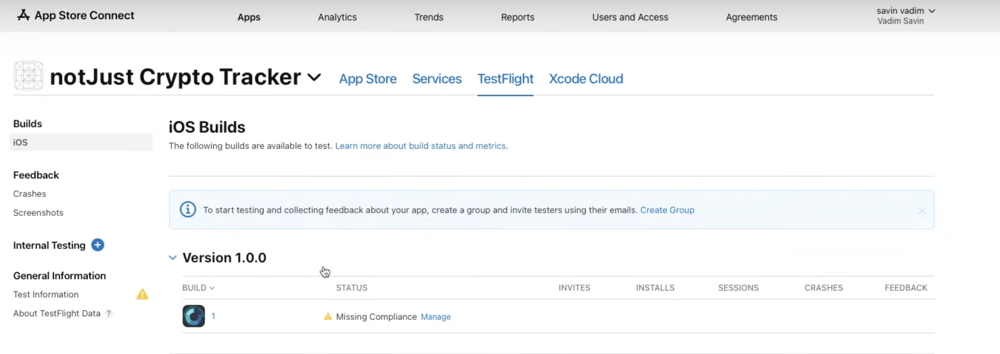

After the processing is finished you will see a warning near your build saying *Missing Compliance*, click on the **Manage** button and select **Yes** if your application use any encryption and **No** if it does not, then click **Start Internal Testing**. 
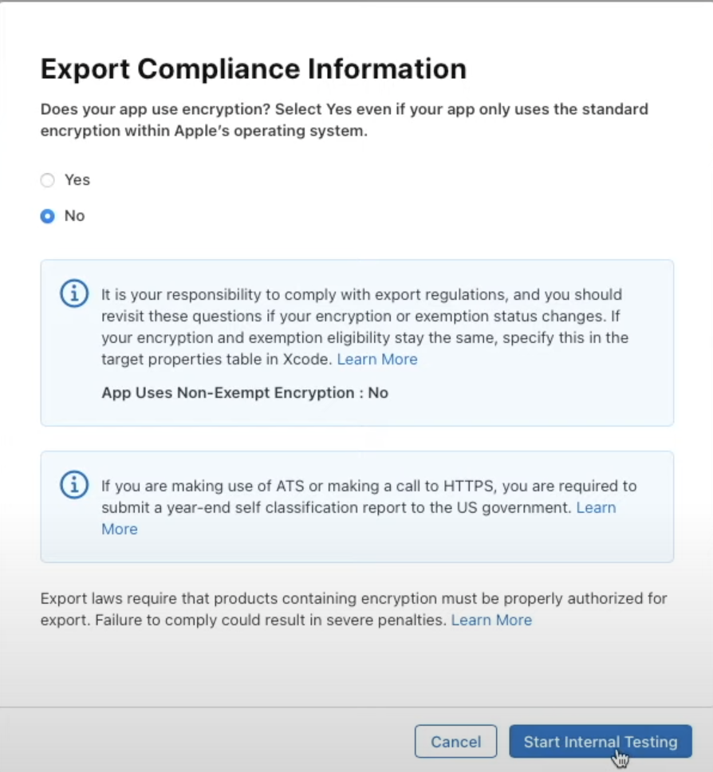

## Submitting Application To Apple Review

Before we can release our application to the App Store, we need to submit it for the **Apple Review** and pass it. In order to submit the app for the review, let's go back to the main dashboard screen by clicking **App Store** in the top menu bar.

Now we need to scroll down until we find **Build** section and click **Select a build before you submit your app**.

In the pop-up window select the build that you want to submit and click **Done**. After that, scroll to the top of the page and click **Add for Review** in the top right corner.
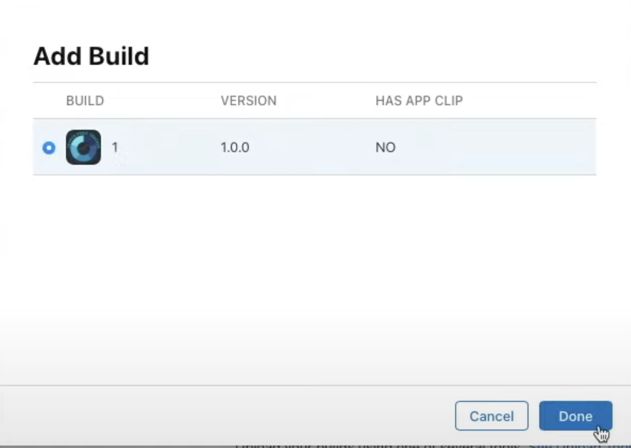

In the next page we will be able to review the details of the submission and if everything is correct click **Submit to App Review**.

Now we have to wait around 24 hours untill Apple fully reviews our application and approves it, so stay patient and I will wait you here!

## Releasing Application To The App Store

Finally, we can release our application to the App Store!! 🥳 🥳
To do that, simply click **Release This Version** in the top right corner of the **App Store Connect** dashboard, approve the release in the pop-up and that's it!
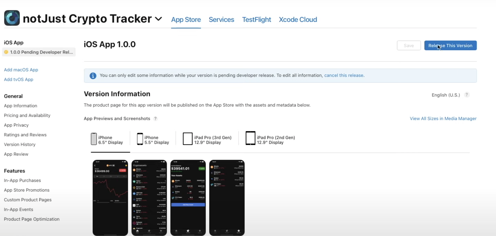

## Updating Application

When updating Expo application, you almost always have two options **Over The Air (OTA)** updates and normal updates. In this section, I will show you how to do both and try to explain when to choose which.

### OTA Updates

With OTA updates you can release new functionality, quick bug fixes or almost anything that you need by simply opening your project in the code editor and running `expo publish` in the terminal. Once the command is executed, the next time user opens your application on their phones, they will see the new update.

But OTA updates have a few limitations, if you change anything in the ios or android folders, if you change your splash screen, icon, app name, owner, scheme, add new libraries, change your libraries or do anything that is listed in [this](https://docs.expo.dev/workflow/publishing/) article, then you will have to release a normal update. *(Also, I would suggest releasing normal updates after implementing big features or making big changes)*

### Releasing New Update

First things first, we have to increment application *version* and ios *buildNumber* in the **app.json** file. Then run `eas build --platform ios` command in the terminal, login to your Apple account and EAS will take care of the rest automatically.

Once the build is finished, run `eas submit -p ios --latest` in the terminal and wait until EAS submits your build to the **App Store Connect** as well as until **App Store Connect** finishes processing your build.

Now go to the **App Store Connect** dashboard, then open TestFlight tab and fix the warning with **Missing Compliance** the same way as we did when submitting the first build.

After that, go back to the **App Store** tab in the **App Store Connect** dashboard and click on a **+** symbol near **iOS App** title.
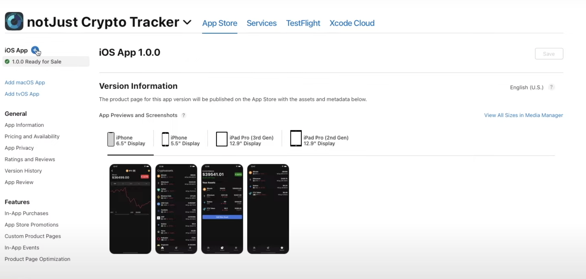

In the pop-up, provide a new version number (most likely it will be 1.0.1) and click **Create**.

Then scroll down to the **What's New in This Version** section and simply provide the details of what you have changed in this new version.

Now scroll a bit more until you find **Build** section, here just like before click on **Select a build before you submit your app**, select the new build and scroll to the top of the page to save these changes by clicking **Save** button in the right top corner.

Lastly, click **Add for Review** near the **Save** button and follow the same steps from before.

That's it, Apple again will take around 24 hours to review your application, after which you will be able to come back to the dashboard and release a new version just like we did before!

I hope this guide was clear, comprehensive, and helped you to easily release your application to the Apple's App Store! I also hope that your application will be the next hot app on the store! Good luck and keep coding! 🤓
