import YoutubeVideo from '../../../src/components/shared/YoutubeVideo';

So, finally after a long time of developing your application you are ready to take it to the next step and publish it to the Google Play Store, CONGRATULATIONS! But we still have to go through a few more steps before we can start celebrating, and I will try to guide you through them as clearly as I can. Let's buckle up and start working!

During this guide, we will use **Expo Application Services** because it makes everything SOOO much easier and faster that I think you will enjoy using it as well! 😊

Quick side note, if you prefer following video tutorial instead, you can watch the video below.
<YoutubeVideo id="oBWBDaqNuws" />
If you chose to follow the guide - let's roll!

## Creating Google Developer Account

First and foremost, we have to create a **Google Developer Account** so that we could publish our application to the Google Play Store.

To do that, simply go to their [website](https://play.google.com/console/about/), click **Go to Play Console** button in the top right corner and then login with your **Gmail** account. After that, select if you are creating a new account for *Yourself* or *Organization/Business* and click **Get Started ->**.
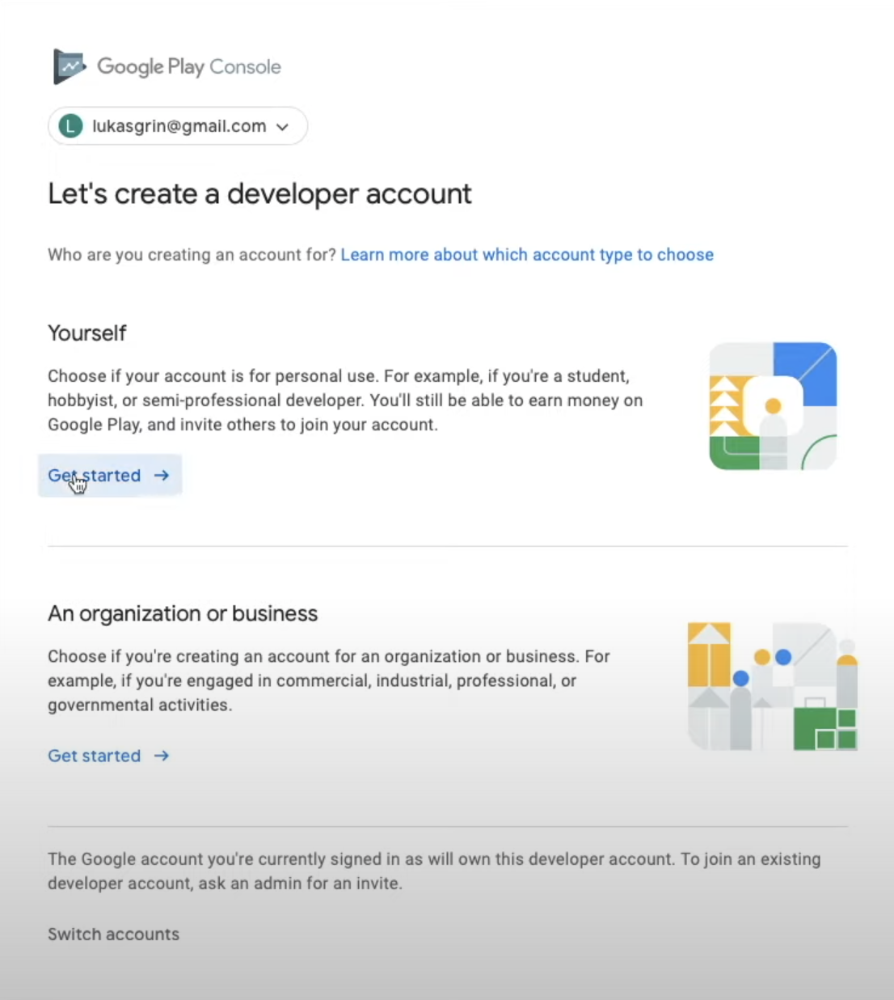

In the next page, simply provide all of the necessary information and click **Create account and pay** on the bottom of the page, after which you will see a pop-up asking you to provide your card details and finalize the purchase. Yes, we will have to pay a one time 25$ fee in order to create a developer account and be able to publish our applications on the Google Play Store.

Once the payment is confirmed, you will be redirected to the next page where you will have to click **Go to Play Console**, which will finally open the dashboard.

## Creating Google Service Account

While we are still in the dashboard, let's create a **Google Service Account**. To do that, in the left menu bar expand the **Setup** tab and click **API access**.
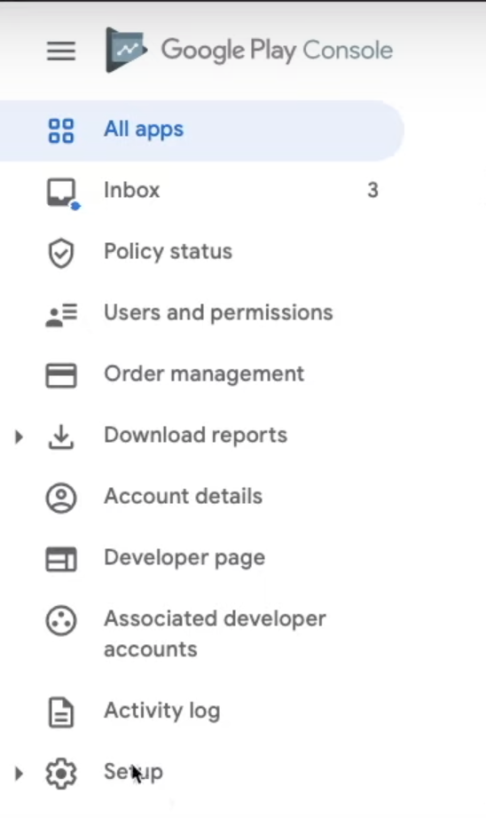

Then click **Choose a project to link**, which will open a pop-up asking you to agree to the Terms of Service, click **I agree** button in the bottom right corner to do that.
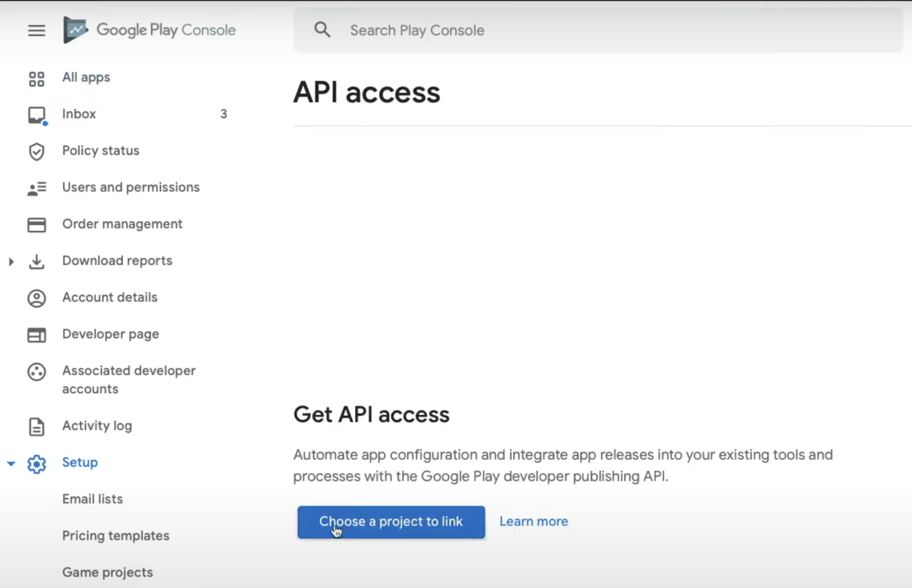

On the next page, select **Create a new project** and click **Link project** on the bottom right of the page.
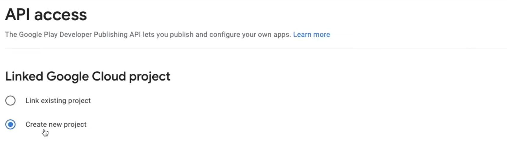

Now click **Create new service account** button to start creating it.
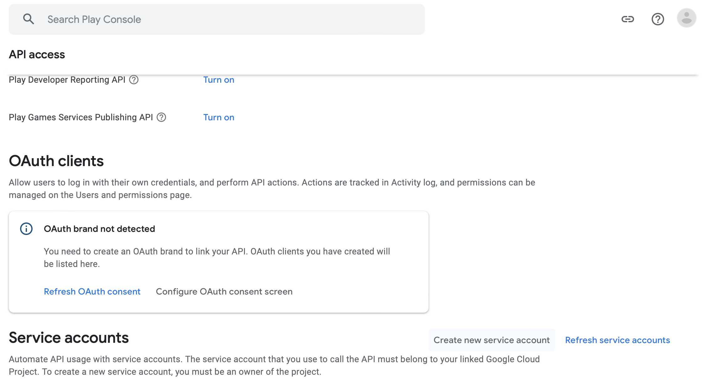

In the pop-up, click on the **Go to the Google Cloud Platform** link, this will open the **Google Cloud Platform** dashboard.

In the dashboard, click the **+ CREATE SERVICE ACCOUNT** button on the top of the dashboard.

And provide the necessary details about the new service account:
- Service account name - The name of this account (you can simply provide your application name here).
- Description (Optional) - Description about what this service account will do.

After providing the details, click **CREATE AND CONTINUE** and in the second step select **Service Accounts -> Service Account User** role. After selecting the role, click **CONTINUE**.
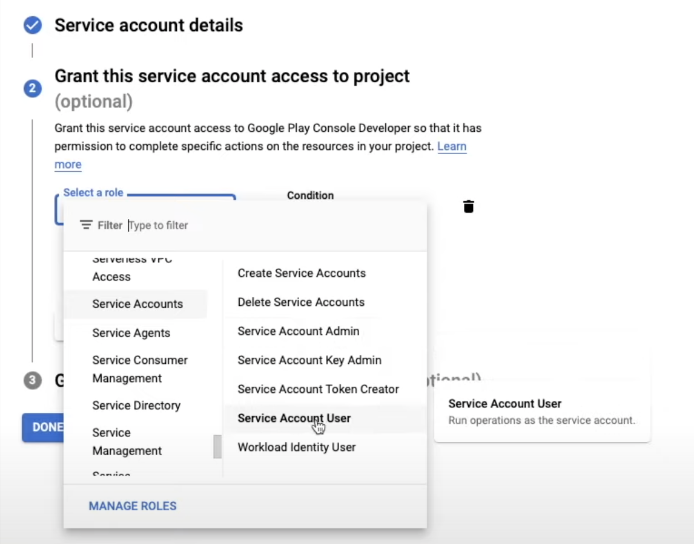

The third step is optional, so we will leave it empty and simply click **DONE**. 
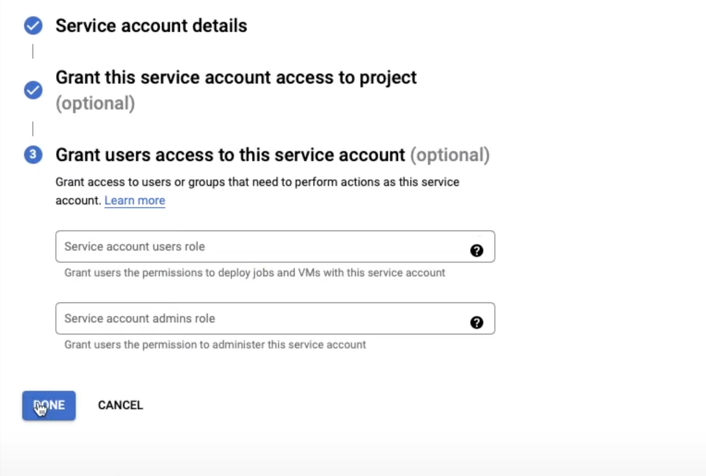

### Creating Service Account Key

We are almost there, but we still need to create a key for this service account. In order to do that, we have to select **Actions -> Manage keys** under the newly created service account.

Now click **ADD KEY** and select **Create new key** in the dropdown.
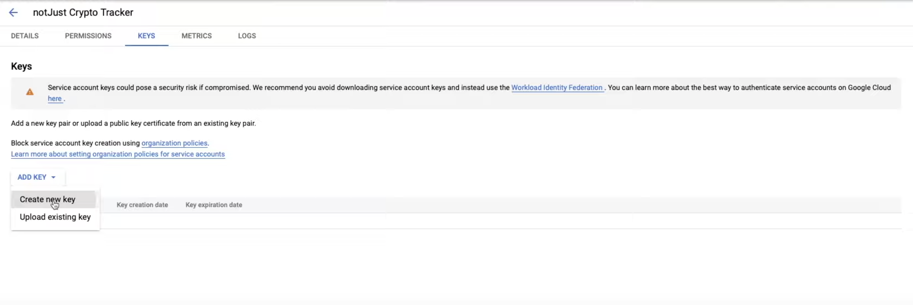

In the pop-up, select **Key Type** of **JSON** and click **Create**. This will create a new key and automatically download it to your computer - STORE IT SAFELY!
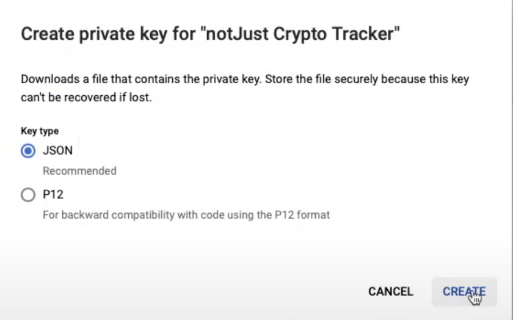

Once the download is finished, you can close the pop-up and **Google Cloud Platform** dashboard. In the **Google Play Console** dashboard, close the pop-up by clicking **Done** and you should see your new service account under **Service Accounts** tab. *If you don't see it, try reloading the page*

Our last step is to grant the access to this service account. To do that simply click **Grant access** button near your newly created service account, in the next page simply click **Invite user** button in the bottom right corner and in the pop-up confirm the invite by clicking **Send invite**.
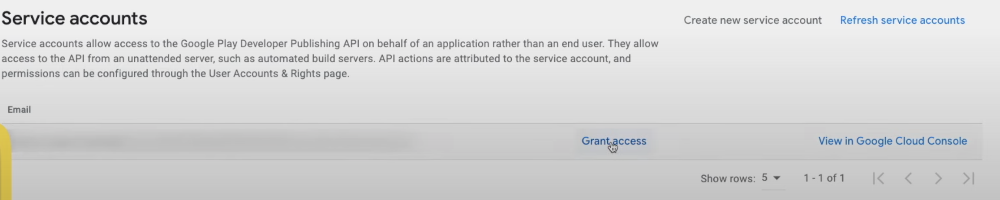

## Creating Expo Account

We will need an expo account to use **Expo Application Services**. So, to create your expo account go to their [website](https://expo.dev), click **Sign Up** button in the top right corner and complete the registration process. After that, confirm your email address, and we are ready to go!

## Creating First Build

### Adjusting Application Settings

Before we can create our first build, we need to adjust some information about our application. To do that, open your code editor (in my case it is **Visual Studio Code**) and navigate to your **app.json** file. In here we will have to change:
name - The name of your application.
slug - A piece of URL that represents your application.
package - Application package name.
versionCode - Your android application version. *When releasing a new update, this will have to be incremented by one every time*.

After these changes, your **app.json** should look similar to this.
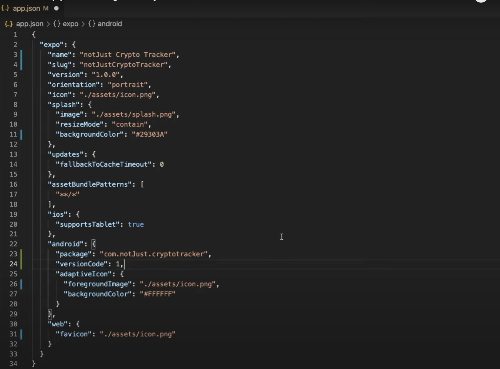

### Installing Expo Application Services

Before we can start using **Expo Application Services** we need to install it by opening the terminal and typing `npm install -g eas-cli`.

Once the installation is finished, we can login to our expo account by typing `eas login` in the same terminal and providing the username as well as the password of the expo account that we have created earlier. *(You can test if you logged in successfully by typing `eas whoami` in the terminal, which should display your username).*

### Configuring The Project

The last step before we can start creating our first build is to configure the project. We can simply do that by running `eas build:configure` in the terminal, and choosing android as our platform. This command will create *eas.json* file in your project, which we will adjust a bit later.

### Creating The Build

Finally we can create our first build! So let's not waste any time and start doing that by running `eas build --platform android` command in the terminal. *If you don't have an **Android Keystore**, then EAS will ask you if you need one, select **Yes** and EAS will take care of the rest.*

To track the progress of your build simply click on the *build details* link in the terminal, which will open a new tab in your browser with all the details.

Once the status of the progress changes to **Finished**, it means that finally we have our application build, and we can download it by clicking **Download** button. *Keep the downloaded file somewhere close, because we will need it very soon*.
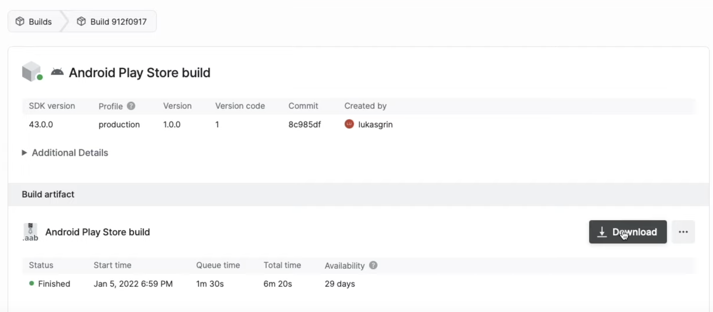

## Creating The Application On The Google Play Console

Before we can start setting up our application, we have to create it on the **Google Play Console**. Therefore, go back to the dashboard and simply click **Create app** in the main dashboard screen.
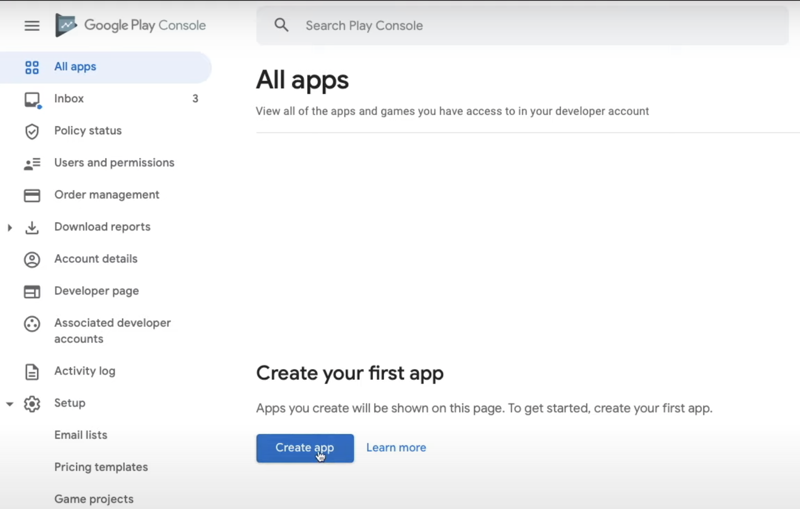

In this page we will have to provide some basic information about the application:
- App name - The name that will be displayed for the users on the Google Play Store.
- Default language - What default language does your application use.
- App or game - Select if your application is a game or an app.
- Free or paid - Select if your application is free or paid.

And lastly, we will have to confirm that the application meets the **Developer Program Policies** as well as accept US export laws. After that, simply click the **Create app** button in the bottom right corner, and you will be redirected to your application dashboard.

## Setting Up The Application

Now it's time to provide more detailed information about the application. To start, in your application dashboard simply scroll until you find a **Set up your app** tab and click **View Tasks** dropdown which will expand the list of task that we will have to go through.

*After every step don't forget to click **Save** button in the bottom right corner and go back to the main dashboard page after that.*

### App Access

Here you will have to select if your application is restricted based on login credentials or any other form of authentication. If it is, then you  will have to provide instructions on how to access them, if it is not, then simply select **All functionality is available without special access**.
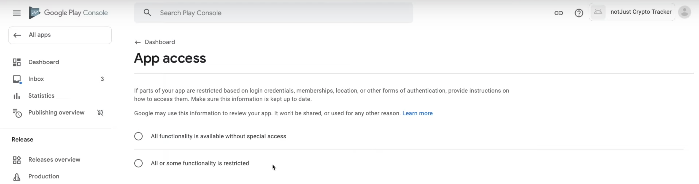

### Ads

Here you will have to select if your application contains any ads. If it does, you have to make sure that ads comply with Google ads policy. Also, keep in mind that selecting **Yes** will show users that your application contains ads before they download the app.

### Content Ratings

In this section you will have to complete a short questionnaire about your application, after that your application will receive an official content ratings. Ratings will be displayed on Google Play Store to help users identify if your app is suitable for them.

### Target Audience

In this section simply select the target age group that suits your application and in the next page answer to the question whether your app may unintentionally appeal to children.

### News App

Simply answer to whether your application is a news application or not.
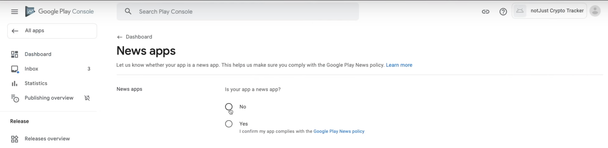

### COVID-19 Contact Tracing And Status Apps

This section is more relevant to the applications that are somehow related to the COVID-19 and who knows, maybe by the time you are following this guide it's not even there. But if it is, just select all statements that apply to your application.

### Data Safety

Before doing anything here, we need to add privacy policy, but it would take too much time to write it from scratch now, therefore I did some research and managed to find a website that will help you to generate your privacy policy at least for now. Open the [website](https://app.privacypolicies.com/wizard/privacy-policy) and go through the questionnaire. After you are finished with that, your privacy policy URL will be generated, so just copy the URL and go back to the **Google Play Console** dashboard. 

In the dashboard scroll to the bottom of the side menu and under **Policy** tab click **App content**.

In here, click **Manage** under **Privacy policy** tab. Then paste the URL that you just copied in the box and click **Save** button in the right bottom corner.

After the steps above, scroll to the top of the side menu and go to the **Dashboard** where we will be able to continue.

This section helps users to understand how your application collects and shares their data. At first, you will be asked if your application collects or shares certain types of data, then if it does just answer to the questions about each type of user data and when you are done simply review, and submit the answers.

### Select An App Category And Provide Contact Details

In this section, we will have to provide some more details:
- App or game - Select whether the application is an app or a game.
- Category - Select which category fits your application the best.
- Email address - Email address which can be used to contact you by the users.
- Phone number (Optional) - Phone number which can be used to contact you by the users
- Website (Optional) - URL to the website of yours.
- External marketing - I recommend leaving the box ticked if you want your application to be advertised outside of Google Play.

### Set Up Your Store Listing

Finally, the last step of the set up! In this section, we will have to provide:
- App name - The name of your application. *Most likely this will be already populated with the correct name*
- Short description - Short description of your application. One good catchy sentence should work very well here.
- Full description - Long description of your application. Spend some time here to write a good description if you want to increase your downloads.
- App icon - The icon that will be displayed on the store. *(512px by 512px)*
- Feature graphic - A larger banner that Google will display in the store. *(1024px by 500px)*
- Phone screenshots - At least two screenshots of your application, I would recommend 4 if you want to be eligible for promotion. You can simply take screenshots from the emulator.
- 7-inch tablet screenshots - Up to eight 7-inch tablet screenshots. You can take screenshots from the emulator the same way just for a tablet.
- 10-inch tablet screenshots - Up to eight 10-inch tablet screenshots. Again, you can simply take screenshots from the emulator just for a 10-inch tablet.

## Submitting New App To Google Review

Now that we have the application all set up, we can start submitting it to the Google Review! First thing that you will have to do is scroll down and find under the **Release your app** tab **Publish your app on Google Play** section, then click **View tasks** dropdown and select the first task.
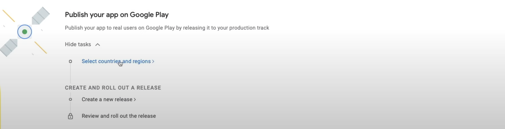

### Select Countries And Regions

In here, click on the **Add countries / regions** button in the middle of the screen and select the countries that you want your application to be available on. After doing that, go back to the main dashboard screen.

### Create A New Release

In this page, click **Create new release** button in the middle of the screen and provide the required information:
- App bundles - Here you will need to upload the build that we have downloaded earlier from the expo.dev dashboard.
- Release name - This will not be shown to the users on Google Play Store, it's just so that you could follow each release easier.
- Release notes - Add new release notes to the user, so that it would be clear what this new version added, changed or fixed.

After providing the information, click **Save** button in the bottom of the right corner and then click **Review release** to check if your release doesn't have any errors. If everything is good, simply click **Start rollout to Production** in the right bottom corner of the screen and confirm the rollout in the pop-up.

That's it, you have submitted your application to the Google Review! Now it will take around 24 hours for Google to review your application and if everything meets their guidelines, your application will change status from **In Review** to **Available on Google Play**, and it will be automatically listed on the Google Play Store!!

## Updating Application

When updating Expo application, you almost always have two options **Over The Air (OTA)** updates and normal updates. In this section, I will show you how to do both and try to explain when to choose which.

### Releasing New Update

First things first, we have to increment application *version* and android *versionCode* in the **app.json** file, which after the changes should look something like this.
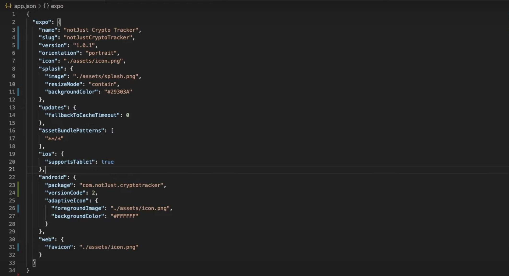

Then we need to open **eas.json** file and add:
- "serviceAccountKeyPath" - The path on your computer to your service account key that we have downloaded earlier in the guide.
After the changes, your **eas.json** should look something like this.
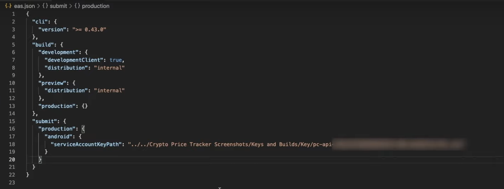

Then open the terminal and run `eas build --platform android` command, after that EAS will take care of the rest automatically.

Once the build is finished, run `eas submit -p android --latest` in the terminal and wait until EAS submits your build to the **Google Play Console**.

Once the submission is finished, go back to the **Google Play Console** dashboard and click **Releases Overview** in the side menu under **Release** tab, and you should see your new release under the **Latest releases** section. 

In order to release this version to production, simply click the arrow near this new release.
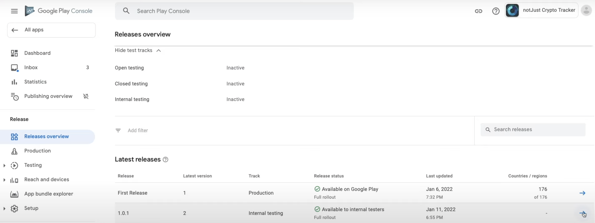

Then click **Promote release** dropdown in the top right corner and select **Production**.

Now you will see the same page as before, so provide all of the necessary information, then click **Save** and **Review release**, after which you should follow the same steps from before.

Now it's time to wait, this review should take less time, but sometimes it takes longer as well, so be patient!

After the review is finished, your users will be able to download a new update!

### OTA Updates

With OTA updates you can release new functionality, quick bug fixes or almost anything that you need by simply opening your project in the code editor and running `expo publish` in the terminal. Once the command is executed, the next time user opens your application on their phones, they will see the new update.

But OTA updates have a few limitations, if you change anything in the ios or android folders, if you change your splash screen, icon, app name, owner, scheme, add new libraries, change your libraries or do anything that is listed in [this](https://docs.expo.dev/workflow/publishing/) article, then you will have to release a normal update. *(Also, I would suggest releasing normal updates after implementing big features or making big changes)*

That's it, we have covered everything that you need to know in order to release your application to the Google Play Store! I hope this guide was clear, comprehensive, and helped you to easily release your application! I also hope that your application will be the next hot app on the store! Good luck and keep coding! 🤓

