import YoutubeVideo from "../../../src/components/shared/YoutubeVideo/YoutubeVideo";

So, finally after a long time of developing your application you are ready to take it to the next step and publish it to the Apple's App Store, CONGRATULATIONS! But we still have to go through a few more steps before we can start celebrating, and I will try to guide you through them as clearly as I can. Let's buckle up and start working!

Quick side note, if you prefer to follow a video format tutorial instead, you can watch the video below.
<YoutubeVideo id="r-Z--YDrmjI" title={frontmatter.title} />
If you chose to follow the guide - let's roll!

## Creating Apple Developer Account

First and foremost, we have to create an **Apple Developer Account** so that we could publish our application to the Apple's App Store.

To do that, simply go to their [website](https://developer.apple.com), click **Account** in the top menu bar and then click **Do not have an Apple ID? Create yours now.** In the register page provide all of the information that Apple is requiring and click **Continue**. After that you will be asked to confirm your email address by entering the code that they've sent you and later also confirming the phone number that you've provided.

### Enrolling to Apple Developer Program

In order to be able to manage your application and most importantly publish it to the App Store you need to enroll to the **Apple Developer Program**, and it costs 99$ a year which is pretty steep compared to Google Play but there is no way around it if you want to have your application on the App store.

To enroll, simply click the gray box on the bottom of the dashboard.
 
In the next page you can read a bit about the benefits of the program and click the tiny blue **Enroll** button on the top right side of the page.

Now in this page you can read a bit on what you need in order to enroll either as an individual or organization. When you are finished reading, scroll down to the bottom of the page and click **Start Your Enrollment**.

Then provide the necessary personal information, click **Continue** and in the following page select if you are developing applications as an individual or organization, after which you can click **Continue** again and in the last registration page simply review as well as confirm that you agree with Apple's **Developer Program License Agreement** and click **Continue**.

Now in the last step you will have to pay those 99$ that I've told you about earlier in order to complete your enrollment. After the payment, you will be redirected to the main dashboard, and we will be able to continue!

## Creating New Application

### Creating Bundle Identifier

The first thing that we need to do before we can create our application on the **App Store Connect** is to create an application identifier and we need it in order to uniquely identify the application on the app store. To create a new identifier, simply click **Certificates, IDs & Profiles** button on the left side menu.
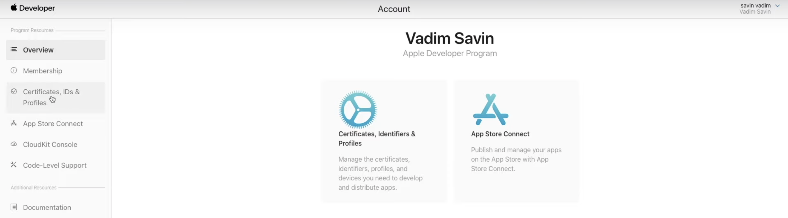

After that, select **Identifiers** on the left side menu.
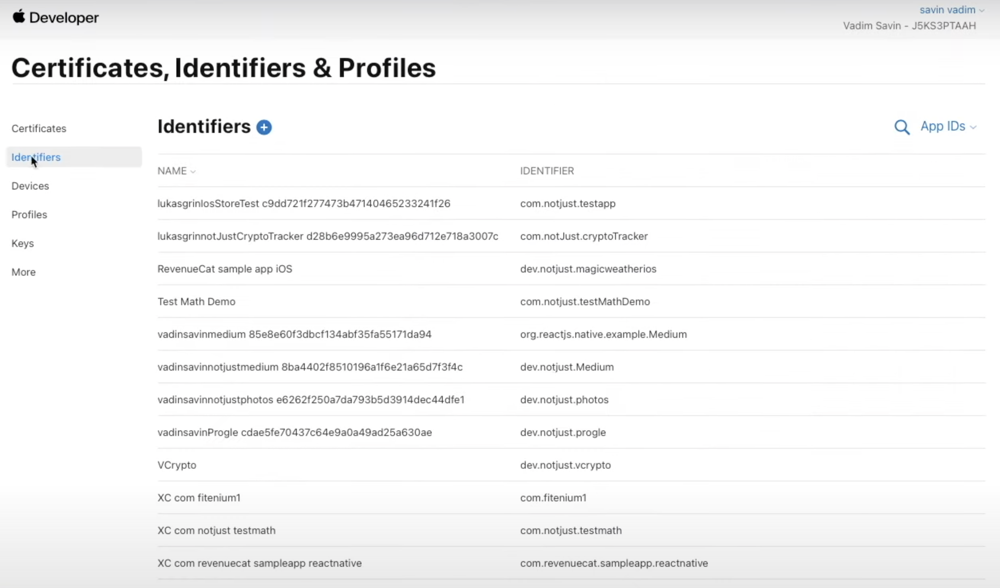

And then click the **+** button to add a new identifier.

Now we need to select **App IDs** in the list and click **Continue**.
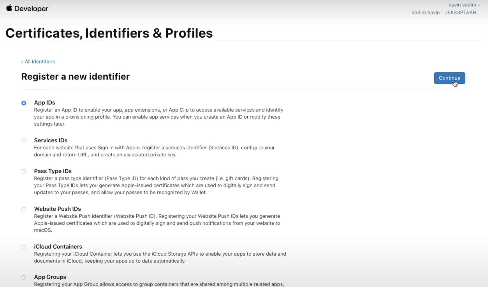

Then select a type of **App** and once again click **Continue**.

And in the last step we will have to provide some more information about this identifier. Firstly, we need to provide an identifier description that's only going to be visible to you, so make it clear for yourself. Secondly, we need to select **Capabilities** that your application has, it's very common to have *Push Notifications*, *Sign In with Apple* and *Maps*, so make sure to tick those boxes if you use any of that. If your app doesn't use any of those capabilities, simply leave them unticked. And lastly, we need to provide a unique **Bundle ID**. I recommend following a reverse-domain name style (com.domainname.appname).

After providing all of the necessary details, click **Continue**, then in the next page review all of the information and if everything is correct click **Register**.
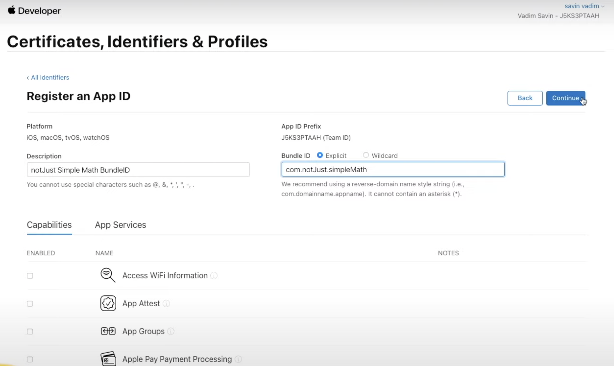

### Creating App In The App Store Connect

Now we need to go to the App Store Connect [website](https://appstoreconnect.apple.com/login) and log in to our Apple developer account that we created a few minutes ago.

After logging in, click on the **My Apps** icon.

Then click on a **+** symbol next to the **Apps** title and select **New App** to start creating your application.

Now you should see a pop-up card where we will have to provide some information about the application.
- Platforms - Because we are releasing this application only for *iOS*, that's what we will choose.
- Name - Provide the name of your application that users will see on the App Store.
- Primary Language - Provide the primary language of your application.
- Bundle ID - Here you should select the bundle ID that we have created a few minutes ago.
- SKU - This is a unique ID for your application, you can make it the same as your Bundle ID.
- User Access - Here you can select what access certain roles have, but more times than not you will choose **Full Access**, especially as an individual.

After providing all of the necessary information, click **Create** and wait a minute before reloading the page, which should display your application!

If your application appeared, click on it and now the real "fun" begins 😄

### General Application Information

Let's start by uploading application screenshots. We will need at least one screenshot for:
- 6.5-inch iPhone Display
- 5.5-inch iPhone Display
- 12.9-inch iPad Pro (3rd Gen) Display
- 12.9-inch iPad Pro (2nd Gen) Display

You can simply take these screenshots from the simulator. To upload them, click on the screen size that you are uploading for and then click **Choose File**, after that select the screenshots from your computer.

Now let's scroll a bit down and provide:
- Promotional Text - This will always appear above the description, so one good sentence about your application should be good here.
- Description - Think about this very well because it's pretty important to give a good idea to the users about your application.
- Keywords - Also very important, create good keywords that suite your application if you want your app to appear better in the search results.
- Support URL - If you already have, you can paste the URL either to your website or your privacy policy. If you don't have either of them, don't worry, I will show you how to get your privacy policy URL a bit later in the tutorial.
- Version - Pretty self-explanatory, you should provide the version of your app, most likely it's going to be 1.0.0 as it is your first release.
- Copyright - Who owns the copyright to the application.

Then scroll down even more, and we will have to provide some **App Review Information** for the testers.
- Sign-In Information (Optional) - If your application has an authorization screen, then you will have to provide login details to your application for the tester. If your application doesn't have any authorization screen, then simply uncheck **Sign-In required** box.
- Contact Information - Provide your first name, last name, phone number and email in case a tester needs to contact you.
- Notes (Optional) - If you need to, you can provide some notes for the tester.
- Attachment (Optional) - If you need to, you can attach some attachments for the tester.

And lastly in this page we will have to select **Version Release** approach.
- Manually release this version - After the application approval, you will have to go to the dashboard and release the application yourself.
- Automatically release this version - After the application approval, your application will be released automatically right away.
- Automatically release this version after App Review, no earlier than - You can specify the date at which you want your application to be released automatically.

Now we can scroll to the top of the screen and click **Save** button in the top right corner to save the information.

After that, click **App Information** under **General** on the left side menu.

And here we will see that some fields are already populated automatically, but some are still empty, we have to fix that:
- Subtitle (Optional) - If you want, you can add a subtitle to your application.
- Category - Select which category fits your application the best. *You can also select secondary category*
- Content Rights - Click **Set Up Content Rights Information**, and if your application contains, shows or access any third-party content, then select **Yes** in the pop-up, otherwise select **No** and click **Done**.
- Age Rating - Click **Set Age Rating Across All Platforms**, and go through the questionnaire, which will according to the answers automatically generate an age rating for your application.

Now scroll to the top of the page and click **Save**.

After that, click **Pricing and Availability** under **General** on the left side menu.

In here, we simply need to select the price of your application. Most likely it is going to be free, but we still need to specify that by clicking on a dropdown list and selecting the price. Most likely you will want to leave the rest of the information in this page on default settings. After making the changes, click **Save** in the top right corner of the screen.

Now let's set up our application privacy. Click **App Privacy** under **General** on the left side menu.

Privacy policy is very important, but it takes too much time to write it from scratch, therefore I did some research and managed to find a website that will help you to generate your privacy policy at least for now. Open the [website](https://app.privacypolicies.com/wizard/privacy-policy) and go through the questionnaire. After you are finished with that, your privacy policy URL will be generated, so just copy it and go back to the **App Store Connect**.

In the dashboard, click on the **Edit** button near the **Privacy Policy** title.

Simply paste the URL under **Privacy Policy URL** and click **Save**. *(Don't forget to paste this URL under **Support URL** that we left empty earlier in the tutorial)*

While we are still in this page, we can set up our data collection practices. To do that, simply click **Get Started** button in the gray box below and answer to a few questions.

Lastly, we need to save all of this information by clicking **Publish** in the top right corner.

Perfect, we have finished the longest part of the guide, I think you deserve a short coffee break! ☕

## Creating First Build

Before we can create our first build, we need to do some adjustments to our application. To do that, open your app's ios folder on Xcode.

### Login To Apple Developer Account

Now in the top bar hover on **Xcode** and select **Preferences**, which should open a pop-up table.

In the pop-up table top menu bar click on **Accounts**.

Then click on the **+** button in the left bottom corner of the table and select **Apple ID** option in the next pop-up, after which click **Continue** and log in to your Apple developer account.
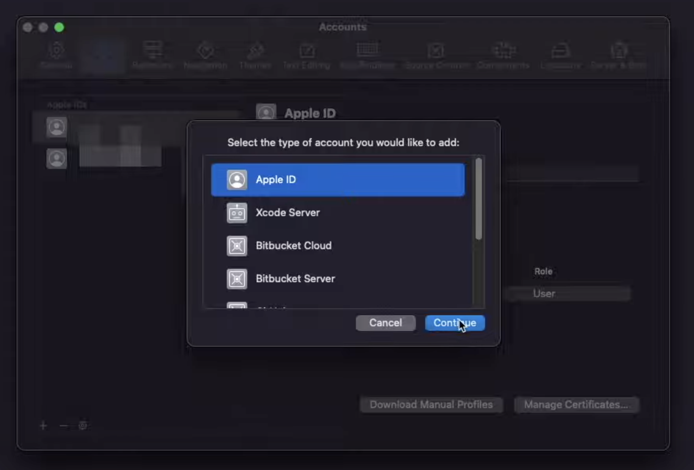

After logging in, close the initial pop-up table and click on your app folder on the left.

Then click on **Signing and Capabilities** tab.

And tick **Automatically manage signing** box.

Last but not least, in the **Team** dropdown select the account that you just logged in with. 
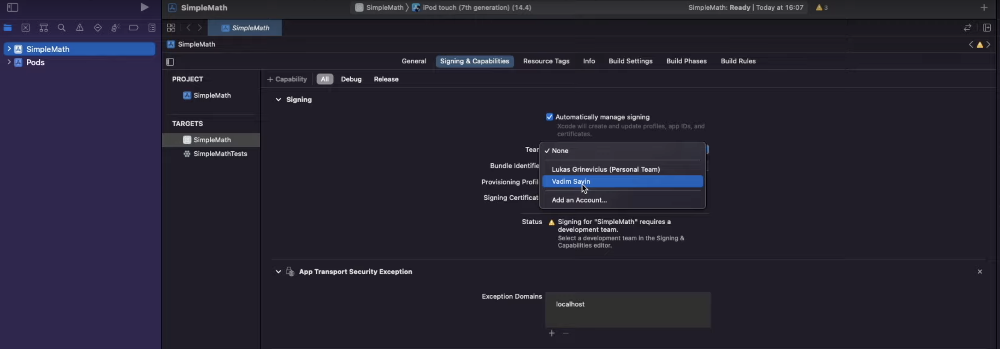

### Adjusting Application Information

Now we will have to adjust as well as provide some information about the application. To start, go to the **General** tab.
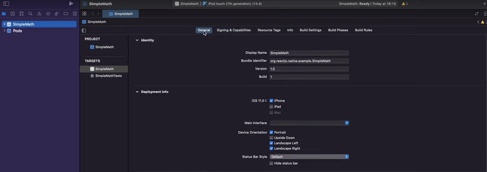

And here provide:

Identity:
- Display Name - The name that's going to be displayed under your app icon.
- Bundle identifier - This should be the same bundle identifier that we have created in the **App Store Connect**.
- Version - This is the version of your application, most likely it's going to be 1.0.0 as this is your first release. *Keep in mind that you will have to increment this number by one with each new update*
- Build - This is the build number for this version, if this is your first release, then this will be 1. *Keep in mind that you will have to increment this number by one each time you create a new build*

Deployment Info:
- iOS - Select whether your app is available only for iPhones or also for iPads.
- Device Orientation - Select what orientation your application supports.

*Leave everything else on default if you don't have much experience with what other settings do/mean.*

### Changing Icons

Now we need to update the icons of our application, and we will need a lot of different sizes of them, but don't worry, I got you covered here as well.

Open this [website](https://developer.apple.com), upload the image that you want to make your icon, tick iPhone box and click **Generate**. 
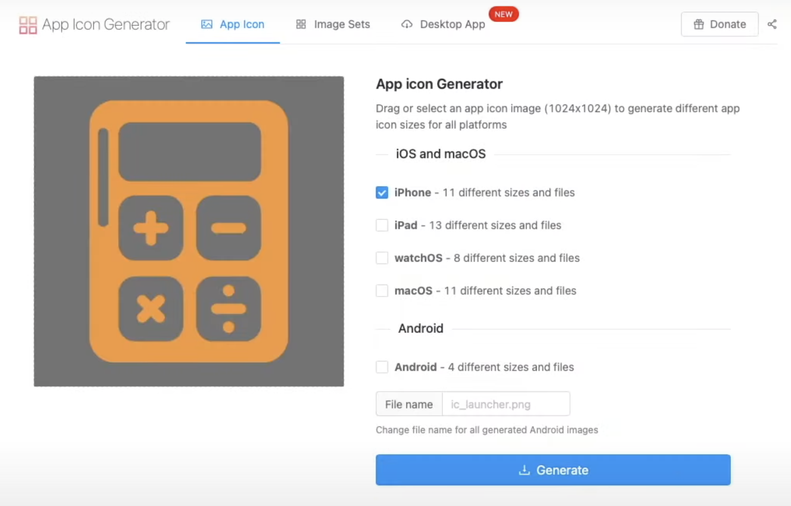

After downloading the zip file, unzip it and navigate to AppIcons -> Assets.xcassets -> AppIcon.appiconset and there you will find all of the icons that we will need.

Now in the Xcode expand directories like shown in the image below and click on **Images**.
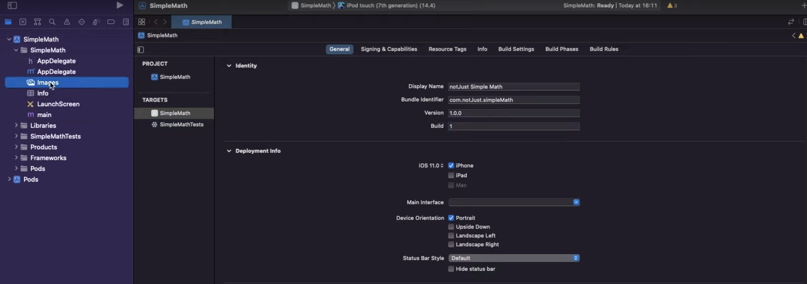

Then click on **AppIcon**.
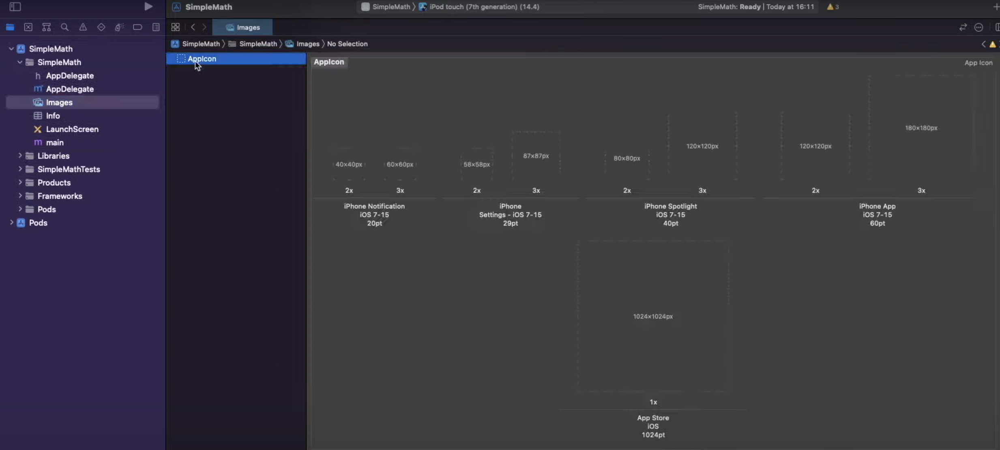

And here, drag the images from the downloaded zip file into their positions. *Names should match*
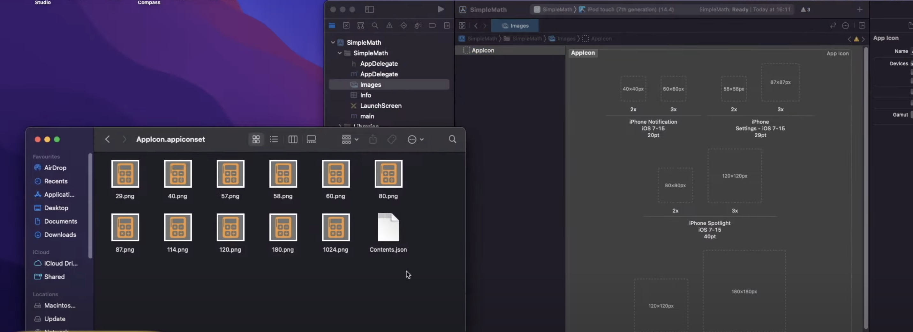

Now let's rebuild the app to make sure that changes took effect and nothing broke. To do that, in the top bar hover on **Product** and click on **Clean Build Folder**.
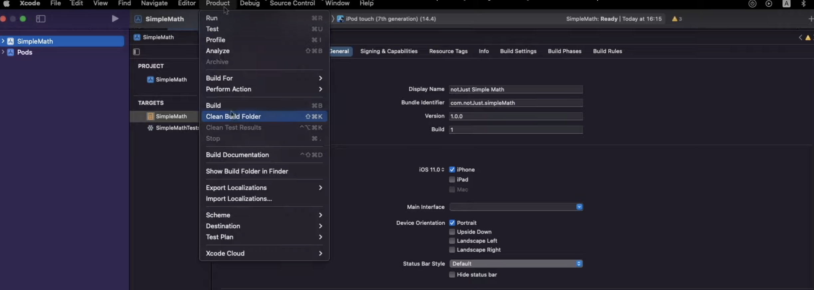

Once the cleaning is finished, hover on **Product** again and click on **Build**. This will take a bit more time, but after it's done, if no errors were shown, we can archive our application!

### Archiving Application

First things first, we need to change the target device. To do that, click on already selected device on the top.
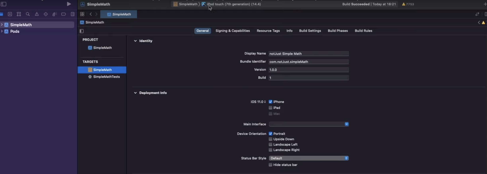

Then scroll to the top and select **Any iOS Device (arm64)**.
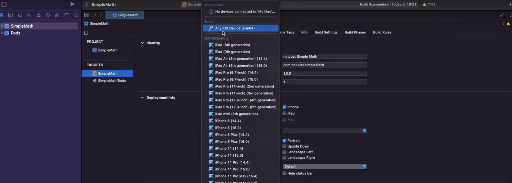

After that, once again hover over **Product** and click **Archive**. *This will take approximately the same time as it took to build the application*

### Submitting New Build From Xcode

Once the archiving is finished, a new window should've opened.
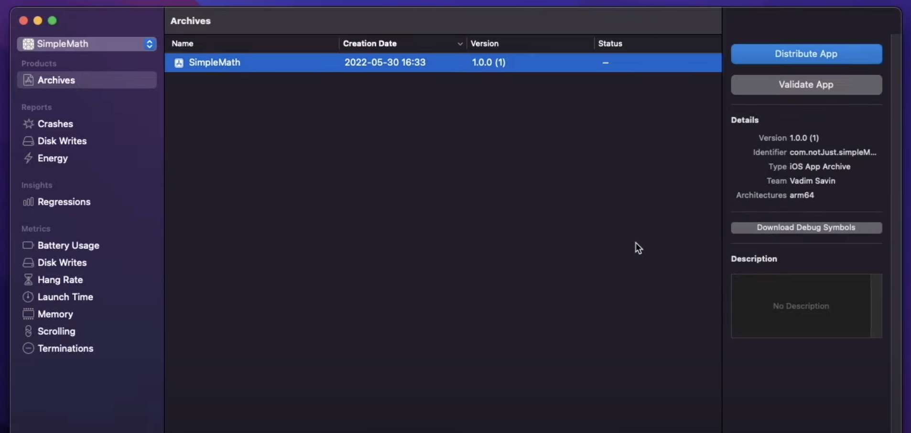

*If this window didn't open automatically, then in Xcode hover over **Window** and click on **Organizer***

In the **Archives** window, select your archive and click **Distribute App**.
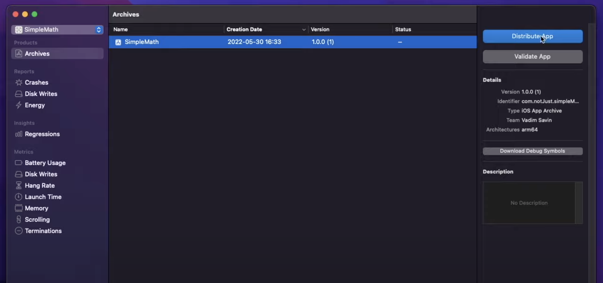

Now we will have to go through a few more setting up steps before being able to submit our app to the **App Store Connect**.

In the first step, just select **App Store Connect** and click **Next**.

In the second one, select **Upload** and click **Next** again.
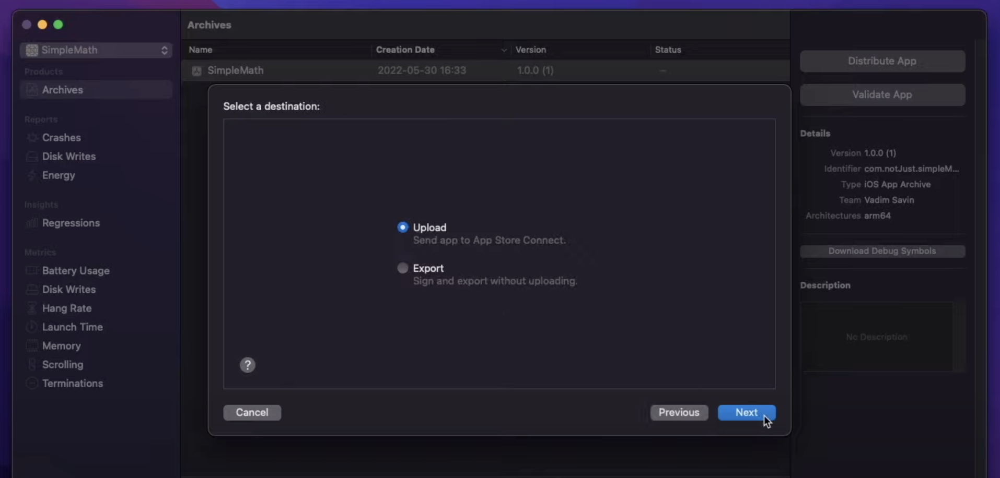

In the third one, leave everything ticked and click **Next**.
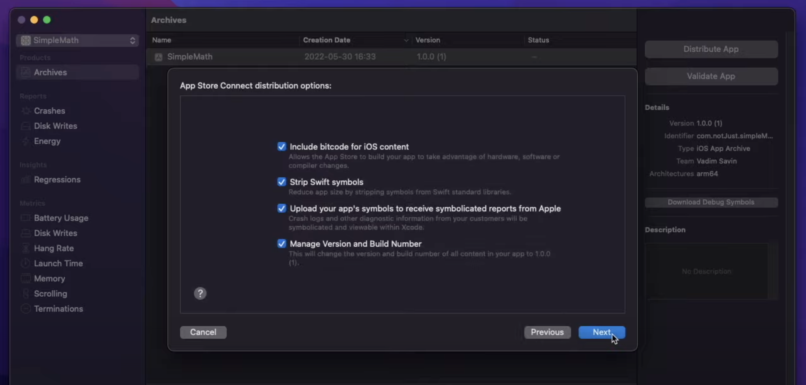

In the fourth step, tick **Automatically manage signing** and then click **Next**.
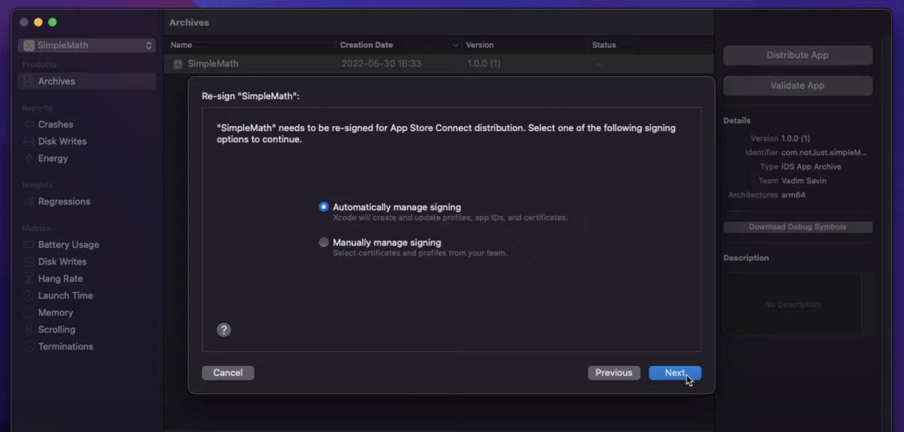

And in the final step, simply review the information and click **Upload**.

Once the uploading is finished, we can go back to our **App Store Connect** dashboard and click **TestFlight** tab in the top menu bar. *Keep in mind that the app will have to be uploaded from the Xcode and then processed in the **App Store Connect**, so everything should take around 10 minutes*

## Submitting Application To Apple Review

Once your newly submitted build appears in the **App Store Connect** dashboard, you should see a missing compliance warning near it. Don't worry, simply click **Manage**.
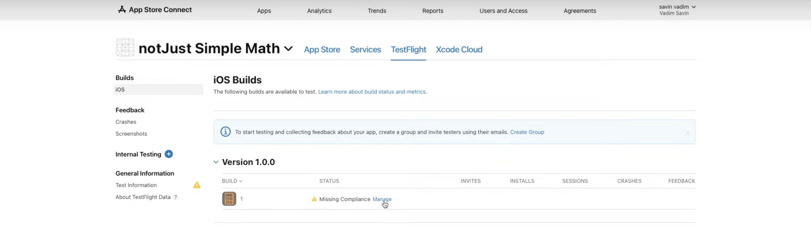

Then select whether your app use encryption and click **Start Internal Testing**. *In my case, I had to select no*

Before we can release our application to the App Store, we need to submit it for the **Apple Review** and pass it. In order to submit the app for the review, let's go back to the main dashboard screen by clicking **App Store** in the top menu bar.

Now we need to scroll down until we find **Build** section and click **Select a build before you submit your app**.

In the pop-up window select the build that you want to submit and click **Done**. After that, scroll to the top of the page and click **Add for Review** in the top right corner.

In the next page we will be able to review the details of the submission and if everything is correct click **Submit to App Review**.
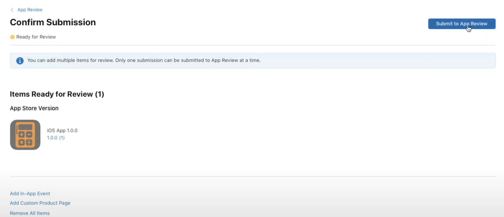

Now we have to wait around 24 hours until Apple fully reviews our application and approves it if all of their guidelines were followed or rejects it with a message of why it was rejected, so stay patient, and I will wait you here!

## Releasing Application To The App Store

Finally, we can release our application to the App Store!! 🥳 🥳
To do that, simply click **Release This Version** in the top right corner of the **App Store Connect** dashboard, approve the release in the pop-up and that's it!

## Releasing New Update

Releasing a new update follows exactly the same steps as releasing the first version, the only difference is that you have to go to the Xcode and increment your version number as well as build number.
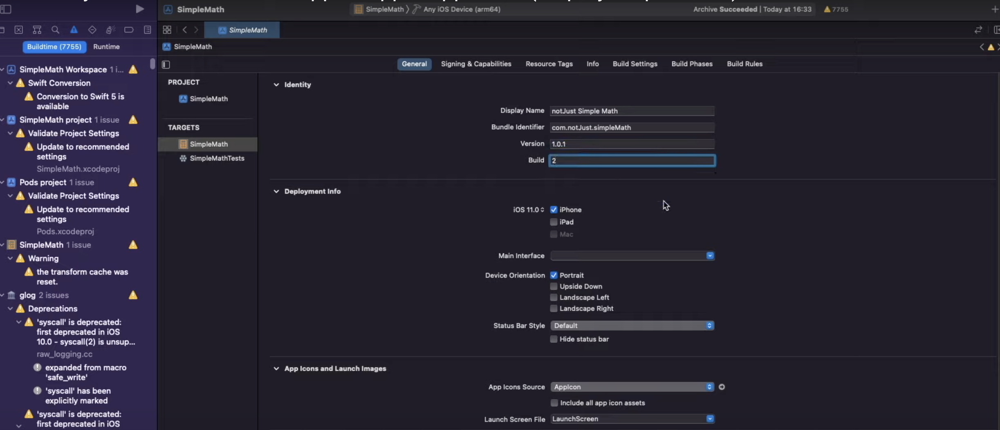

Then simply archive your application and follow the same steps as we did before.

That's it, we have covered everything that you need to know in order to release your React Native CLI application to the Apple App Store!

I hope this guide was clear, comprehensive, and helped you to easily release your application to the Apple App Store! I also hope that your application will be the next hot app on the store! Good luck and keep coding, bye! 🤓
