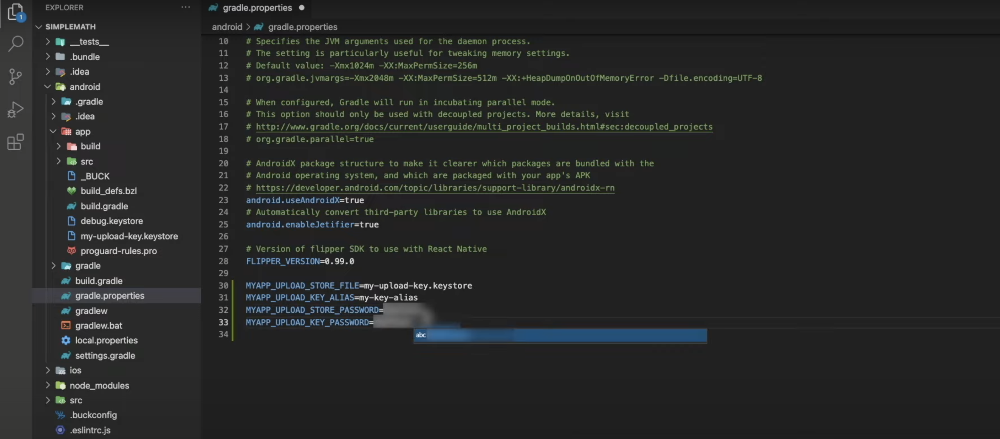
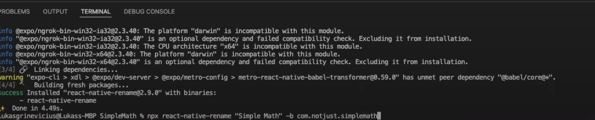
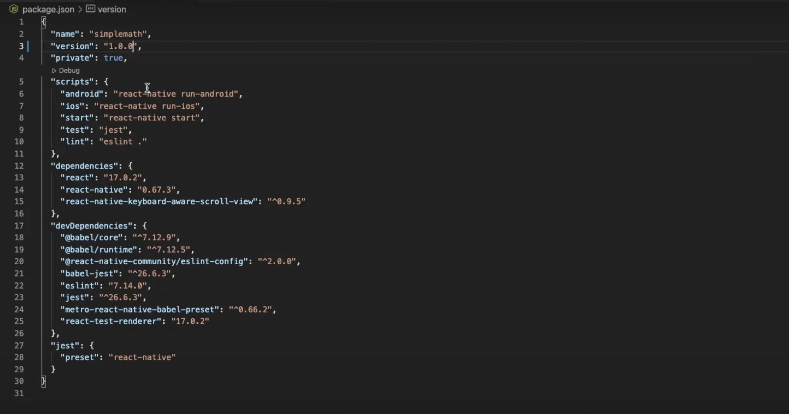
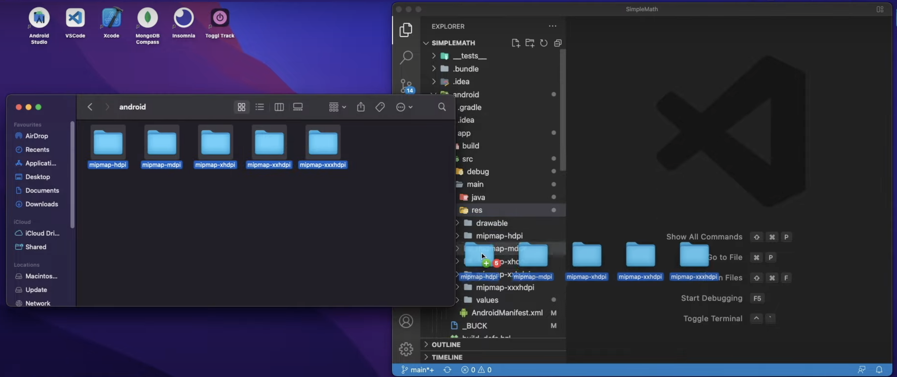
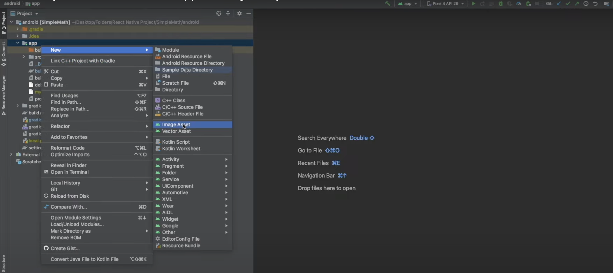
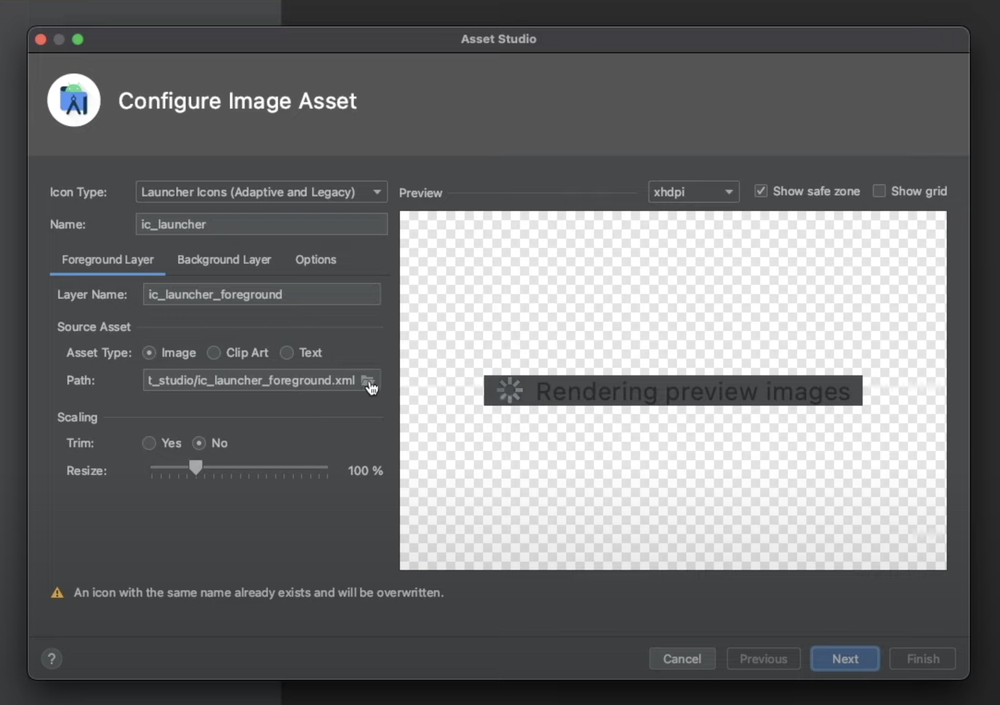
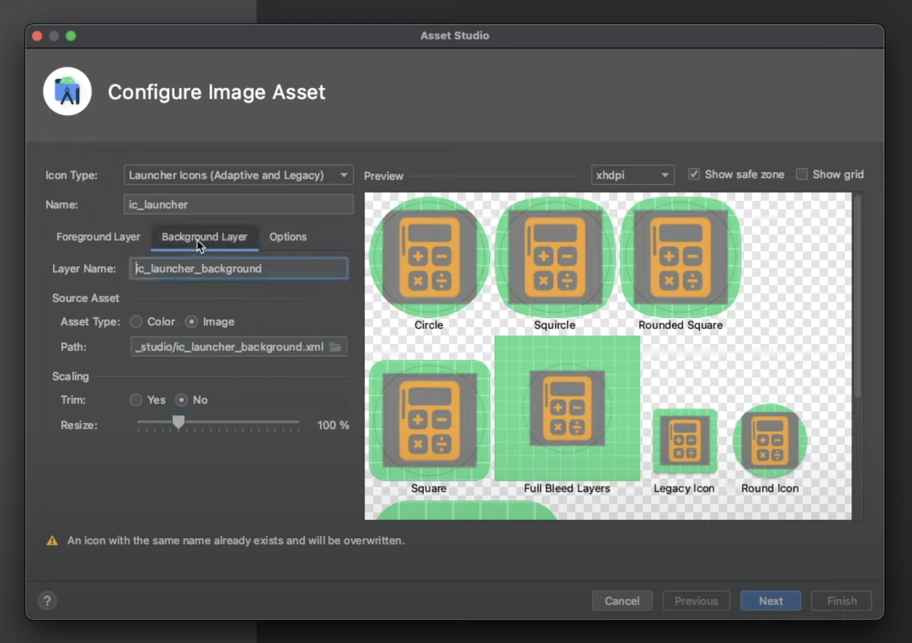
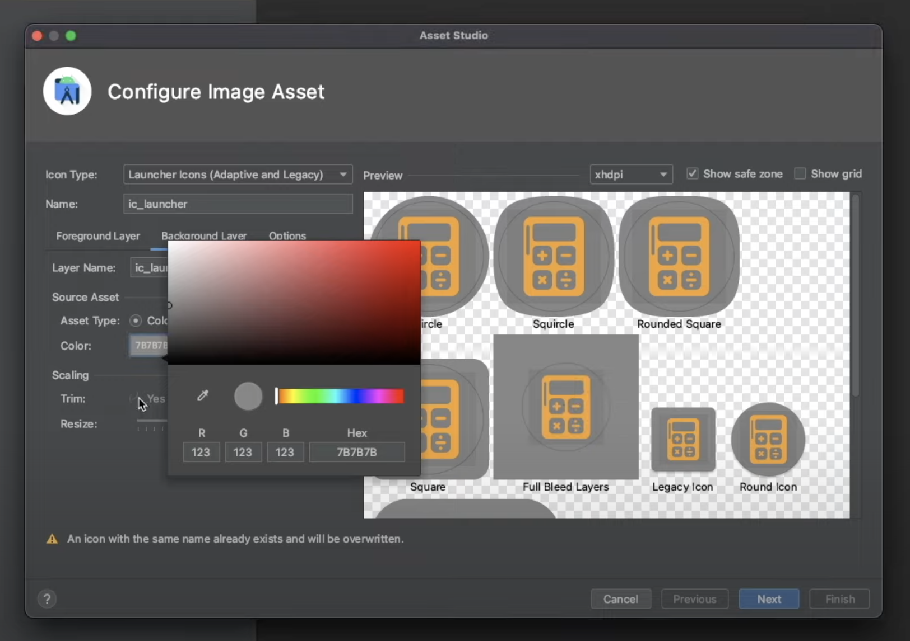
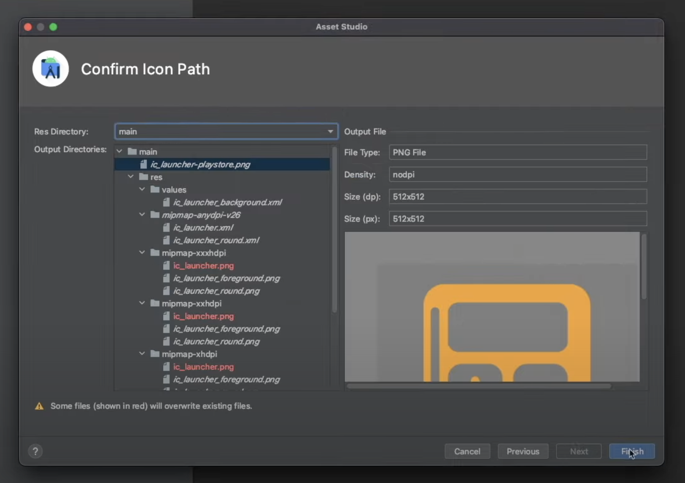
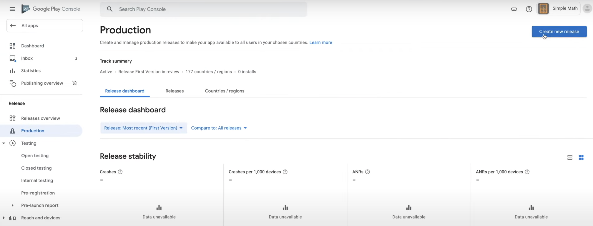

import YoutubeVideo from "../../../src/components/shared/YoutubeVideo/YoutubeVideo";

So, finally after a long time of developing your application you are ready to take it to the next step and publish it to the Google Play Store, CONGRATULATIONS! But we still have to go through a few more steps before we can start celebrating, and I will try to guide you through them as clearly as I can. Let's buckle up and start working!

Quick side note, if you prefer to follow a video format tutorial instead, you can watch the video below.
<YoutubeVideo id="A3--3Ozxz6o" title={frontmatter.title} />
If you chose to follow the guide - let's roll!

## Creating Google Developer Account

First and foremost, we have to create a **Google Developer Account** so that we could publish our application to the Google Play Store.

To do that, simply go to their [website](https://play.google.com/console/about/), click **Go to Play Console** button in the top-right corner and then login with your **Gmail** account. After that, select if you are creating a new account for _Yourself_ or _Organization/Business_ and click **Get Started ->**.


In the next page, simply provide all of the necessary information and click **Create account and pay** on the bottom of the page, after which you will see a pop-up asking you to provide your card details and finalize the purchase. Yes, we will have to pay a one time 25$ fee in order to create a developer account and be able to publish our applications on the Google Play Store.

Once the payment is confirmed, you will be redirected to the next page where you will have to click **Go to Play Console**, which will finally open the dashboard.

## Creating First Build

### Generating an Upload Key

In order to publish your application on Google Play Store, Google requires an upload key to be able to verify your identity, but thankfully generating that key is not that difficult.

First of all, we need to find our Java JDK bin folder. For Windows users it's most likely going to be `C:\Program Files\Java\jdkx.x.x_x\bin` and for Mac users simply run `/usr/libexec/java_home` command in the terminal to find your full path. 

After that, we need to navigate to that directory in our terminal by running `cd ` + the path to your Java JDK bin folder.


And then run:

For Windows users - `keytool -genkeypair -v -storetype PKCS12 -keystore my-upload-key.keystore -alias my-key-alias -keyalg RSA -keysize 2048 -validity 10000`

For Mac users - `sudo keytool -genkey -v -keystore my-upload-key.keystore -alias my-key-alias -keyalg RSA -keysize 2048 -validity 10000`

After running this command, we will have to provide some more details:
- Password - Here you need to provide the password of your computer.
- Enter keystore password - Here you will have to create a password for this key. *Don't forget it!*
- Re-enter new password - Simply repeat the password that you have chosen for this key.
- What is your first and last name? - Provide your first and last name.
- What is the name of your organizational unit? - You can simply say IT here, but if you have an organizational unit, then provide that.
- What is the name of your organization? - Here you need to provide the name of your organization but if you don't have one, simply type *Freelancer* or something like this.
- What is the name of your city or locality? - Provide the name of the city that you are living in.
- What is the name of your State or Province? - Provide the name of your State or Province.
- What is the two-letter country code? - Country code of the country that you are living in.

And in the last step, you need to verify that provided information is correct by typing `yes` or `no`. 

That's it, our upload key is generated! But we still need to add it to our project and to do that, navigate to the Java SDK bin folder where we have created this key and drag it into the project's **android -> app** directory.


Now we have to update the gradle files with the new keystore information and to do that navigate to **android -> app -> gradle.properties** and paste these four lines on the bottom of the page:

`MYAPP_UPLOAD_STORE_FILE=my-upload-key.keystore`

`MYAPP_UPLOAD_KEY_ALIAS=my-key-alias`

`MYAPP_UPLOAD_STORE_PASSWORD=*****`

`MYAPP_UPLOAD_KEY_PASSWORD=*****`

*Don't forget to change **MYAPP_UPLOAD_STORE_PASSWORD** and **MYAPP_UPLOAD_KEY_PASSWORD** to the password that you've created for the keystore*


And lastly, navigate to **android -> app -> build.gradle** and update it with the information below:

```js
android {
    ...
    signingConfigs {
        release {
            if (project.hasProperty('MYAPP_UPLOAD_STORE_FILE')) {
                storeFile file(MYAPP_UPLOAD_STORE_FILE)
                storePassword MYAPP_UPLOAD_STORE_PASSWORD
                keyAlias MYAPP_UPLOAD_KEY_ALIAS
                keyPassword MYAPP_UPLOAD_KEY_PASSWORD
            }
        }
    }
    buildTypes {
        release {
            ...
            signingConfig signingConfigs.release
        }
    }
} 
```

After the changes, it should look something like this:


### Changing The Name And The Package Name Of The Application

This part is not mandatory, but it's pretty common to change the name and/or the package name of your application. And for this, I have found a very nice library that takes care of everything with one simple command, otherwise changing them is a very tedious and error-prone task, especially changing the package name.

Simply run `npx react-native-rename "new_name_of_the_app" -b new_package_name_of_the_app` and that's it, we have managed to save A LOT of time.


### Changing The Version

This part is not mandatory as well, but I think it will make your life easier when releasing new updates, so I have to mention it. 

When releasing a new update, every time you will have to increment version number as well as build number of your application. If you are releasing it for both iOS and Android, that means incrementing them in all of the places, which is even more work and also pretty annoying work.
 
But don't you worry, I have you covered here, with this library you will be able to change the versions and build numbers in all of the necessary places with one simple command.

First of all, go to your **package.json** file and change **"version"**.


After that, simply run `npx react-native-version --never-amend` and that's it!
*Check their [documentation](https://www.npmjs.com/package/react-native-version) for different command options*.

### Changing Icons

Okay, now this part is mandatory, so let's strap our seat belts and continue!

Every application needs icons and in this case we need many different sizes of them, so to make everything easier for you, I have found a very nice tool that helps with that.

Open this [website](https://developer.apple.com), upload the image that you want to make your icon, tick Android box and click **Generate**. 


After downloading the zip file, unzip it and navigate to the **android** folder, there you will find all of the necessary folders.

Now open **android -> app -> src -> main -> res** in your project and drag the folders from the downloaded zip file into your project. *It will ask if you want to replace the already existing folders, and we do want to replace them, so simply click **Replace** for all of them.*


We also need to provide rounded icons, and for that open your project's **android** folder in **Android Studio**.


Then in **Android Studio** expand **android -> app** folder and click right mouse button hovered on the **app** folder, then hover on **New** and click **Image Asset** just like in the image below.


In the window pop-up, select a path to your icon image.


Adjust the size of the image if needed.


Then navigate to the **Background Layer**.


Click on **Color Asset Type**.


If needed change the background color of your icon by clicking on the color indicator and choosing the one that fits you. Once you are satisfied with the color, click **Next** in the bottom-right corner.


Afterwards, simply click **Finish** to save the changes.


That's it, we are done with the icons!

### Bundling Application

Now that we are done with the setting up part, we can finally bundle our application!

To do that, simply open the terminal, run `cd android` and after that `./gradlew bundleRelease` commands. Once the bundling is finished, you can find your android app bundle in **android -> app -> build -> outputs -> bundle -> release -> app-release.aab**, which we will use a little bit later in this tutorial, so remember where it is stored.

Finally we are done with the technical part of this tutorial, now we can go back to the **Google Play Console** dashboard and continue from there! 🥳 

## Creating The Application On The Google Play Console

Before we can start setting up our application, we have to create it on the **Google Play Console**. Therefore, in the main dashboard screen simply click **Create app**.


In this page, we will have to provide some basic information about the application:

- App name - The name that will be displayed for the users on the Google Play Store.
- Default language - What default language does your application use.
- App or game - Select if your application is a game or an app.
- Free or paid - Select if your application is free or paid.

And lastly, we will have to confirm that the application meets the **Developer Program Policies** as well as accept US export laws. After that, simply click the **Create app** button in the bottom-right corner, and you will be redirected to your application's dashboard.

## Setting Up The Application

Now it's time to provide more detailed information about the application. To start, in your application dashboard simply scroll until you find a **Set up your app** tab and click **View Tasks** dropdown which will expand the list of task that we will have to go through.


_After every step don't forget to click **Save** button in the bottom-right corner and go back to the main dashboard page after that._

### App Access

Here you will have to select if your application is restricted based on login credentials or any other form of authentication. If it is, then you will have to provide instructions on how to access them, if it is not, then simply select **All functionality is available without special access**.


### Ads

Here you will have to select if your application contains any ads. If it does, you have to make sure that ads comply with Google ads policy. Also, keep in mind that selecting **Yes** will show users that your application contains ads.


### Content Ratings

In this section you will have to complete a short questionnaire about your application, after that your application will receive official content ratings. Ratings will be displayed on Google Play Store to help users identify if your app is suitable for them.


### Target Audience

In this section simply select the target age group that suits your application and in the next page answer to the question whether your app may unintentionally appeal to children.


### News App

Simply answer to whether your application is a news application or not.


### COVID-19 Contact Tracing And Status Apps

This section is more relevant to the applications that are somehow related to the COVID-19 and who knows, maybe by the time you are following this guide it's not even there. But if it is, just select all statements that apply to your application.


### Data Safety

This section helps users to understand how your application collects and shares their data.

But before doing anything here, we need to add a privacy policy, of course it would take too much time to write it from scratch now, therefore I did some research and managed to find a website that will help you to generate your privacy policy at least for now. Open the [website](https://app.privacypolicies.com/wizard/privacy-policy) and go through the questionnaire. After you are finished with that, your privacy policy URL will be generated, so just copy the URL and go back to the **Google Play Console** dashboard.


In the dashboard scroll to the bottom of the side menu and under **Policy** tab click **App content**.


In here, click **Manage** under **Privacy policy** tab. Then paste the URL that you just copied in the box and click **Save** button in the right bottom corner.


After the steps above, scroll to the top of the side menu and go to the **Dashboard**, then click on the **Data Safety** task where we will be able to continue with data safety section.

At first, you will be asked if your application collects or shares certain types of data, then if it does just answer to the questions about each type of user data and when you are done simply review, and submit the answers.

### Select An App Category And Provide Contact Details

In this section, we will have to provide some more details:

- App or game - Select whether the application is an app or a game.
- Category - Select which category fits your application the best.
- Email address - Email address which can be used to contact you by the users.
- Phone number (Optional) - Phone number which can be used to contact you by the users.
- Website (Optional) - URL to your website.
- External marketing - I recommend leaving the box ticked if you want your application to be advertised outside of Google Play.

### Set Up Your Store Listing

Finally, the last step of the set-up! In this section, we will have to provide:

- App name - The name of your application. _Most likely this will be already populated with the correct name_
- Short description - Short description of your application. One good catchy sentence should work very well here.
- Full description - Long description of your application. Spend some time here to write a good description if you want to increase your downloads.
- App icon - The icon that will be displayed on the store. _(512px by 512px)_
- Feature graphic - A larger banner that Google will display in the store. _(1024px by 500px)_
- Phone screenshots - At least two screenshots of your application, I would recommend 4 if you want to be eligible for promotion. You can simply take screenshots from the emulator.
- 7-inch tablet screenshots - Up to eight 7-inch tablet screenshots. You can take screenshots from the emulator the same way just for a tablet.
- 10-inch tablet screenshots - Up to eight 10-inch tablet screenshots. Again, you can simply take screenshots from the emulator just for a 10-inch tablet.

## Submitting New App To Google Review

Now that we have the application ready, we can start submitting it for the Google Review! First thing that you will have to do is scroll down and find under the **Release your app** tab **Publish your app on Google Play** section, then click **View tasks** dropdown and select the first task.


### Select Countries And Regions

In here, click on the **Add countries / regions** button in the middle of the screen and select the countries that you want your application to be available on. After doing that, go back to the main dashboard screen.


### Create A New Release

In this page, click **Create new release** button in the middle of the screen and provide the required information:

- App bundles - Here you will need to upload the bundle that we have created earlier. *If you forgot, you can find your bundle in **android -> app -> build -> outputs -> bundle -> release -> app-release.aab** of your project.*
- Release name - This will not be shown to the users on Google Play Store, it's just so that you could follow each release easier.
- Release notes - Add new release notes for users to better understand what this new version added, changed or fixed.

After providing the information, click **Save** button in the bottom-right corner and then click **Review release** to check if your release doesn't have any errors. If everything is good, simply click **Start rollout to Production** in the bottom-right corner of the screen and confirm the rollout in the pop-up.


That's it, you have submitted your application to the Google Review! Now it will take around 24 hours for Google to review your application and if everything meets their guidelines, your application status will be changed from **In Review** to **Available on Google Play**, and it will be automatically listed on the Google Play Store!!


## Releasing New Update

Releasing a new update follows very similar steps to releasing the first version. Go to your project's **package.json**, increment **"version"** number and run `npx react-native-version --never-amend` command in the terminal to update your app version and build number.

Afterwards, simply navigate to android folder by running `cd android` in the terminal and then create a new app release bundle by running `./gradlew bundleRelease` command.

Then in **Google Play Console** dashboard click on the **Production** menu option on the left side menu, and click **Create new release** in the top-right corner of the page.


From here just follow the same steps from before, just provide different release name, provide some release notes for users to better understand what changed in the app and also upload that newly created app release bundle.

That's it, we have covered everything that you need to know in order to release your React Native CLI application to the Google Play Store!

I hope this guide was clear, comprehensive, and helped you to easily release your application to the Google Play Store! I also hope that your application will be the next hot app on the store! Good luck and keep coding, bye! 🤓