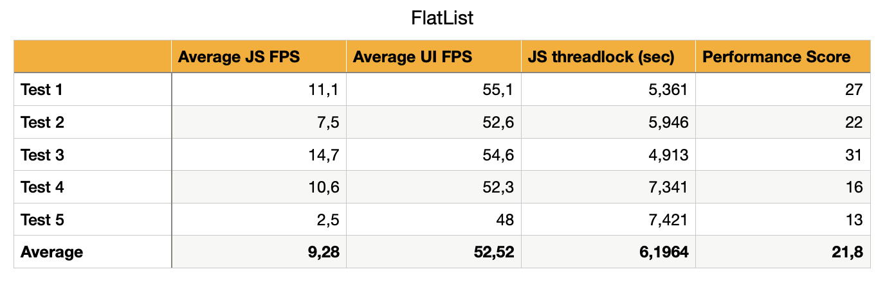

import YoutubeVideo from "../../../src/components/shared/YoutubeVideo";

Hello and welcome back to another blog, notJust developers! Today we are going to do something different, which is going to be very exciting and definitely helpful at least to some of you. Most likely you can already guess what this blog will be about from the title alone, but just to make sure that we are on the same page - today we will be comparing newly released Shopify’s FlashList versus an old but widely used FlatList. 

Now you may be thinking what is there to compare, so let me quickly go over that. First of all, we won’t be comparing the ease of use because as you will see a bit later it’s basically the same, and it is the same because FlashList is using FlatList’s API. So, the thing that we care about the most and the one that we will compare in this blog today is the performance.

If you used FlatList before you might be familiar with it’s I would even say very bad performance, and Shopify is claiming that FlashList is a lot more performant. But claims are only claims until they are proven, right? So let’s put it to the test and see whether FlashList is actually more performant and if it is, by how much.

If you prefer watching instead of reading, I will add a video below to make your life easier! 😉
<YoutubeVideo id="1l5Pn4VbnO4" />

## Measuring Performance
Firstly, let me quickly explain how are we going to measure the performance. One of the key metrics in measuring the performance of the app is the frame rate. We want the app to run at 60 frames per second in order to give the users an impression of smoothness.
 
But in React Native’s case, applications have two threads - the UI thread and JavaScript thread, and we need to make sure that both of them are running at 60 frames per second or at least as close to it as possible. But why JavaScript thread is important to us? The answer is simple, it is important because JavaScript drives the application's UI, so if JavaScript thread’s frames per second are dropping, especially if they’re reaching zero, the app will be unresponsive, and you won’t be able to press or do anything at that time, which of course is very bad. 

Now, how can we track our application’s frames per second? For that we could simply enable the performance monitor in our application, but that would be rather hard to properly test and draw results from, so we will be using React Native Performance Monitor Flipper Plugin.

## Planning Testing Case
Now we need to make a rough plan for our testing case. First of all, we want to use a low-end device because of course on a high-end newly released devices everything will work a lot better and smoother but not everybody will have them, so we want to make sure that on average every user can have a nice experience using our application. Therefore, in our case we will be using Motorola Nexus 6. For you to better understand and visualize the difference between this phone and iPhone 13 PRO MAX, let’s look at their Geekbench CPU scores.


The difference is enormous, so take that into consideration.
 
Secondly, we can’t draw conclusions just from running the test once, so we will run it five times and use the average results at the end to compare both lists.

Thirdly, for each test we will be scrolling through a VERY LARGE list of crypto coins and using `adb shell input 500 2000 500 0 50` command three times, where each time the command will automatically scroll the list for approximately 100 positions.

Fourthly, for every test we will have completely same conditions to make the comparison as accurate as possible.

And last but not least, our goal will be to never drop the UI thread below fifty frames per second and the JavaScript thread should never reach zero.

## Comparison
Before starting the comparison, I just wanted to remind that we are testing on a very old phone, which will have a HUGE impact on the performance of both lists.

Now let me quickly show you the difference in code of both the FlatList and the FlashList.

Firstly, here is an example of the FlatList, probably you are already pretty familiar with it.
```jsx
  <View>
    <Text>FlatList</Text>
    <FlatList
      data={coins}
      renderItem={({item, index}) => renderItem(item, index)}
    />
  </View>
```

And here is the code snippet of the FlashList. As you can see, they are basically the same, the only difference is that FlashList suggests adding `estimatedItemSize` prop, which is a number that hints FlashList about the approximate size of the items before they are rendered. It uses this value to decide how many items it needs to draw on the screen before the initial load and while scrolling.
*If sizes of items are different take the average value.*

```jsx
  <View>
    <Text>FlashList</Text>
    <FlashList
      data={coins}
      renderItem={({item, index}) => renderItem(item, index)}
      estimatedItemSize={70}
    />
  </View>
```

### FlatList
After the first batch of tests, we can see the final results for the FlatList in the table below. And from the first glance, we can safely say that they are pretty bad. 
- Our average JavaScript thread frames per second was **9.28**, which is terrible. 
- Our average UI thread frames per second stayed above **50**, which is actually good.
- Our JavaScript thread on average was non-responsive for a whopping **6.1964** seconds, and that is terribly bad.
- Our average performance score was merely **21.8**, which again is very low.


Now let's try to put the FlashList to the test and see if it can hold up any better.

### FlashList
Before we can start testing the FlashList, we need to install it. Thankfully, that is very easy, we simply need to run `yarn add @shopify/flash-list` and then `cd ios && pod install`. That's it, we have installed the FlashList nice and easy, so let's start testing!

After a few minutes for me and no time for You, below we can see the final results of the FlashList. And right away we can see that FlashList is **clearly** a winner here.
- Our average JavaScript thread frames per second was **41.56**, which is simply amazing compared to the FlatList.
- Our average UI thread frames per second improved slightly, but nothing to write a book about.
- Our JavaScript thread never reached 0, which is by far the biggest factor in this comparison.
- Our average performance score was **79.2** and that is an enormous improvement from the FlatList.


## Outro
Here you go, I’m not going to draw any conclusions to which list is better in general, but looking solely at the performance FlashList is clearly a winner here. I highly encourage you to try the FlashList yourself, as it is in my opinion a very big step forward for the React Native community. And we should say a big thank you to Shopify for that because they are putting so much work into making this community even stronger and better. 

That being said, I hope that this blog was interesting to you, valuable, informative and in general enjoyable to read.

As always, don’t stop coding and see you in the next one! 👋


