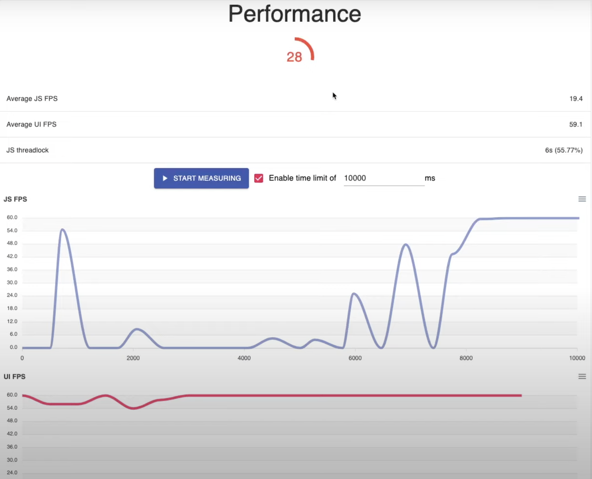
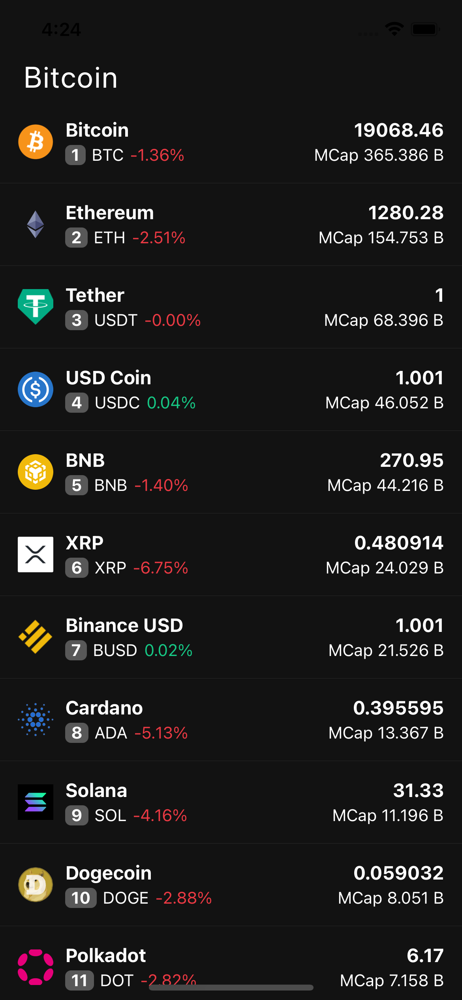
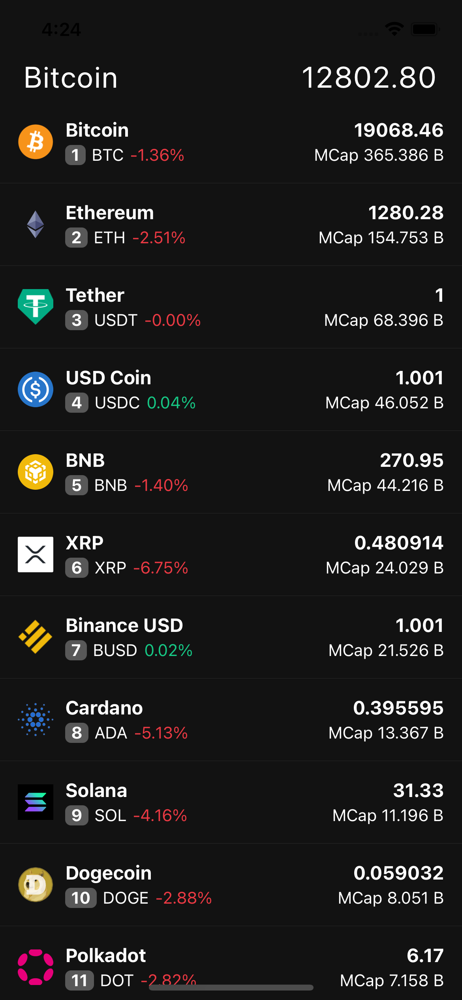
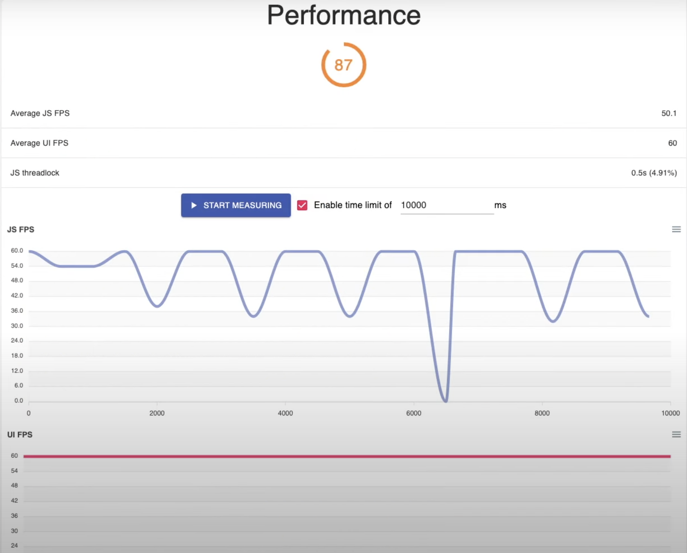

import YoutubeVideo from "../../../src/components/shared/YoutubeVideo/YoutubeVideo";

Hello and welcome back to another blog, notJust developers! Today, once again we are going to talk about the performance, as this is the topic that's really interesting to me and in my opinion very important if you want to guarantee pleasant user experience in your application.

But this time I will show you how to optimize your application by using three different techniques, which are **useMemo**, **useCallback** and **memo**. After the implementation of these techniques, we have managed to increase the performance score of our application from ~25 to ~85, so make sure to follow along and try to do the same for your app!

If you prefer watching instead of reading, I will add a video below that you can follow! 😉
<YoutubeVideo id="DXhcbMvNX04" title={frontmatter.title} />

## Starting Performance Score
Before anything, we need to measure the starting performance score of our application to get the base results from where we will try to improve. Having the base performance score will make comparison at the end a lot easier and more accurate. For measuring the performance score, I will use **React Native Performance Score Monitor Flipper** plugin.

After testing the app for a few times, the final average result was around 30, which is pretty horrible to say the least. But we like challenges, so let's see whether we can improve it at least a little bit!


## React.memo
Here we have a simple application that displays a very big list of crypto coins and a title **Cryptoassets** at the top of the screen. Once the **Cryptoassets** title is clicked, it should change its color to green and after clicking it once more, it should revert back to white.


Here is the code of our main **HomeScreen** component:
```jsx
import React, { useState } from 'react';
import { FlatList, View, Text } from 'react-native';
import CoinItem from '../../components/CoinItem';
import coins from '../../assets/data/coins.json';
import styles from './styles';

const HomeScreen = () => {
  const [isGreen, setIsGreen] = useState(false);

  return (
    <View>
      <View style={styles.titleContainer}>
        <Text
          style={[styles.title, {color: isGreen ? '#16c784' : 'white'}]}
          onPress={() => setIsGreen(!isGreen)}>
          Cryptoassets
        </Text>
      </View>
      <FlatList
        data={coins}
        renderItem={({item}) => (
          <CoinItem
            marketCoin={item}
          />
        )}
      />
    </View>
  );
};

export default HomeScreen;
```

And here is the code of our **CoinItem** component:
```jsx
import React from 'react';
import { Text, View, Image } from 'react-native';
import styles from './styles';

const CoinItem = ({ marketCoin }) => {
  const {
    name,
    current_price,
    market_cap_rank,
    price_change_percentage_24h,
    symbol,
    market_cap,
    image,
  } = marketCoin;

  const percentageColor =
    price_change_percentage_24h < 0 ? '#ea3943' : '#16c784' || 'white';

  const normalizeMarketCap = marketCap => {
    if (marketCap > 1e12) {
      return `${(marketCap / 1e12).toFixed(3)} T`;
    }
    if (marketCap > 1e9) {
      return `${(marketCap / 1e9).toFixed(3)} B`;
    }
    if (marketCap > 1e6) {
      return `${(marketCap / 1e6).toFixed(3)} M`;
    }
    if (marketCap > 1e3) {
      return `${(marketCap / 1e3).toFixed(3)} K`;
    }
    return marketCap;
  };

  return (
    <View style={styles.coinContainer}>
      <Image source={{uri: image}} style={styles.image} />
      <View>
        <Text style={styles.title}>
          {name}
        </Text>
        <View style={styles.infoContainer}>
          <View style={styles.rankContainer}>
            <Text style={styles.rank}>{market_cap_rank}</Text>
          </View>
          <Text style={styles.text}>{symbol.toUpperCase()}</Text>
          <Text style={{color: percentageColor}}>
            {price_change_percentage_24h?.toFixed(2)}%
          </Text>
        </View>
      </View>
      <View style={styles.rightContainer}>
        <Text style={styles.title}>{current_price}</Text>
        <Text style={styles.marketCap}>
          MCap {normalizeMarketCap(market_cap)}
        </Text>
      </View>
    </View>
  );
};

export default CoinItem;
```

### Problem
Looking solely at the code you might not find the main problem right away, but once we start using the app, the problem is very obvious. After clicking the **Cryptoassets** title at the top in order to change its color, it takes WAAAAY too long to do that, simply changing the color shouldn't take that long.

### Solution
To find the best solution, firstly we have to understand our code, so let's dive a bit deeper into that. Our **HomeScreen** component is mainly doing two things, changing the color of the title by changing the state and displaying the **FlatList** with crypto coins. At this point, **CoinItem** component is not doing anything major except for displaying the coin data how we want it to be displayed. So why is it taking so long to simply change the color?!

Well, that's how React Native works. If we change the state in **HomeScreen** component, it re-renders everything in that component, which means **FlatList** is re-rendered as well, which leads into re-rendering every single one of the coins in that list AGAIN even though we are not doing anything with them!!

You can probably already understand that this is pretty bad because re-rendering those coins again and again is way too expensive. Okay, so what is the solution, you might ask? And one simple solution would be to use **React.memo**, so let's see how can we do that.

The good thing is that fixing this problem requires only two simple changes in the **CoinItem** component:
1. Import the higher order component *memo* from *React*.
2. Wrap our component with HOC *memo*.

That's it, just like that we were able to fix this problem and now our title changes the color INSTANTLY!

Here is the code of how **CoinItem** component should look like after the changes:
```jsx
import React, { memo } from 'react'; // <----- 1. Import higher order component 'memo'.
import { Text, View, Image } from 'react-native';
import styles from './styles';

const CoinItem = ({ marketCoin }) => {
  const {
    name,
    current_price,
    market_cap_rank,
    price_change_percentage_24h,
    symbol,
    market_cap,
    image,
  } = marketCoin;

  const percentageColor =
    price_change_percentage_24h < 0 ? '#ea3943' : '#16c784' || 'white';

  const normalizeMarketCap = marketCap => {
    if (marketCap > 1e12) {
      return `${(marketCap / 1e12).toFixed(3)} T`;
    }
    if (marketCap > 1e9) {
      return `${(marketCap / 1e9).toFixed(3)} B`;
    }
    if (marketCap > 1e6) {
      return `${(marketCap / 1e6).toFixed(3)} M`;
    }
    if (marketCap > 1e3) {
      return `${(marketCap / 1e3).toFixed(3)} K`;
    }
    return marketCap;
  };

  return (
    <View style={styles.coinContainer}>
      <Image source={{uri: image}} style={styles.image} />
      <View>
        <Text style={styles.title}>
          {name}
        </Text>
        <View style={styles.infoContainer}>
          <View style={styles.rankContainer}>
            <Text style={styles.rank}>{market_cap_rank}</Text>
          </View>
          <Text style={styles.text}>{symbol.toUpperCase()}</Text>
          <Text style={{color: percentageColor}}>
            {price_change_percentage_24h?.toFixed(2)}%
          </Text>
        </View>
      </View>
      <View style={styles.rightContainer}>
        <Text style={styles.title}>{current_price}</Text>
        <Text style={styles.marketCap}>
          MCap {normalizeMarketCap(market_cap)}
        </Text>
      </View>
    </View>
  );
};

export default memo(CoinItem); // <----- 2. Wrap component with HOC memo.
```

### Explanation
Now let's try to better understand what's happening here. When we wrap our component with HOC *memo* - it memoizes the component. Which means that every time we render the FlatList and coin items inside that FlatList, it will check whether the props of the coin are the same as in the memory. If they are the same, then it won't re-render that coin item, but if the props have changed, then it will re-render them.

So now after changing the title color in the **HomeScreen** component it won't re-render all of the coin items because we are not changing their props and thus they are the same as in the memory!

## useCallback
Even though we might think that the above solution should now work with every prop that we add, we would be wrong. We can very easily break the expected behavior and I will show you a pretty common example of when that would happen.

Let's say that every time after we click on one of the coin names in the list, we want to display its name instead of the **Cryptoassets** title.


Let's adjust our code a bit for that!

**HomeScreen** component code:
```jsx 
import React, { useState } from 'react';
import { FlatList, View, Text } from 'react-native';
import CoinItem from '../../components/CoinItem';
import coins from '../../assets/data/coins.json';
import styles from './styles';

const HomeScreen = () => {
  const [isGreen, setIsGreen] = useState(false);
  const [title, setTitle] = useState('Cryptoassets'); // <------ 1. Add new useState hook.

  const setCryptoTitle = (name) => { // <------ 3. Add this function.
    for (let i = 0; i <= 10000000; i++) {} // This piece of code is here to make the function expensive
    setTitle(name);
  }

  return (
    <View>
      <View style={styles.titleContainer}>
        <Text
          style={[styles.title, {color: isGreen ? '#16c784' : 'white'}]}
          onPress={() => setIsGreen(!isGreen)}>
          {title} {/* <------ 2. Add the title from the state */}
        </Text>
      </View>
      <FlatList
        data={coins}
        renderItem={({item}) => (
          <CoinItem
            marketCoin={item}
            setTitle={setCryptoTitle} {/* <------ 4. Pass the function to CoinItem */}
          />
        )}
      />
    </View>
  );
};

export default HomeScreen;
```

**CoinItem** component code:
```jsx
import React, { memo } from 'react';
import { Text, View, Image } from 'react-native';
import styles from './styles';

const CoinItem = ({ marketCoin, setTitle }) => { // <------ 1. Import the setTitle function
  const {
    name,
    current_price,
    market_cap_rank,
    price_change_percentage_24h,
    symbol,
    market_cap,
    image,
  } = marketCoin;

  const percentageColor =
    price_change_percentage_24h < 0 ? '#ea3943' : '#16c784' || 'white';

  const normalizeMarketCap = marketCap => {
    if (marketCap > 1e12) {
      return `${(marketCap / 1e12).toFixed(3)} T`;
    }
    if (marketCap > 1e9) {
      return `${(marketCap / 1e9).toFixed(3)} B`;
    }
    if (marketCap > 1e6) {
      return `${(marketCap / 1e6).toFixed(3)} M`;
    }
    if (marketCap > 1e3) {
      return `${(marketCap / 1e3).toFixed(3)} K`;
    }
    return marketCap;
  };

  return (
    <View style={styles.coinContainer}>
      <Image source={{uri: image}} style={styles.image} />
      <View>
        <Text style={styles.title} onPress={() => setTitle(name)}> {/* <------ 2. Add onPress and pass coin name */}
          {name}
        </Text>
        <View style={styles.infoContainer}>
          <View style={styles.rankContainer}>
            <Text style={styles.rank}>{market_cap_rank}</Text>
          </View>
          <Text style={styles.text}>{symbol.toUpperCase()}</Text>
          <Text style={{color: percentageColor}}>
            {price_change_percentage_24h?.toFixed(2)}%
          </Text>
        </View>
      </View>
      <View style={styles.rightContainer}>
        <Text style={styles.title}>{current_price}</Text>
        <Text style={styles.marketCap}>
          MCap {normalizeMarketCap(market_cap)}
        </Text>
      </View>
    </View>
  );
};

export default memo(CoinItem);
```

### Problem
As I said, by making those cahnges above, we have managed to break the **memo** that we have just implemented. So now if we click on one of the crypto coin names, it will re-render all of the coin items and if we click on the title in the top left corner to change its color, it will once again re-render all of the coin items just like before.

### Solution
First things first, we need to understand why is this happening. If you remember, I have explained before that every time we change the state, the whole component is re-rendered and that means **FlatList** with its coin items as well. Well, that's happening again. But you might think that we just fixed this same problem. And yes, you would be right, but let me explain why simply adding a **setCryptoTitle** function broke our **memo**.

It happened because when we are trying to compare the objects in React Native it’s comparing them referentially, which means we are trying to check if those objects are allocated in the same space in memory. So in our case, because we are changing the state in **HomeScreen**, everything is re-rendered and therefore every time we create an entirely new **setCryptoTitle** function, which means **memo** will think that we are passing a new prop, because **memo** compares everything referentially. Now you might be thinking then why **memo** is comparing it that way, and it's simply to be more efficient, because comparing values is way more expensive.

But don't worry, we can easily fix this problem by using a hook called **useCallback**.

And once again, the changes that we have to make are very small:

1. Import useCallback hook from React.
2. Create a memoized function.
3. Change which function is passed to CoinItem component.

Here is the code of how **HomeScreen** component should look like after the changes:

```jsx
import React, { useState, useCallback } from 'react'; // <------ 1. Import useCallback hook
import { FlatList, View, Text } from 'react-native';
import CoinItem from '../../components/CoinItem';
import coins from '../../assets/data/coins.json';
import styles from './styles';

const HomeScreen = () => {
  const [isGreen, setIsGreen] = useState(false);
  const [title, setTitle] = useState('Cryptoassets');

  const memoizedCallback = useCallback((name) => { // <------ 2. Change the setCryptoTitle function to this
    for (let i = 0; i <= 10000000; i++) {} // This piece of code is here to make the function expensive
    setTitle(name);
  }, [])

  return (
    <View>
      <View style={styles.titleContainer}>
        <Text
          style={[styles.title, {color: isGreen ? '#16c784' : 'white'}]}
          onPress={() => setIsGreen(!isGreen)}>
          {title}
        </Text>
      </View>
      <FlatList
        data={coins}
        renderItem={({item}) => (
          <CoinItem
            marketCoin={item}
            setTitle={memoizedCallback} {/* <------ 3. Pass the memoizedCallback function instead of the setCryptoTitle */}
          />
        )}
      />
    </View>
  );
};

export default HomeScreen;
```

### Explanation
Now let's try to better understand what have we changed.

So, **useCallback** hook expects a function that you want to memoize as its first parameter and dependency array, which will tell this hook when it should change as the second parameter. In our case, we will leave the dependency array empty because we don't want it to change.

And now with the help of **useCallback** we will be able to memoize the function and therefore it will stay referentially the same, so when we will be passing it to the **CoinItem** component, it won’t re-render the coin because now the objects will be referentially the same and **memo** will work again!

## useMemo
Lastly, let's say that once we click on the coin in the list, we want to display its current price multiplied by 10 in the right top corner. 


Here are the adjustment that we need to make for that to work:

**HomeScreen** component code:
```jsx
import React, { useState, useCallback } from 'react';
import { FlatList, View, Text } from 'react-native';
import CoinItem from '../../components/CoinItem';
import coins from '../../assets/data/coins.json';
import styles from './styles';

const HomeScreen = () => {
  const [isGreen, setIsGreen] = useState(false);
  const [title, setTitle] = useState('Cryptoassets');
  const [price, setPrice] = useState(0); // <------ 1. Add new state.

  const memoizedCallback = useCallback((name) => {
    for (let i = 0; i <= 10000000; i++) {} 
    setTitle(name);
  }, [])

  const multipliedPrice = () => { // <------ 2. Add this function
    for (let i = 0; i <= 10000000; i++) {} // This piece of code is here to make the function expensive
    return (price * 10).toFixed(2)
  }

  return (
    <View>
      <View style={styles.titleContainer}>
        <Text
          style={[styles.title, {color: isGreen ? '#16c784' : 'white'}]}
          onPress={() => setIsGreen(!isGreen)}>
          {title}
        </Text>
        <Text style={styles.title}>{(multipliedPrice())}</Text> {/* <------ 3. Add multipliedPrice() here */}
      </View>
      <FlatList
        data={coins}
        renderItem={({item}) => (
          <CoinItem
            marketCoin={item}
            setTitle={memoizedCallback}
            setPrice={setPrice} {/* <------ 4. Pass the setPrice function to CoinItem */}
          />
        )}
      />
    </View>
  );
};

export default HomeScreen;
```

**CoinItem** component code:
```jsx
import React, { memo } from 'react';
import { Text, View, Image, Pressable } from 'react-native'; // <------ 1. Import Pressable
import styles from './styles';

const CoinItem = ({ marketCoin, setTitle, setPrice }) => { // <------ 2. Import the setPrice function
  const {
    name,
    current_price,
    market_cap_rank,
    price_change_percentage_24h,
    symbol,
    market_cap,
    image,
  } = marketCoin;

  const percentageColor =
    price_change_percentage_24h < 0 ? '#ea3943' : '#16c784' || 'white';

  const normalizeMarketCap = marketCap => {
    if (marketCap > 1e12) {
      return `${(marketCap / 1e12).toFixed(3)} T`;
    }
    if (marketCap > 1e9) {
      return `${(marketCap / 1e9).toFixed(3)} B`;
    }
    if (marketCap > 1e6) {
      return `${(marketCap / 1e6).toFixed(3)} M`;
    }
    if (marketCap > 1e3) {
      return `${(marketCap / 1e3).toFixed(3)} K`;
    }
    return marketCap;
  };

  return (
    <Pressable
      style={styles.coinContainer}
      onPress={() => setPrice(current_price)}> { /* <------ 3. Change View to Pressable and add onPress */}
      <Image source={{uri: image}} style={styles.image} />
      <View>
        <Text style={styles.title} onPress={() => setTitle(name)}>
          {name}
        </Text>
        <View style={styles.infoContainer}>
          <View style={styles.rankContainer}>
            <Text style={styles.rank}>{market_cap_rank}</Text>
          </View>
          <Text style={styles.text}>{symbol.toUpperCase()}</Text>
          <Text style={{color: percentageColor}}>
            {price_change_percentage_24h?.toFixed(2)}%
          </Text>
        </View>
      </View>
      <View style={styles.rightContainer}>
        <Text style={styles.title}>{current_price}</Text>
        <Text style={styles.marketCap}>
          MCap {normalizeMarketCap(market_cap)}
        </Text>
      </View>
    </Pressable>
  );
};

export default memo(CoinItem);
```

### Problem
These changes introduced a big problem because every time we change the color of the title in the **HomeScreen** or change the state of other things, we will call **multipliedPrice()** function again and again. We clearly don't want that to be happening because that function is very expensive and once again will slow down our app tremendously. We want to minimize the times we have to call this function to a bare minimum and thankfully we have **useMemo** for it!

### Solution
As you probably already understood, once we change the state in **HomeScreen** component, because of how React Native works it re-renders everything in that component and that means **multipliedPrice()** will be called every time that happens, even though the function will have same the results as before.

But once again, we can easily prevent that function from being called unnecessarily with only a few simple adjustments! 

1. Import useMemo hook from React.
2. Create a memoized function.
3. Change the function that is called.

**HomeScreen** component code:
```jsx
import React, { useState, useCallback, useMemo } from 'react'; // <------ 1. Import useMemo hook.
import { FlatList, View, Text } from 'react-native';
import CoinItem from '../../components/CoinItem';
import coins from '../../assets/data/coins.json';
import styles from './styles';

const HomeScreen = () => {
  const [isGreen, setIsGreen] = useState(false);
  const [title, setTitle] = useState('Cryptoassets');
  const [price, setPrice] = useState(0); 

  const memoizedCallback = useCallback((name) => {
    for (let i = 0; i <= 10000000; i++) {} 
    setTitle(name);
  }, [])

  const multipliedPrice = () => {
    for (let i = 0; i <= 10000000; i++) {} // This piece of code is here to make the function expensive
    return (price * 10).toFixed(2)
  }

  const memoizedPrice = useMemo(() => multipliedPrice(), [price]) // <------ 2. Create a memoized function.

  return (
    <View>
      <View style={styles.titleContainer}>
        <Text
          style={[styles.title, {color: isGreen ? '#16c784' : 'white'}]}
          onPress={() => setIsGreen(!isGreen)}>
          {title}
        </Text>
        <Text style={styles.title}>{(memoizedPrice)}</Text> {/* <------ 3. Change from multipliedPrice() to memoizedPrice */}
      </View>
      <FlatList
        data={coins}
        renderItem={({item}) => (
          <CoinItem
            marketCoin={item}
            setTitle={memoizedCallback}
            setPrice={setPrice}
          />
        )}
      />
    </View>
  );
};

export default HomeScreen;
```
### Explanation
First of all, let me expand on the **useMemo** hook a bit. **useMemo** expects a function that you want to memoize as the first parameter and the dependency array, just like the **useCallback** hook. But in this case we are dependent on the **price state**, so we need to pass the **price state** to **useMemo** dependency array, which means that this function will only be called when the **price state** changes. And just like that we were able to stop calling the **multipliedPrice()** on every render! 

But now you might be wondering, so what is the difference between the **useCallback** and **useMemo** hooks. And to put it as simply as I can, **useCallback** returns its function when dependencies change, while **useMemo** calls its function and returns the result when dependencies change.

## Final Performance Score
After running the tests for a few times, I'm happy to announce that we have managed to improve by quite a lot. The average score after all of the tests were around 85, so that's a HUUUGE increase from the starting 25! 


## Disclaimer
Also, I want to mention that memoizing everything is not a solution either, if you use it everywhere it can even hurt the performance. So for example the most common use cases for each would be using **useMemo** on expensive functions, wrapping components in **React.memo** only when that component is re-rendered often with the same props and the component is relatively big in size, and using **useCallback** when the component that accepts your function relies on the referential equality. Of course there are a few more good use cases for them, but I just gave you the most common ones where I think that you can start!

## Thank You For Reading!
As always, I hope that this tutorial was helpful to you, that you’ve learned something new, and now you will be able to improve the performance of your application! THANK YOU very much for reading and if you've enjoyed this blog, you can find many more blogs like this on our website. Also, don't forget to check out our YouTube channel because we are releasing a lot of interesting tutorials/videos every week and I think you should enjoy them. So, without wasting any more of your time, see you soon, bye!