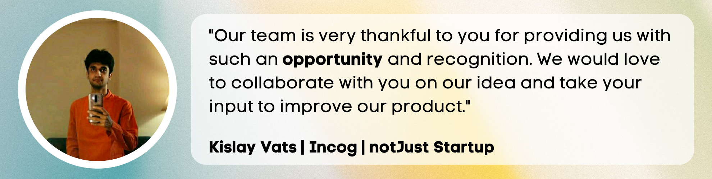

import OptInForm from '../../../src/components/shared/OptInForm/OptInForm';
import Button from '../../../src/components/shared/Button/Button';
import YoutubeVideo from "../../../src/components/shared/YoutubeVideo/YoutubeVideo";

Hey notJust Developers, are you ready for a new **Challenge**?

Join the **notJust Hack** from 25th to 27th November, and build that App that you always wanted to.

<YoutubeVideo id="PYQwn2Amrzw" title="notJust Hackathon Announcement" />

## Why participate?

Use this opportunity to:

- Build the app that you always wanted to
- Learn a new technology, framework, tool
- Attend **daily workshops** and learn from the best
- Join the **group coaching** sessions and get help from our mentors
- Join a **community** of motivated developers and spend a weekend building together

We promise a weekend full of fun activities, learnings and hard work.

As I always say, the best way to learn something new is to build a real project with it.

<OptInForm formId={"57a6ea4ec2"} formSrc={"https://awesome-teacher-1065.ck.page/57a6ea4ec2/index.js"} title="Sign up, and let's Hack together 👇" />

## 🎁 Prizes

### ✨ 3 Winners

- **$500** 💰
- notJust Dev TShirt
- Stream swag
- Nhost swag

### ✨ 3 Runner ups

- **$250** 💰
- notJust Dev TShirt
- Stream swag
- Nhost swag

### 1 Special prize from [Stream](https://gstrm.io/notjustdevhack) for their favorite project

- $300 Amazon Gift Card
- Stream swag

### 1 Special prize from [Nhost](http://bit.ly/3hMq836) for their favorite project

- Nhost Pro plan for 24 months (worth **$600**)
- 1h Startup-coaching session with [Johan Eliasson](https://www.linkedin.com/in/johan--eliasson/), CEO / Founder of Nhost

### 1 Special prize from [notJust Academy](https://academy.notjust.dev/)

- [The Full Stack Mobile Developer](https://academy.notjust.dev/) Ultimate package (worth **$399**)
- If you are already a course member, we will send you $399

## 📅 Schedule

### 🔴 Kickoff Live stream on Youtube

📅 Thursday 24th November - [3pm UTC](https://dateful.com/convert/utc?t=3pm)

### 🧰 Workshop: Build any Mobile App with React Native

📅 Friday 25th November - [3pm UTC](https://dateful.com/convert/utc?t=3pm)

Let’s Kickstart the #notJust.Hack with a workshop on building mobile applications with React Native

✅ The power of React Native 
✅ How to get started 
✅ Learn by building REAL Projects

And because the best way to learn is by getting your hands dirty, we will build a **Virtual Events App!**

### 🙋 Group Coaching

📅 Friday 25th November - [6pm-7pm UTC](https://dateful.com/convert/utc?t=6pm)

### 🧰 Workshop: Virtual Events App [React Native | Nhost]

📅 Saturday 26th November - [3pm UTC](https://dateful.com/convert/utc?t=3pm)

Building Full Stack applications in 2022 is so accessible for Mobile Developers with the help of services like [Nhost](http://bit.ly/3hMq836).

Today we will use [Nhost](http://bit.ly/3hMq836) to build a Full-Stack Events App 📅

✅ Authentications 
✅ Database & GraphQL API 
✅ Storage 
✅ Apollo Client

Join the workshop, and let’s learn together!

### 🙋 Group Coaching

📅 Saturday 26th November - [6pm-7pm UTC](https://dateful.com/convert/utc?t=6pm)

### 🧰 Workshop: Build a Chat App with Stream SDK

📅 Sunday 27th November - [3pm UTC](https://dateful.com/convert/utc?t=3pm)

Adding Chat to your application couldn’t be easier than using [Stream Chat](https://gstrm.io/notjustdevhack).

That’s exactly what we are going to do during today’s workshop.

We will build a premium messaging experience for our Virtual Events app 📅

✅ Private and Group messaging 
✅ Message reaction 
✅ Replies & Threads 
✅ Attachements, URL previews, gifs 
✅ and more

Join the workshop, and let’s learn together!

### 🙋 Group Coaching

📅 Sunday 27th November - [6pm-7pm UTC](https://dateful.com/convert/utc?t=6pm)

### 🔴 Demo day

📅 Monday 28th November - [3pm UTC](https://dateful.com/convert/utc?t=3pm)

## Demo day

To participate at the demo day, you will have to submit a 3 minutes long video presentation of your project together with a link to the github repository. The submissions that follow the requirements will be played at the Demo Day, on 28th November, and our juries will vote for the best ones.

For the video presentation, we recommend following this structure:

- Introduce yourself and the project in one sentence
- Talk about the problem. Why is there a need for your application. It can also be for your personal need, that’s fine as long as there is a purpose behind.
- Talk about the solution.
  How are you planning to solve this problem. Here, you have the opportunity to show your vision for the project. You defiently won’t manage to build everything in just 3 days, but it’s important to visualise how the solution will look in the end.
- What technologies did you use?
- Demo. Show us the main functionalities of your application. Even if not everything is perfect.
- What are your next steps? Do you plan on continuing to work on the app?

❗ The video should be maximum 3 minutes. In order to give everyone the possibility to present, we will stop the video presentations at 3 minutes.

## 🧑‍⚖️ Evaluation criteria

All projects will be judged by our juries.

The criteria will be:

- **The idea**
  The usefulness of the project in real-world
- **UI/UX**
  Keep it simple and consistent. There is not enough time to invest in sophisticated UIs and animations. The focus should be on simplicity, usability, and overall look of the application.
- **Realisation**
  The completeness and complexity of your project will be evaluated here. We recommend focusing on having the most critical features “workable” first.
- **Presentation**
  Your presentation skills

Requirements:

- The project should be a **Mobile Application** build with any tools/technologies/frameworks you know best
- **The project should be started during the Hackathon**
- You can work alone, or in teams

## 🆘 Need help?

[Join our discord channel](https://discord.gg/VpURUN2) and get help from our mentors.

Every day, we will host a workshop to help you on your journey of building an app in 3 days.

Also, we will host Group Coaching sessions daily where you can ask questions and get help from us.

## Feedback from our previous events

## 🙏 Thanks to our sponsors

### Stream

[Stream](https://gstrm.io/notjustdevhack) powers Chat Messaging and Activity Feeds for billions of global end-users across thousands of different apps.

The Stream Maker Account provides qualifying teams with full and free access to Stream's Chat and Activity Feed APIs, making them accessible to side projects and new startups. No credit card is required. [Try Stream for Free!](https://gstrm.io/notjustdevhack)

### Nhost

[Nhost](http://bit.ly/3hMq836) is an open-source alternative to Firebase, leveraging the power of GraphQL. We provide all the APIs, services, and SDKs you need to build apps users love. Go from a side project to a successful business in a few days. [Try Nhost for Free!](http://bit.ly/3hMq836)

## Sharing is caring 🙌

If you are excited about this event, help your network discover it as well. Invite your friends and learn together. It's more effective and also fun to learn together.
<Button 
  href="http://bit.ly/3GhZw3X"
  target="_blank"
  class="flex-1"
  title="Share on Twitter 🐦"
  flex1
/>

<Button
  href="http://bit.ly/3EvCkxU"
  target="\_blank"
  type="secondary"
  title="Share on LinkedIn 🧑‍💼"
  flex1
/>

Thanks for all your support 🙏

<OptInForm formId={"57a6ea4ec2"} formSrc={"https://awesome-teacher-1065.ck.page/57a6ea4ec2/index.js"} title="Don't forget to sign up...">To join the daily workshops and the group coaching sessions during the Hackathon!</OptInForm>
