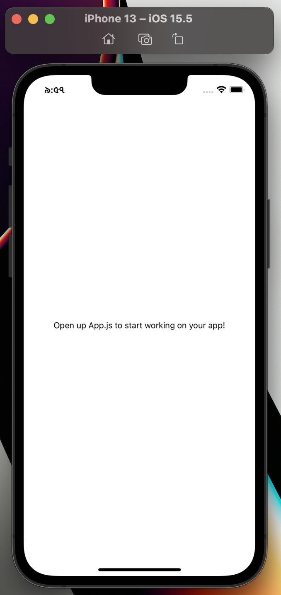
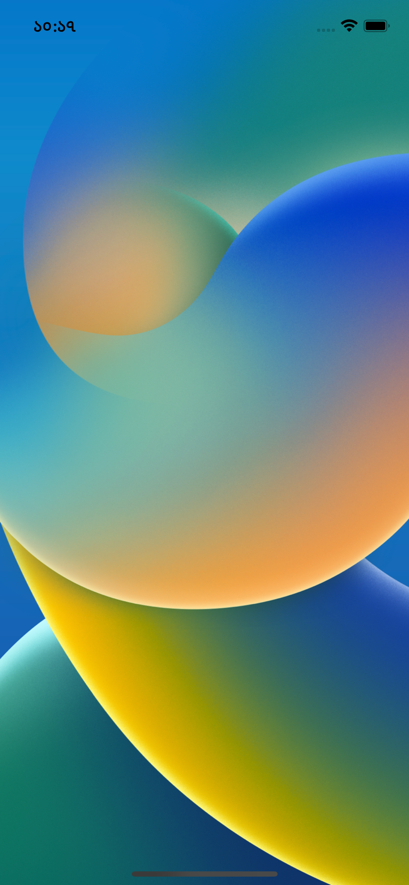
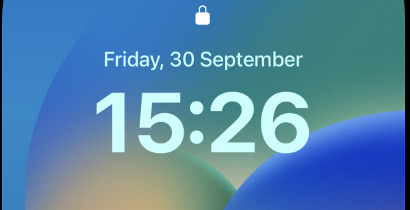
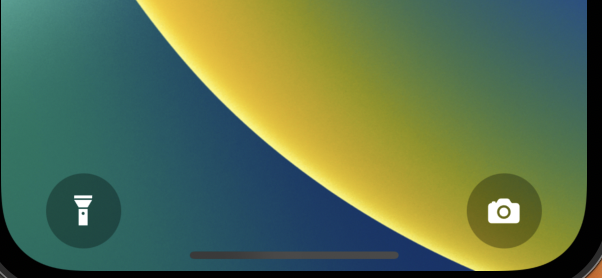
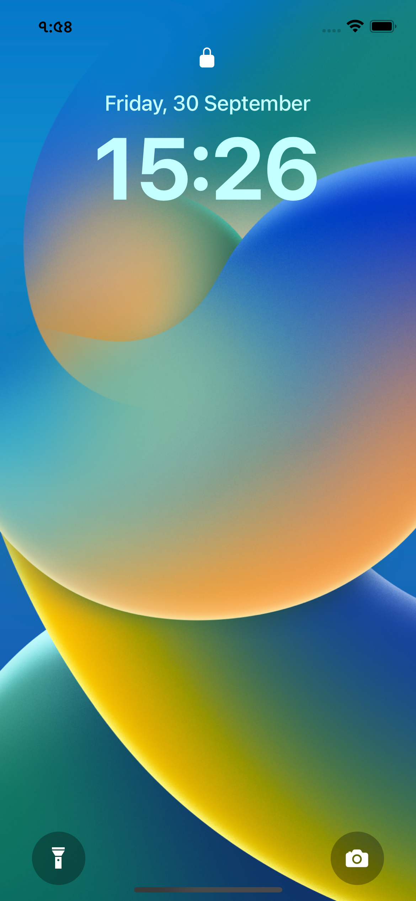
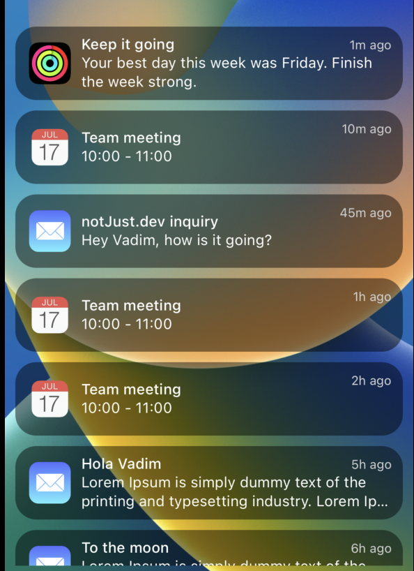
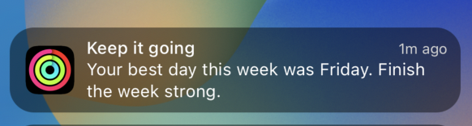

import YoutubeVideo from "../../../src/components/shared/YoutubeVideo/YoutubeVideo";

One of the most effective ways to learn is to build real-life projects and we are going to do exactly that in this series! This is going to be a four part blog series, we will build the beautiful iOS 16 lock screen from scratch. Moreover we be learning animations! React-Native and Reanimated will be used as our core technologies. This series will be divided into four chapters. They are the following,

1. iOS 16 lock screen - UI.
2. iOS 16 lock screen - Dynamic time.
3. iOS 16 lock screen - Custom animations.
4. iOS 16 lock screen - FlatList animations.

This blog post will cover the first chapter of this series (iOS 16 lock screen - UI). We will build the beautiful UI together and learn along the way. First, let’s see ahead what we are going to build.


If you like watching videos, no worries! We have it covered as well in video format. You can watch the video below.

<YoutubeVideo id="IC3wrgZ9joA" title={frontmatter.title} />

**Section 1 - Initialize the project**

The first step is to create the project using Expo. If you don’t have expo set up on your machine, you can follow our [guide](https://www.notjust.dev/blog/2021-11-04-expo-development-environment-setup-for-first-react-native-project-windows) setting it up or follow the [official one](https://docs.expo.dev/get-started/installation/). Assuming you have expo all set up on your machine, let’s run this command to create a blank project,

```powershell
npx create-expo-app iOSLockScreen
```

This will create a blank project. Now let’s go inside our project using the terminal and run it on our simulators/devices.

```powershell
cd iOSLockScreen
npm run start
```

When you hit `npm run start`, your dev server will start and you should see there are few options for you to open up the app in device or simulators. From there we either need to press ‘i’ to run iOS simulator, “a” to run on Android, or we can also scan the QR code to run the app on our physical device using the expo go app. This should open the project in your preferred simulator / device. We should be able to see the following preview at this point,



Alright, Now let’s get our hands dirty. The fun is about to start. Open up the `App.js` file and start coding! Wait, before we really start coding there is one last thing we need to do. We need to download the assets. Go to this [link](https://assets.notjust.dev/ios-lockscreen), give your name and email. You should be able to download the assets. Now move the assets folder in our project’s root directory.

**1. Wallpaper**

First, we will set up the wallpaper in our UI by using react native `ImageBackground` component.

```jsx
// import image background
import { ImageBackground } from 'react-native';
// import the wallpaper from our assets folder
import wallpaper from './assets/images/wallpaper.webp';
```

Now we need to render the `ImageBackground` with our asset. Inside our return statement

```jsx
<ImageBackground
  source={wallpaper}
  style={StyleSheet.absoluteFill}
></ImageBackground>
```

With this amount of code, we already get a beautiful-looking UI.



You may ask, why ImageBackgroud? Because we will put other content on top of the image and ImageBackground does exactly that.

**2. Time and Lock Icon**

Next, we want to show the lock icon and time at the top of our image like the following,



Inside our `ImageBackgroud` tag, we can do the following to render this.

and the necessary styles for that,

```jsx
import { Ionicons, MaterialCommunityIcons } from "@expo/vector-icons";

.....
.....

<View style={styles.header}>
   <Ionicons name="ios-lock-closed" size={20} color="white" />
    <Text style={styles.date}>Friday, 30 September</Text>
    <Text style={styles.time}>15:26</Text>
</View>
```

```jsx
header: {
  alignItems: "center",
  justifyContent: "center",
  height: 250,
},
date: {
	color: "#C3FFFE",
  fontSize: 20,
  fontWeight: "500",
  marginTop: 20,
},
time: {
  fontSize: 82,
  fontWeight: "bold",
  color: "#C3FFFE",
}
```

**3. Footer**

Great, our upper part is done, now let’s check what we want to achieve at the bottom part of our UI.



Let’s build this now.

```jsx
....
import { Ionicons, MaterialCommunityIcons } from "@expo/vector-icons";
.....
{/* footer */}
<View style={styles.footer}>
  {/* flashlight icon */}
  <View style={styles.icon}>
    <MaterialCommunityIcons name="flashlight" size={24} color="white" />
  </View>

  {/* camera icon */}
  <View style={styles.icon}>
    <Ionicons name="ios-camera" size={24} color="white" />
  </View>
</View>
```

and the styles will be,

```jsx
footer: {
  flexDirection: "row",
  justifyContent: "space-between",
  marginTop: "auto",
  paddingVertical: 10,
  paddingHorizontal: 30,
  height: 75,
},
icon: {
  backgroundColor: "#00000050",
  width: 50,
  aspectRatio: 1,
  alignItems: "center",
  justifyContent: "center",
  borderRadius: 50,
},
```

Let’s dissect a few important footer styles to understand a bit more,

1. The flashlight icon and the camera icon are rendered in a row, hence, `flexDirection: "row"`
2. We need to put a maximum amount of distance between these two icons, hence `justifyContent: "space-between"`
3. `marginTop: auto` will make our footer render at the bottom relative to our header view. Without this, it will just get rendered after our header view.

Awesome, now let’s see what we have achieved so far. If you have been following until now, you should get the following. Looks amazing, isn’t it?



**4. Notification List**

The final part of our UI is the notification list. Check out the preview of the list before we dive into the code.



In order to build the Notification List, let’s create two separate components called `NotificationList` and `NotificationItem` inside `src/components` directory.

**NotificationList Component**

`NotificationList` is responsible for rendering the `NotificationItem` in react native’s `FlatList`. Let’s look at how it looks,

```jsx
import { FlatList } from 'react-native';
import notifications from '../../assets/data/notifications';
import NotificationItem from './NotificationItem';

const NotificationsList = () => {
  return (
    <FlatList
      data={notifications}
      renderItem={({ item, index }) => (
        <NotificationItem data={item} index={index} />
      )}
    />
  );
};

export default NotificationsList;
```

1. `data`: The data is static coming from our `assets/data` file.
2. We are just using a `FlatList` to render the data in a list.

**NotificationItem Component**


The actual UI of the item is rendered inside `NotificationItem` component. Each notification item gets these details from our list, (src/assets/data)

```
{
    id: "1",
    createdAt: "1m",
    icon: fitness,
    title: "Keep it going",
    subtitle: "Your best day this week was Friday. Finish the week strong.",
},
```

The implementation for this item’s UI will be the following

```jsx
import { View, Text, StyleSheet, Image } from 'react-native';

export const NOTIFICATION_HEIGHT = 80;

const NotificationItem = ({ data, index }) => {
  return (
    <View style={styles.container}>
      <Image source={data.icon} style={styles.icon} />
      <View style={{ flex: 1 }}>
        <Text style={styles.title}>{data.title}</Text>
        <Text style={styles.subtitle} numberOfLines={2}>
          {data.subtitle}
        </Text>
      </View>
      <Text style={styles.time}>{data.createdAt} ago</Text>
    </View>
  );
};

const styles = StyleSheet.create({
  container: {
    height: NOTIFICATION_HEIGHT - 10,
    backgroundColor: '#00000075',
    margin: 5,
    marginHorizontal: 10,
    padding: 13,
    borderRadius: 20,
    flexDirection: 'row',
    alignItems: 'center',
  },
  time: {
    color: 'lightgray',
    fontSize: 12,
    position: 'absolute',
    right: 10,
    top: 10,
  },
  icon: {
    width: 40,
    height: 40,
    marginRight: 10,
  },
  title: {
    color: 'white',
    fontWeight: '500',
    letterSpacing: 0.2,
  },
  subtitle: {
    color: 'white',
    lineHeight: 18,
    letterSpacing: 0.2,
  },
});

export default NotificationItem;
```

With that, we have come to the end and successfully built the amazing UI together! Hopefully, you enjoyed making the UI as much as I did. If you want to play around with what we have built so far, enjoy the snack ;)

[https://snack.expo.dev/@saad-bashar/github.com-saad-bashar-ios16lockscreen](https://snack.expo.dev/@saad-bashar/github.com-saad-bashar-ios16lockscreen)

Now that we have this UI up and running, we can move forward to our next steps. As you can see we are showing a static time in our UI at the moment which is really boring! In our next step, let’s fix that and enable dynamic time in our UI.
