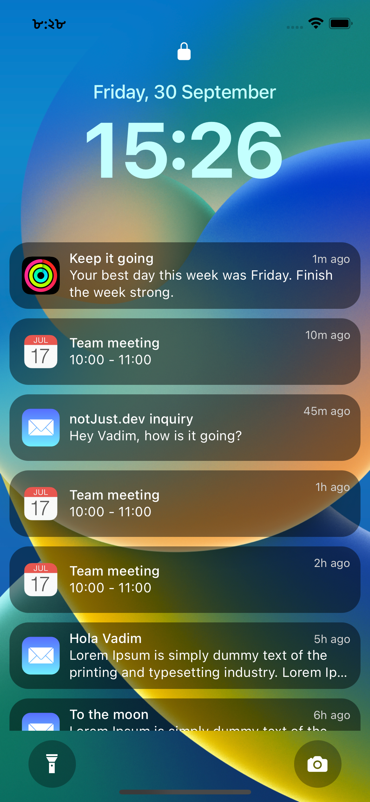

import YoutubeVideo from "../../../src/components/shared/YoutubeVideo/YoutubeVideo";
import Snack from '../../../src/components/shared/Snack/Snack';

[In our first part](https://www.notjust.dev/blog/2022-11-05-iOS16-lock-screen-ui), we started with the iOS 16 lock screen and we managed to build the awesome UI together. Let’s just review what we have built so far



As you can see from the preview we built 3 main components in our screen,

1. Header section → Where we show the lock icon and date-time.
2. Notification list
3. Footer → Where we show the flashlight and camera icon.

As of now our date and time inside header are fixed which is really boring! Let’s change it. This is going to be the second part of the series where we would like to create a dynamic time component that will give us an updated date and time. Just like the clock on your wall.

## Install `dayjs` package

First we will do some prep work. In order to deal with date and time there are lots of libraries which help us make our life easier. In this project, we are going to use [dayjs](https://day.js.org/) library. Why dayjs?

1. It has lots of utility functions for us. Formatting, validating, and parsing dates are really simple!
2. The library size is really small.

To install this library just run,

```jsx
npm install dayjs
```

## Render the date-time

We can render the date and time the way we want it very easily by the help of dayjs library

- **Import the library**

```jsx
import dayjs from 'dayjs';
```

- **Display current date**
  - To display the date, we can use `dayjs().format("dddd, DD MMMM")` that will format the date like `Friday, 05 November`
  - To display the time, we can use `dayjs().format("hh:mm")` that will format the time like `12:00`

With these changes, the texts at the top of our component should be,

```html
<Text style="{styles.date}">{dayjs().format("dddd, DD MMMM")}</Text>
<Text style="{styles.time}">{dayjs().format("hh:mm")}</Text>
```

Cool! Now we should be able to see the current date and time in our simulators or devices. However, the work is not done yet. As you have probably discovered that our date-time is not really updating, even though it gives us the current date-time when the application renders but after that it does not update anymore.

Let’s now fix it. We don’t want a broken clock in our application. Do we?

## Update the date-time

We need a couple of changes now in order to update the time.

### Create a date-time state

1. Since we will need to update our time, we need to put it into a state variable.

```jsx
import { useState } from 'react';

// inside our component
const [date, setDate] = useState(dayjs()); // default value is now our current time
```

### Format our date-time using dayjs

2. We have put `dayjs()` into our `date` state so we can use our `date` state to show the date-time now inside our `<Text />` component

```jsx
<Text style={styles.date}>{date.format("dddd, DD MMMM")}</Text>
<Text style={styles.time}>{date.format("hh:mm")}</Text>

```

### Update the date-time state using `setInterval`

3. We want to update the time with one minute interval every time. To do so we can use the javascript’s `setInterval` function. A typical `setInterval` function’s prototype is the following,

```jsx
setInterval(() => {
  functionToTrigger();
}, timeInMs);
```

This means that the `functionToTrigger()` will be called or triggered every `timeInMs` value. We will set the value of `timeInMs` and the `functionToTrigger` now.

As we want to update our clock every minute, our function will become,

```jsx
setInterval(() => {
  updateTime(); // dummy function for now, will work on this.
}, 60000); // 1 min = 60000 milliseconds
```

Great, now our `updateTime` function will trigger an update in every one minute. Let’s update our time by using `setDate` hook.

```jsx
setInterval(() => {
  setDate(dayjs()); // dayjs() always gives us the current time
}, 60000);
```

4. We have our core logic set up for updating the time, where do we want to use this logic now? You might have guessed it already, since this is a side effect and it does not depend on user’s interaction we will use react’s `useEffect` hook. The next question is when do we want to start this logic? We want to start our timer after our component mounts. By using an empty dependency array inside our `useEffect` hook we can achieve that lifecycle.

```jsx
useEffect(() => {
  setInterval(() => {
    setDate(dayjs()); // dayjs() always gives us the current time
  }, 60000);
}, []);
```

Awesome, with that you should be able to see your time being updated every minute. Exciting!

### Preview

Before we go any further, let’s check whether our implementation is working so far, let’s update the time in every seconds and show seconds in our header with the hours and mins for the sake of the demo.

```jsx
useEffect(() => {
  setInterval(() => {
    setDate(dayjs()); // dayjs() always gives us the current time
  }, 1000 * 1);
}, []);
```

and change our `<Text />` component to show the seconds,

```jsx
<Text style={styles.time}>{date.format('hh:mm:ss')}</Text>
```


So cool! It’s working as expected and we can see that our timer is being updated every seconds.

Let’s revert back the code since we have already proved that it’s working!

### Clean up the interval

5. There is one more final thing that we need to add. In our final step, we will need to clear the interval to make sure that when our application un-mounts we clean up the interval object and we do not keep it running. In order to do so we can do the following,

```jsx
useEffect(() => {
  let timer = setInterval(() => {
    setDate(dayjs());
  }, 1000 * 1);

  return () => clearInterval(timer);
}, []);
```

Note here,

1. Our setInterval function returns a timer object that we want to clear, hence the variable `timer`
2. `clearInterval()` is a global funciton that we can directly use, no need to import. We are passing our `timer` variable to `clearInterval(timer)` to clear the `setInterval` function.

## Snack link

If you want, you can play with the snack below,
<Snack snackId="@saad-bashar/github.com-saad-bashar-ios16-lock-screen-dynamic-time" height={700} />

## Conclusion

Things are taking really good shape at this point. Next part will be a bit more intense as we are going to dive into the world of animations. Stay tuned!
