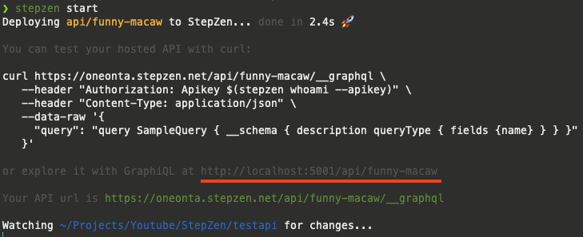
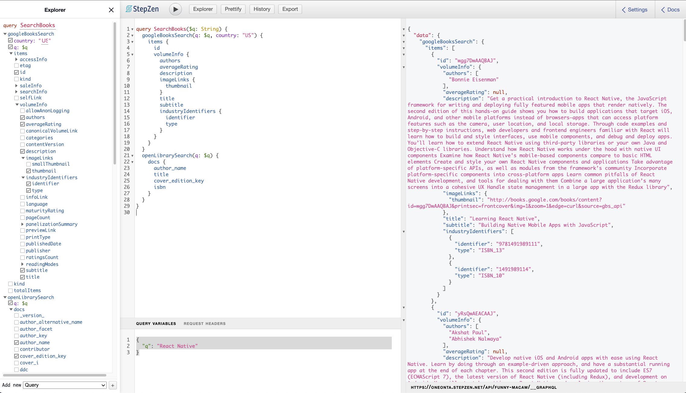

import YoutubeVideo from "../../../src/components/shared/YoutubeVideo/YoutubeVideo";
import OptInForm from '../../../src/components/shared/OptInForm/OptInForm';

# Build a Books App with React Native

In this tutorial, we will build a Books App similar to [GoodReads](https://www.goodreads.com/) that will allow users to search for books and keep track of the books that they have read. For that, we will use:

- [React Native](https://reactnative.dev/) with [Expo](https://docs.expo.dev/) for the mobile application
- [Google Books API](https://developers.google.com/books)
- [Open Library API](https://openlibrary.org/)
- [StepZen](http://bit.ly/3V3NMHb) to build a GraphQL API, using above mentioned public REST APIs
- [Apollo Client](https://www.apollographql.com/docs/react/integrations/react-native/) to query the API from React Native
- [Async Storage](https://react-native-async-storage.github.io/async-storage/) to persist data on the device storage

If you want to follow along, and build this application yourself, make sure to download the Asset bundle that contains all the dummy data, pre-defined compontents, PDF presentation and more.

<OptInForm formId={"fa0876eef5"} formSrc={"https://awesome-teacher-1065.ck.page/fa0876eef5/index.js"} title="Download the Asset Bundle 👇">To get the Source Code, PDF guide, dummy data, images, etc. </OptInForm>

If you prefer video format, then you can follow the build here:

<YoutubeVideo id="-qAhg4EDIwQ" title={frontmatter.title} />

Now that we are all set up, Let’s get started 🚀

## Create a GraphQL API in minutes

As we said, we are going to use **Google Books** and **Open Library** APIs to get the data about books. These APIs are public, and you don’t need an API key to work with them.

These are REST APIs, and here we can see an example of the search query endpoint:

[https://www.googleapis.com/books/v1/volumes?q=React+Native](https://www.googleapis.com/books/v1/volumes?q=React+Native)

Working with 2 different REST APIs in the same application is quite a challenge. That’s why, we are going to use [StepZen](http://bit.ly/3V3NMHb) to setup a GraphQL API and then easily query our GraphQL API from our application.

This tutorial is sponsored by [StepZen](http://bit.ly/3V3NMHb). StepZen is a GraphQL server with a unique architecture that helps developers build APIs fast and with less code (using declarative configurations).

In simple words, [StepZen](http://bit.ly/3V3NMHb) helps you build one GraphQL API from multiple sources: different APIs, databases, micro-services, etc. And that’s exactly what we need today.

### Get started with StepZen

1. Create a Free StepZen account [here](http://bit.ly/3V3NMHb)
2. Install cli and login

```jsx
npm install -g stepzen
stepzen login -a oneonta
```

Check out the [Getting Started guide](https://stepzen.com/docs/quick-start/with-graphql) for more information

1. Import the Gogle API

```jsx
stepzen import curl \
	"https://www.googleapis.com/books/v1/volumes?q=harry&country=US" \
	--query-name googleBooksSearch \
	--query-type GoogleRoot \
	--prefix Google \
	--name GoogleBooks
```

2. Import the Open Library api

```jsx
stepzen import curl \
	"http://openlibrary.org/search.json?q=the+lord+of+the+rings" \
 	--query-name openLibrarySearch \
	--query-type OpenLibraryRoot \
	--prefix OL \
	--name OpenLibrary
```

3. Start the server

```jsx
stepzen start
```



### Explore the API

Expore the API by clicking on the highlighted link above

4. Let’s add the next query

```graphql
query SearchBooks($q: String) {
  googleBooksSearch(q: $q, country: "US") {
    items {
      id
      volumeInfo {
        authors
        averageRating
        description
        imageLinks {
          thumbnail
        }
        title
        subtitle
        industryIdentifiers {
          identifier
          type
        }
      }
    }
  }
  openLibrarySearch(q: $q) {
    docs {
      author_name
      title
      cover_edition_key
      isbn
    }
  }
}
```

5. and this Query variables

```graphql
{
  "q": "React Native"
}
```

6. Now we can press **Play** at the top to execute our query. In the right pannel, we should see the response to our qury.



And that’s it for our backend. That’s how easy it is to build a GraphQL API using StepZen.

## Mobile Application

### Set up a new application using Expo

7. initialize app

```jsx
npx create-expo-app BooksMobile --template tabs
```

8. Change the tint color inside `constants/Colors.ts`

```graphql
const tintColorLight = "#46AA71";
```

### Get started with Apollo Client

9. Install and setup apollo

[Integrating with React Native](https://www.apollographql.com/docs/react/integrations/react-native/)

```jsx
npx expo install @apollo/client graphql
```

10. Setup apollo inside `App.tsx`

```jsx
import { ApolloClient, InMemoryCache, ApolloProvider } from "@apollo/client";

const API_KEY = "<YOUR_API_KEY>";

// Initialize Apollo Client
const client = new ApolloClient({
  uri: "https://oneonta.stepzen.net/api/good-deer/__graphql",
  headers: {
    Authorization: `Apikey ${API_KEY}`,
  },
  cache: new InMemoryCache(),
});

...

<ApolloProvider client={client}>
  <Navigation colorScheme={colorScheme} />
</ApolloProvider>
```

<aside>
🔐 Get the api key by running `stepzen whoami --apikey` in the command line

</aside>

11. Let’s query the books inside `screens/TabOneScreen.tsx`

```jsx
const query = gql`
  query SearchBooks($q: String) {
    googleBooksSearch(q: $q, country: "US") {
      items {
        id
        volumeInfo {
          authors
          averageRating
          description
          imageLinks {
            thumbnail
          }
          title
          subtitle
          industryIdentifiers {
            identifier
            type
          }
        }
      }
    }
    openLibrarySearch(q: $q) {
      docs {
        author_name
        title
        cover_edition_key
        isbn
      }
    }
  }
`;

export default function TabOneScreen({
  navigation,
}: RootTabScreenProps<'TabOne'>) {
  const { data, loading, error } = useQuery(query, {
    variables: { q: 'React Native' },
  });

  console.log(JSON.stringify(data, null, 2));

  return (
    <View style={styles.container}>
      {loading && <ActivityIndicator />}
      {error && (
        <View style={styles.container}>
          <Text style={styles.title}>Error fetching books</Text>
          <Text>{error.message}</Text>
        </View>
      )}
    </View>
  );
}
```

### Render a list of Books

12. Now, let’s create a file called `Book.d.ts`that will store our global types

```jsx
type Book = {
  image: string,
  title: string,
  authors: string[],
  isbn: string,
};
```

13. Create a new component `components/BookItem.tsx`

```
import { View, Text, StyleSheet, Image } from "react-native";
import React from "react";

type BookItemProps = {
  book: Book;
};

const BookItem = ({ book }: BookItemProps) => {
  return (
    <View style={styles.container}>
      <Image source={{ uri: book.image }} style={styles.image} />
      <View style={styles.contentContainer}>
        <Text style={styles.title}>{book.title}</Text>
        <Text>by {book.authors?.join(", ")}</Text>
      </View>
    </View>
  );
};

const styles = StyleSheet.create({
  container: {
    flexDirection: "row",
    marginVertical: 10,
  },
  image: {
    flex: 1,
    aspectRatio: 2 / 3,
    marginRight: 10,
  },
  contentContainer: {
    flex: 4,
    borderColor: "lightgray",
    borderBottomWidth: 0.5,
  },
  title: {
    fontSize: 16,
    fontWeight: "500",
  },
});

export default BookItem;
```

14. Render a list of books inside `screens/TabOneScreen.tsx`

```jsx
<FlatList
  data={data?.googleBooksSearch?.items || []}
  renderItem={({ item }) => (
    <BookItem
      book={{
        title: item.volumeInfo.title,
        image: item.volumeInfo.imageLinks.thumbnail,
        authors: item.volumeInfo.authors,
      }}
    />
  )}
  showsVerticalScrollIndicator={false}
/>
```

15. Add the Input Box, and switch to a `LazyQuery`

```jsx
const [search, setSearch] = useState('');
const [runQuery, { data, loading, error }] = useLazyQuery(query);

<View style={styles.header}>
  <TextInput
    value={search}
    onChangeText={setSearch}
    placeholder="Search..."
    style={styles.input}
  />
  <Button
    title="Search"
    onPress={() => runQuery({ variables: { q: search } })}
  />
</View>;
```

<aside>
💡 A Lazy query allows us to execute the query based on a user event, in this case, when the user presses the **************Search************** button.

</aside>

16. Add 2 tabs for Google Books and Open Library

```jsx
const [provider, setProvider] = useState<
    "googleBooksSearch" | "openLibrarySearch"
  >("googleBooksSearch");

const parseBook = (item) => {
  if (provider === "googleBooksSearch") {
    return {
      title: item.volumeInfo.title,
      image: item.volumeInfo.imageLinks?.thumbnail,
      authors: item.volumeInfo.authors,
			isbn: item.volumeInfo.industryIdentifiers?.[0]?.identifier,
    };
  } else {
    return {
      title: item.title,
      authors: item.author_name,
      image: `https://covers.openlibrary.org/b/olid/${item.cover_edition_key}-M.jpg`,
	    isbn: item.isbn?.[0],
		};
  }
};

...

<View style={styles.tabs}>
  <Text
    style={
      provider === "googleBooksSearch"
        ? { fontWeight: "bold", color: "royalblue" }
        : {}
    }
    onPress={() => setProvider("googleBooksSearch")}
  >
    Google Books
  </Text>
  <Text
    style={
      provider === "openLibrarySearch"
        ? { fontWeight: "bold", color: "royalblue" }
        : {}
    }
    onPress={() => setProvider("openLibrarySearch")}
  >
    Open Library
  </Text>
</View>

...

<FlatList
  data={
    provider === "googleBooksSearch"
      ? data?.googleBooksSearch?.items
      : data?.openLibrarySearch?.docs || []
  }
  renderItem={({ item }) => <BookItem book={parseBook(item)} />}
  showsVerticalScrollIndicator={false}
/>

...
// styles
tabs: {
  flexDirection: "row",
  justifyContent: "space-around",
  alignItems: "center",
  height: 50,
},
```

### My Books

17. Create a context provider that will be responsible for keeping track of my books

```jsx
import React, { createContext, useContext, useState } from "react";

type MyBooksContextType = {
  isBookSaved: (book: Book) => boolean;
  onToggleSaved: (book: Book) => void;
  savedBooks: Book[];
};

const MyBooksContext = createContext<MyBooksContextType>({
  isBookSaved: () => false,
  onToggleSaved: () => {},
  savedBooks: [],
});

type Props = {
  children: React.ReactNode;
};

const MyBooksProvider = ({ children }: Props) => {
  const [savedBooks, setSavedBooks] = useState<Book[]>([]);

  const isBookSaved = (book: Book) => {
    return savedBooks.some(
      (savedBook) => JSON.stringify(savedBook) === JSON.stringify(book)
    );
  };

  const onToggleSaved = (book: Book) => {
    if (isBookSaved(book)) {
      setSavedBooks((books) => books.filter((item) => item !== book));
    } else {
      setSavedBooks((books) => [book, ...books]);
    }
  };

  return (
    <MyBooksContext.Provider value={{ isBookSaved, onToggleSaved, savedBooks }}>
      {children}
    </MyBooksContext.Provider>
  );
};

export const useMyBooks = () => useContext(MyBooksContext);

export default MyBooksProvider;
```

18. In `App.tsx`, wrap our `Navigation` component inside the `MyBooksProvider`

```jsx
<MyBooksProvider>
  <Navigation colorScheme={colorScheme} />
</MyBooksProvider>
```

19. Now we can use `MyBooksContext` inside our screens. For that, we can use the exported custom hook called `useMyBooks`.

Let’s get the neceserry function from the context Inside `components/BookItem.tsx`

```jsx
const { onToggleSaved, isBookSaved } = useMyBooks();
const saved = isBookSaved(book);
```

20. Now we can add a button that will call `onToggleSaved()`

```jsx
<Pressable
  style={[styles.button, saved ? { backgroundColor: 'lightgray' } : {}]}
  onPress={() => onToggleSaved(book)}
>
  <Text style={styles.buttonText}>{saved ? 'Remove' : 'Want to Read'}</Text>
</Pressable>
```

### Render my books

21. Inside `screens/TabTwoScreen.tsx` let’s use the `useMyBooks()` hook and get access the the list of ISBNs that we saved

```jsx
export default function TabTwoScreen() {
  const { savedBooks } = useMyBooks();
  return (
    <View style={styles.container}>
      <FlatList
        data={savedBooks}
        renderItem={({ item }) => <BookItem book={item} />}
      />
    </View>
  );
}
```

## Persisting data

22. Install Async Storage

```jsx
npx expo install @react-native-async-storage/async-storage
```

23. Import

```jsx
import AsyncStorage from '@react-native-async-storage/async-storage';
```

24. Create a function `persistData` that will write our saved books to `AsyncStorage`

```jsx
const persistData = async () => {
  await AsyncStorage.setItem('booksData', JSON.stringify(savedBooks));
};
```

25. Create a function `loadData` that will read and parts data from the `AsyncStorage`

```jsx
const loadData = async () => {
  const dataString = await AsyncStorage.getItem('booksData');
  if (dataString) {
    const items = JSON.parse(dataString);
    setSavedBooks(items);
  }
  setLoaded(true);
};
```

26. Now, using `useEffect` we will load and persistData when necesery.

1. When the components mounts, we want to load data

```jsx
useEffect(() => {
  loadData();
}, []); // empty deps array to trigger the effect ONLY when mounting
```

b. When `savedBooks` data from state changes, we want to persist it to storage

```jsx
useEffect(() => {
  if (loaded) {
    persistData();
  }
}, [savedBooks]); // trigger the effect when savedBooks change
```

## Refactoring

1. Let’s change the tab bar titles and icons
2. Tab One
   1. _name_="Search"
   2. icon: `search`
3. Tab Two
   1. _name_="My Books"
   2. icon: `book`
4. _`initialRouteName_="Search"`
5. Rename:
   1. `TabOneScreen` to `SearchScreen`
   2. `TabTwoScreen` to `MyBooksScren`
6. Hide the header on Search Screen

   1. Add `headerShown: false` in the options object of the SearchScreen
   2. Wrap our `SearchScreen.tsx` inside a `SafeAreaView`

   ```jsx
   <SafeAreaView edges={['top']} style={styles.container}>
     ...
   </SafeAreaView>
   ```

## Challenges for you

The learning doesn’t stop here. The best learning is when you go that extra mile. When you try something on your own. That’s why, here are some ideas how you can improve this application

- Add multiple shelves for my books (want to read, currently reading, already read)
- Add cusom shelves that users can add and manage
- Add the details page of the book and show more information about them
- Merge books from different APIs in the same list
- Ratings
- Gamification:
  - How many books you have read (this month, year, etc)
  - Reading challenges

More advance features:

- Auth layer to let users create accounts
- Save user data (ex: shelves, my books) in a database

## Conclusion

I hope you enjoyed this tutorial as much as I enjoyed creating it.

If you learned something new today, make sure to share this tutorial with your network.

We are trying to help more developers out there, and your help is highly appreciated 🙏
