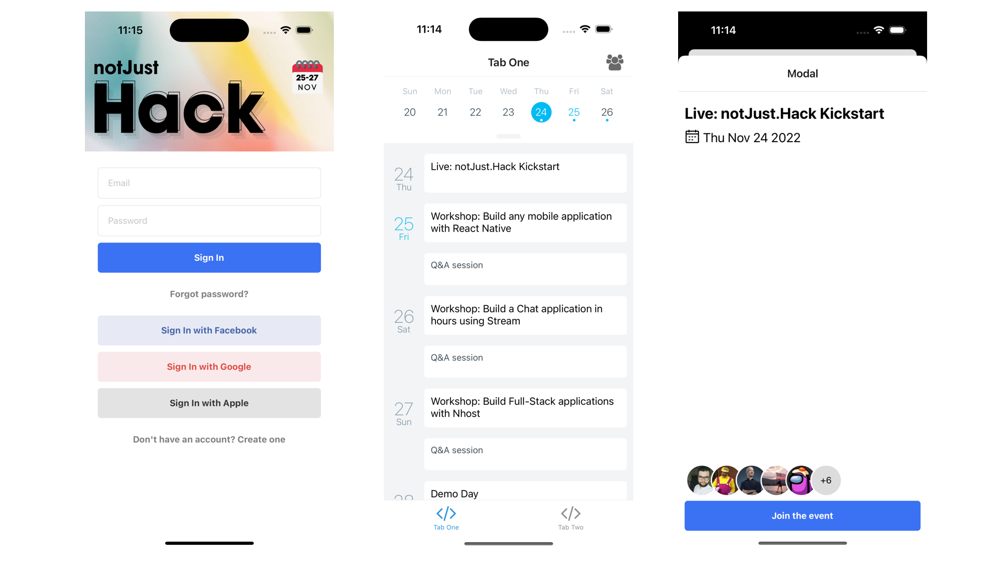
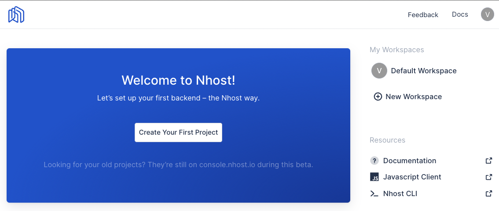
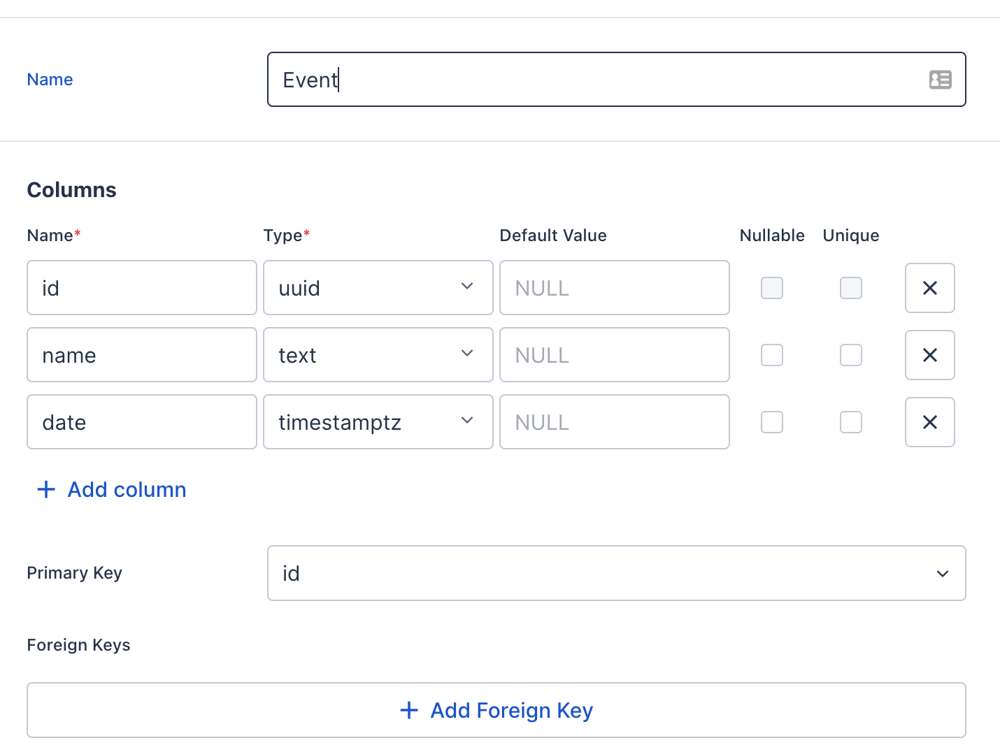
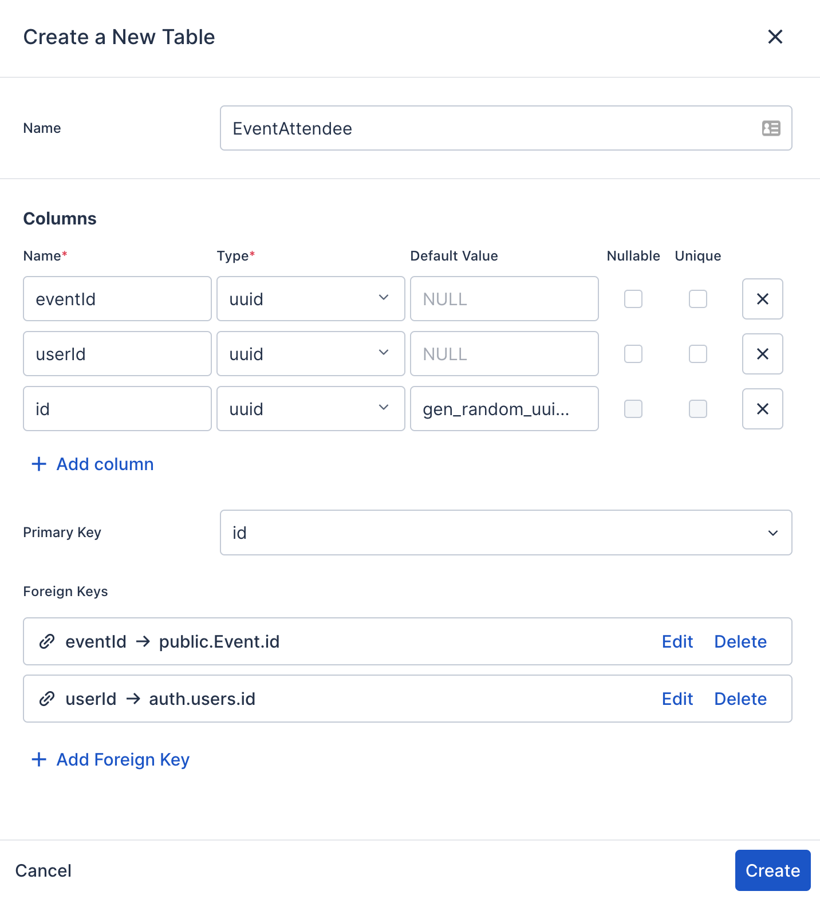
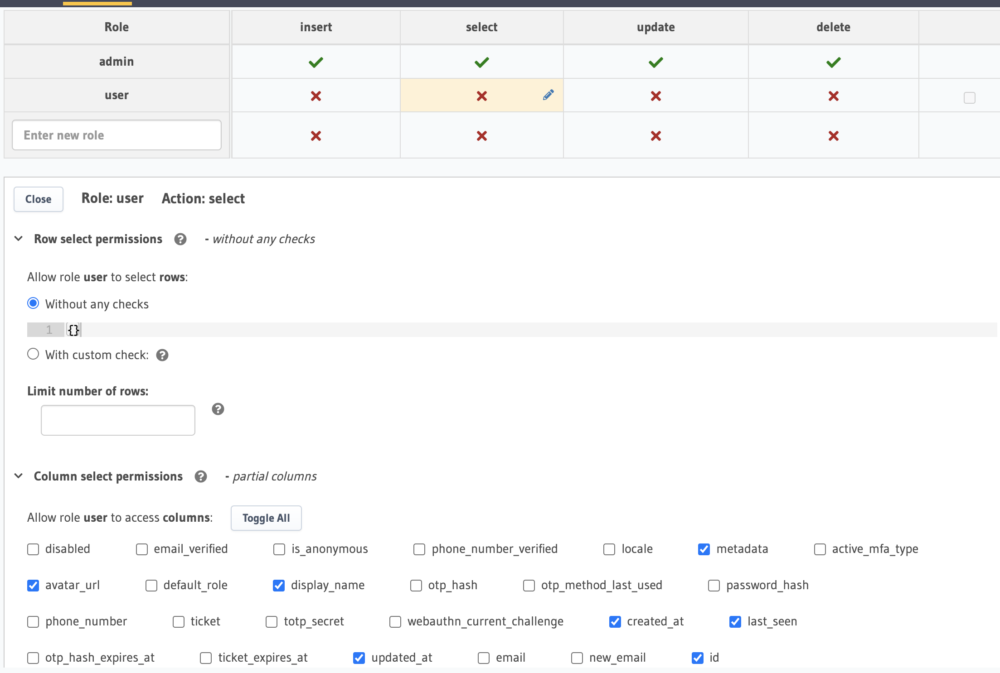
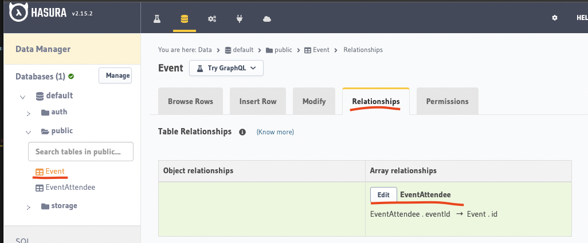

import YoutubeVideo from "../../../src/components/shared/YoutubeVideo/YoutubeVideo";
import OptInForm from '../../../src/components/shared/OptInForm/OptInForm';

Let’s build a full-stack Virtual Events application with React Native and [Nhost](http://bit.ly/3hMq836). Shall we?

You can follow this build in video format here:

<YoutubeVideo id="INLnagMFShw" title={frontmatter.title} />

If you want to follow along, and build this application yourself, make sure to download the Asset bundle that contains all the dummy data, pre-defined components, PDF presentation and more.

<OptInForm formId={"45af57eb50"} formSrc={"https://awesome-teacher-1065.ck.page/45af57eb50/index.js"} title="Download the Asset Bundle 👇">To get the Source Code, PDF guide, dummy data, images, etc. </OptInForm>

## Context

This project is part of the [notJust.Hack](https://www.notjust.dev/hack) event, and the goal is to show you that it is possible to build a functional full-stack application in just 3 days.

In the [first part](https://www.notjust.dev/blog/2022-11-25-virtual-events-app), we built the UI of our Virtual Events Application. We have the User interface ready for the most important screens of the application:

- Schedule and Calendar
- Session details page
- Profile
- Auth screens
  

## The goal for today

Today we will work on the backend side of our application.

We will implement:<br />
✅  Authentications<br />
✅  Database & GraphQL API<br />
✅  Apollo Client<br />

We will use [Nhost](http://bit.ly/3hMq836) which is an open-source alternative to Firebase, leveraging the power of GraphQL. Nhost provides all the APIs, services, and SDKs you need to build apps users love.

This tutorial is sponsored by Nhost, but I am sure you will take a lot of value out of it.

Go from a side project to a successful business in a few days. [Try Nhost for Free!](http://bit.ly/3hMq836)

## Let’s create our Nhost app

1. Create your free account on [Nhost](http://bit.ly/3hMq836)
2. Create your first project



## Install and setup Nhost

Check out [Nhost docs](https://docs.nhost.io/quickstarts/react) for more details.

1. Install

```bash
npx expo install @nhost/react graphql expo-secure-store
```

1. Configure NhostClient inside `App.tsx`

```jsx
import { StatusBar } from 'expo-status-bar';
import { SafeAreaProvider } from 'react-native-safe-area-context';

import useCachedResources from './hooks/useCachedResources';
import useColorScheme from './hooks/useColorScheme';
import Navigation from './navigation';
import { NhostClient, NhostReactProvider } from '@nhost/react';
import * as SecureStore from 'expo-secure-store';

const nhost = new NhostClient({
  subdomain: '',
  region: '',
  clientStorageType: 'expo-secure-storage',
  clientStorage: SecureStore,
});

export default function App() {
  const isLoadingComplete = useCachedResources();
  const colorScheme = useColorScheme();

  if (!isLoadingComplete) {
    return null;
  } else {
    return (
      <SafeAreaProvider>
        <NhostReactProvider nhost={nhost}>
          <Navigation colorScheme={colorScheme} />
        </NhostReactProvider>
        <StatusBar />
      </SafeAreaProvider>
    );
  }
}
```

## Authentication

Nhost [Authentication docs](https://docs.nhost.io/authentication)

### Sign Up

Create a user on the `SignUpScreen.tsx`

```jsx

import { useSignUpEmailPassword } from "@nhost/react";

const SignUpScreen = () => {
	...
	const { signUpEmailPassword, isLoading } = useSignUpEmailPassword();

	const onRegisterPressed = async (data) => {
	    if (isLoading) {
	      return;
	    }
	    const { name, email, password, isSuccess } = data;
	    const { error } = await signUpEmailPassword(email, password, {
	      displayName: name.trim(),
	      metadata: { name },
	    });
	    if (error) {
	      Alert.alert("Oops", error.message);
	    }
		  if (isSuccess) {
	      navigation.navigate("SignIn");
	    }
	  };
	...
}
```

### Sign In

Log in the user inside the `SignInScreen.tsx`

```jsx
import { useSignInEmailPassword } from "@nhost/react";

const SignInScreen = () => {
	...
	const { signInEmailPassword, isLoading } = useSignInEmailPassword();

  const onSignInPressed = async (data) => {
    if (isLoading) {
      return;
    }
    const { email, password } = data;
    const { error, needsEmailVerification } = await signInEmailPassword(email, password);

		if (needsEmailVerification) {
      Alert.alert(
        "Verify your email",
        "Check your email for a confirmation link"
      );
    }

    if (error) {
      Alert.alert("Couldn't sign in!", error.message);
    }
  };
	...
}
```

- You can also disable the email verification checks from the Nhost Dashboard → Settings → Sign-In Methods → Require Verified Emails.

### Protected Routes

Add protected routes in `navigation/index.ts` based on `isAuthenticated` status.

```javascript
import { useAuthenticationStatus } from "@nhost/react";

function RootNavigator() {
  const { isAuthenticated, isLoading } = useAuthenticationStatus();

	if (isLoading) {
    return <ActivityIndicator />;
  }

	return (...)
}

```

### Profile page

Update the `TabTwoScreen.tsx`

```javascript
import { useSignOut, useUserData } from "@nhost/react";

export default function TabTwoScreen() {
  const { signOut } = useSignOut();
  const user = useUserData();

	return (...)
}
```

## Database

Nhost [Database docs.](https://docs.nhost.io/database)

[Database | Nhost Docs](https://docs.nhost.io/database)

### Events table

For this application, we will start with 2 tables: Event and EventAttendee.

The `Event` table will contain information about one event session (ex: a workshop)

Let’s create the `Event` table



### Event Attendees

Users will be able to register for events that they are interested in. That means that we will need a many to many relationship between Users and Events, because one use can register for multiple events, and one event can have many attendees. To design a many to many relationship, we need a Pivot table `EventAttendee` between `Users` and `Events` where every row in the pivot table will represent the registration of one user at one event.

That’s why, the only fields we need in this table, is the `userId` and the `eventId`.

We will also create foreign keys, to link this table with the `User` and `Event` table.

Let’s Create the `EventAttendee`



## GraphQL API

Nhost [GraphQL API docs](https://docs.nhost.io/graphql)

Let’s explore the GraphQL tab from Nhost dashboard. After adding some events manually in the database, you can query them with the next query

```graphql
Event {
  id
  name
  date
}
```

### Permissions

Nhost [Permissions docs](https://docs.nhost.io/graphql/permissions).

So far, we have ran the queries as Admin, but if we will want to run the queries as User, we will get an error.

That’s because For each **role,** we have to create **rules**for the different operations.

Give permissions to the user using Hasura dashboard for all the necessary operations

- First, give users permission to query the `user` database from Hasura dashboard
  

## Query the GraphQL API with Apollo

To query the GraphQL API that we just created using Nhost, we will use [Apollo Client](https://www.apollographql.com/docs/react/). This is a powerful querying and caching library that will help manage the remote data.

- Install Apollo Client

```bash
npx expo install @nhost/react-apollo @apollo/client -- --legacy-peer-deps
```

- Add the Apollo Provider inside `App.tsx`

```jsx
import { NhostApolloProvider } from "@nhost/react-apollo";
...

<NhostReactProvider nhost={nhost}>
  <NhostApolloProvider nhost={nhost}>
    <Navigation colorScheme={colorScheme} />
  </NhostApolloProvider>
</NhostReactProvider>
```

### Query Users

GraphQL query to get the list of users

```graphql
query GetUsers {
  users {
    id
    displayName
    avatarUrl
  }
}
```

Query the list of users inside `UsersScreen.tsx`

```jsx
import { ActivityIndicator, FlatList, Text } from 'react-native';
import UserListItem from '../components/UserListItem';
import { gql, useQuery } from '@apollo/client';

const GetUsers = gql`
  query GetUsers {
    users {
      id
      displayName
      avatarUrl
    }
  }
`;

const UsersScreen = () => {
  const { data, loading, error } = useQuery(GetUsers);

  if (loading) {
    return <ActivityIndicator />;
  }

  if (error) {
    return <Text>{error.message}</Text>;
  }

  return (
    <FlatList
      data={data.users}
      renderItem={({ item }) => <UserListItem user={item} />}
    />
  );
};

export default UsersScreen;
```

### Query events

GraphQL query to get the list of events

```graphql
query GetEvents {
  Event {
    id
    name
    date
  }
}
```

Query the list of events, inside `TabOneScreens.tsx`

```jsx
import { gql, useQuery } from "@apollo/client";

const GetEvents = gql`
  query GetEvents {
    Event {
      id
      name
      date
    }
  }
`;

export default function TabOneScreen({navigation}: RootTabScreenProps<"TabOne">) {
	const { data, loading, error } = useQuery(GetEvents);

	...

	if (loading) {
    return <ActivityIndicator />;
  }

  if (error) {
    Alert.alert("Error fetching events", error.message);
  }
```

As we can see, the data contains an array of events, but for the `Agenda` component, we need the data in a different format.

For that, let’s create a helper function that will receive an array of events, and will group them by days.

```javascript
export const getEventsSchedule = (events: []): AgendaSchedule => {
  const items: AgendaSchedule = {};

  events.forEach((event) => {
    const day = event.date.slice(0, 10);

    if (!items[day]) {
      items[day] = [];
    }
    items[day].push({ ...event, day, height: 50 });
  });

  return items;
};
```

### Query event by id

GraphQL Query to get one event

```graphql
query GetEvent($id: uuid!) {
  Event_by_pk(id: $id) {
    id
    name
    date
  }
}
```

Query the event information inside `ModalScreen.tsx`

```jsx
import { gql, useQuery } from "@apollo/client";

const GetEvent = gql`
  query GetEvent($id: uuid!) {
    Event_by_pk(id: $id) {
      id
      name
      date
    }
  }
`;

...

const { data, loading, error } = useQuery(GetEvent, { variables: { id } });
const event = data?.Event_by_pk;

if (error) {
  return (
    <View style={styles.container}>
      <Text style={styles.title}>Couldn't find the event</Text>
      <Text>{error.message}</Text>
    </View>
  );
}

if (loading) {
  return <ActivityIndicator />;
}
```

## Event Attendees

We have created the relationships:

- EventAttendee ⇒ Event
- EventAttendee ⇒ User

That will help use query the details about the user and the event from the EventAttendee type.

If we want to query the list of `EventAttendees` from an Event, we need to create an array relationship. We can do that, from Hasura dashboard



### Join events

To join an event, we will have to execute a mutation to create a new `EventAttendee` entry with our user id and the event’s id.

GraphQL Mutation to create a new `EventAttendee`

```graphql
const JoinEvent = gql`
  mutation InsertEventAttendee($eventId: uuid!, $userId: uuid!) {
    insert_EventAttendee(objects: [{ eventId: $eventId, userId: $userId }]) {
      returning {
        id
        userId
        eventId
        Event {
          id
          EventAttendees {
            id
          }
        }
      }
    }
  }
`;
```

Now, let’s define the mutation at the top of our component

```javascript
const [doJoinEvent] = useMutation(JoinEvent);
```

Get the `userId`

```javascript
import { useUserId } from "@nhost/react";

...

const userId = useUserId();
```

And then, execute the mutation by calling `doJoinEvent` function inside `onJoin`

```javascript
const onJoin = async () => {
  try {
    await doJoinEvent({ variables: { userId, eventId: id } });
  } catch (e) {
    Alert.alert("Failed to join the event!", (e as Error).message);
  }
};
```

## Query event attendees

To query the event with its attendees, we will update the GetEvent query to include this information

```javascript
const GetEvent = gql`
  query GetEvent($id: uuid!) {
    Event_by_pk(id: $id) {
      id
      name
      date
      EventAttendees {
        user {
          id
          displayName
          avatarUrl
        }
      }
    }
  }
`;
```

Get the `displayedUsers` from our event data

```javascript
const displayedUsers = (event?.EventAttendees || [])
  .slice(0, 5)
  .map((attendee) => attendee.user);
```

Hide the join button, if we are already an attendee

```javascript
const joined = event?.EventAttendees?.some((att) => att.user.id === userId);

{
  !joined ? <CustomButton text="Join the event" onPress={onJoin} /> : null;
}
```

## Hurray 🎉

Congrats, you have successfully build a full-stack mobile application using React Native and Nhost.

If you enjoyed working with Nhost, make sure to [give them Star ⭐  on GitHub](https://github.com/nhost/nhost).
