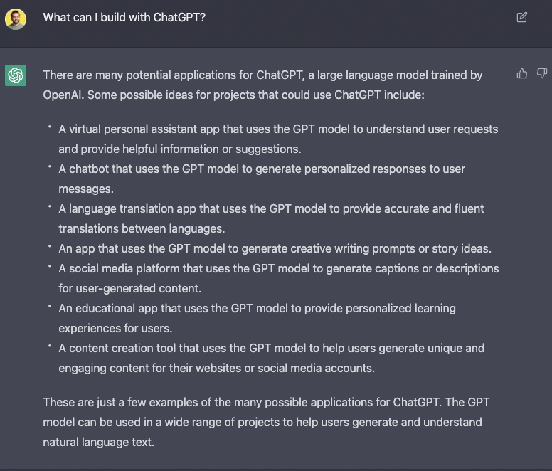
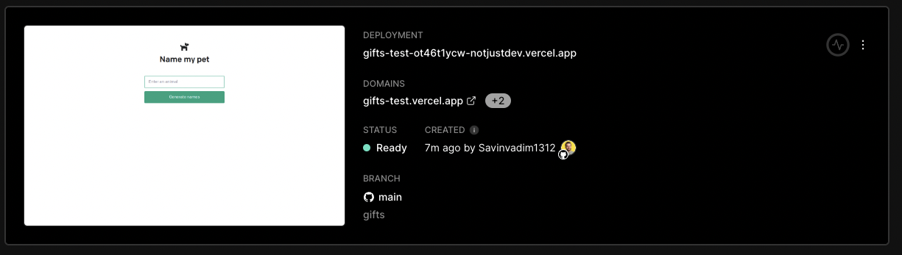
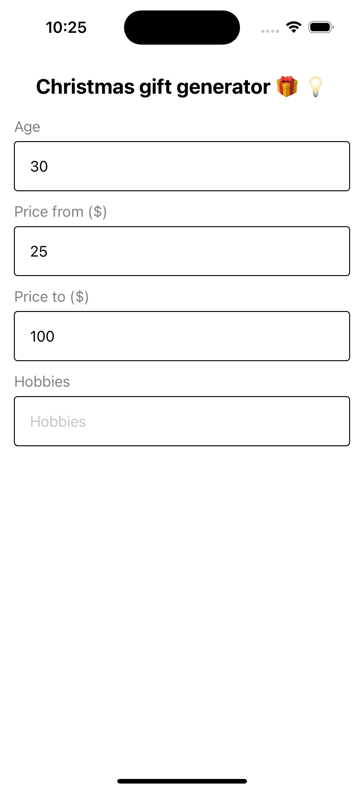
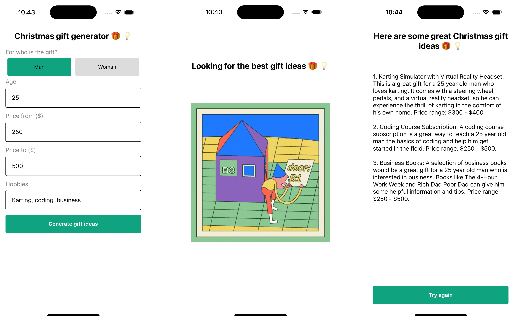

import YoutubeVideo from "../../../src/components/shared/YoutubeVideo/YoutubeVideo";
import OptInForm from '../../../src/components/shared/OptInForm/OptInForm';

[OpenAI](https://openai.com/) just launched [ChatGPT](https://chat.openai.com/chat) - a new AI model that can answer all your questions.

I went deep down the rabit hole asking the most random question and testing “what else” can ChatGPT answer. After some good hours, my mind was blown 🤯  and I started asking myself how long untill even the developers will be replaced by AI.

Fear aside, ChatGPT is trully a very powerful technology that opens the door to so many new opportuninties. It makes AI and Machine learning accessible to any developer, even beginers.

Let’s get our hands dirty with ChatGPT, and integrate it into a real project.

What project should we build?

Let’s be lazy, and just ask ChatGPT for some ideas 💡



And just like that, we have 7 unique project ideas generated by ChatGPT itself.

## The plan

In this tutorial, we'll show you how to use ChatGPT with React Native and NextJS to create a Christmas gift generator that can be used on both the web and mobile platforms.

First, let's take a look at what each of these technologies is and how they work together. ChatGPT is a powerful language model developed by OpenAI that can be used to generate text based on a given input. React Native is a popular JavaScript framework for building native mobile apps, while NextJS is a framework for building server-rendered React apps.

> What if I told you this intro was written by ChatGPT?. Have you noticed?

Alright, back to Vadim...

If you want to follow along, and build this application yourself, make sure to download the Asset bundle that contains all the source code, dummy data, pre-defined components, PDF presentation and more.

<OptInForm formId={"53d1460406"} formSrc={"https://awesome-teacher-1065.ck.page/53d1460406/index.js"} title="Download the Asset Bundle 👇">To get the Source Code, PDF guide, dummy data, images, etc. </OptInForm>

If you prefer video format, then you can follow the build here:

<YoutubeVideo id="kR9Kgo8H7po" title={frontmatter.title} />

Now that we are all set up, Let’s get started 🚀

## Getting started with ChatGPT

Start by logging in or creating a new account on OpenAI: [https://beta.openai.com/signup](https://beta.openai.com/signup)

Now let’s follow the [Quickstart](https://beta.openai.com/docs/quickstart) guide together, to get familiar with OpenAI.

1. Clone the repo

```bash
git clone https://github.com/openai/openai-quickstart-node.git
```

1. Create the `.env` file with your API Key:

```bash
OPENAI_API_KEY=<Your API Key>
```

1. Install dependencies

```bash
npm install
```

1. Let’s run the dev server

```bash
npm run dev
```

Open [http://localhost:3000](http://localhost:3000/) and play around with the Pet Generator.


1. Let’s also use `curl` to query the API endpoint.

```bash
curl -X POST localhost:3000/api/generate -H "Content-Type: application/json" -d '{"animal": "dog"}'
```

## Christmas Gift Generator 🎅🎁

Let’s use the next promt to get recommendation of christmas gifts

```
suggest 3 Christmas gift ideas between 50$ and 100$ for a 30 years old man that is into golfing, business, traveling.
```

The paramters for this promt will be:

- Gender
- Age
- Hobbies
- Price (min, max)

### Create the API endpoint

We need to create a new enpoint that will generate christmas gift ideas based on given paramters.

For that, we will create a new file inside the `pages/api`called `generate-gifts.js`

```jsx
import { Configuration, OpenAIApi } from 'openai';

const configuration = new Configuration({
  apiKey: process.env.OPENAI_API_KEY,
});
const openai = new OpenAIApi(configuration);

export default async function (req, res) {
  const { priceMin, priceMax, gender, age, hobbies } = req.body;
  const completion = await openai.createCompletion({
    model: 'text-davinci-003',
    prompt: generatePrompt(priceMin, priceMax, gender, age, hobbies),
    temperature: 0.6,
    max_tokens: 2048,
  });
  res.status(200).json({ result: completion.data.choices[0].text });
}
function generatePrompt(priceMin, priceMax, gender, age, hobbies) {
  return `suggest 3 Christmas gift ideas between ${priceMin}$ and ${priceMax}$ for a ${age} years old ${gender} that is into ${hobbies}.`;
}
```

<aside>
💡 Files inside the `pages/api/` directory are treated as API endpoints. NextJS maps the file name to the endpoint.

By creating a file `pages/api/generate-gifts.js`, we will be able to do query the `https://you-site.com/api/generate-gifts`endpoint

</aside>

Let’s test the endpoint

```jsx
curl -X POST localhost:3000/api/generate-gifts -H "Content-Type: application/json" -d '{"priceMin": 50, "priceMax": 500, "gender": "woman", "age": 23, "hobbies": "drawing, traveling, coding"}'
```

### WEB UI

Let’s start by creating a new page. For that, we have to create a new file `pages/gifts.js` and NextJS will render it when accessing the url `/gifts`

```jsx
import Head from 'next/head';
import React from 'react';
import { useState } from 'react';
import styles from './index.module.css';

export default function Home() {
  const [gender, setGender] = useState('man');
  const [age, setAge] = useState(30);
  const [priceMin, setPriceMin] = useState(25);
  const [priceMax, setPriceMax] = useState(100);
  const [hobbies, setHobbies] = useState('');
  const [loading, setLoading] = useState(false);

  const [result, setResult] = useState('');

  async function onSubmit(event) {
    event.preventDefault();
    if (loading) {
      return;
    }
    setLoading(true);
    setResult('');
    const response = await fetch('/api/generate-gifts', {
      method: 'POST',
      headers: {
        'Content-Type': 'application/json',
      },
      body: JSON.stringify({ priceMin, priceMax, gender, age, hobbies }),
    });
    const data = await response.json();
    setResult(data.result.replaceAll('\n', '<br />'));
    setLoading(false);
  }

  return (
    <div>
      <Head>
        <title>OpenAI Quickstart</title>
        <link rel="icon" href="/dog.png" />
      </Head>

      <main className={styles.main}>
        <h3>Christmas gift generator 🎁 💡</h3>
        <form onSubmit={onSubmit}>
          <label>For who is the gift?</label>
          <select
            name="gender"
            value={gender}
            onChange={(e) => setGender(e.target.value)}
          >
            <option value="man">Man</option>
            <option value="woman">Woman</option>
          </select>

          <label>Age</label>
          <input
            type="number"
            min={1}
            max={99}
            name="age"
            placeholder="Enter the age"
            value={age}
            onChange={(e) => setAge(Number.parseInt(e.target.value))}
          />

          <label>Price from</label>
          <input
            type="number"
            min={1}
            name="priceMin"
            placeholder="Enter the minimum price"
            value={priceMin}
            onChange={(e) => setPriceMin(Number.parseInt(e.target.value))}
          />

          <label>Price to</label>
          <input
            type="number"
            min={1}
            name="priceMax"
            placeholder="Enter the maximum price"
            value={priceMax}
            onChange={(e) => setPriceMax(Number.parseInt(e.target.value))}
          />

          <label>Hobbies</label>
          <input
            type="text"
            name="hobbies"
            placeholder="Enter the hobbies"
            value={hobbies}
            onChange={(e) => setHobbies(e.target.value)}
          />
          <input type="submit" value="Generate gift ideas" />
        </form>
        {loading && (
          <div>
            <h3>Looking for the best gift ideas 🎁 💡</h3>
            
          </div>
        )}
        <div
          className={styles.result}
          dangerouslySetInnerHTML={{ __html: result }}
        />
      </main>
    </div>
  );
}
```

Updated styles:

```jsx
.main .loading {
  width: 50;
}

.main input[type="text"],
.main input[type="number"],
.main select {
  padding: 12px 16px;
  border: 1px solid #10a37f;
  border-radius: 4px;
  margin-bottom: 12px;
  margin-top: 4px;
}
```

### Upload the project to Github

Let’s stage and commit all our changes first

```bash
git add .
git commit -m "gift generator
```

Now, head to Github and [create a new repository](https://github.com/new).

Back in our project, go ahead and update the url of our local repository to poin to the newly created repo on Github

```bash
git remote set-url origin <your repo url>
```

Now that we have the GitHub repo, we can use it to deploy our project to vercel.

### Deploy to Vercel

This is an optional step, and you will be able to continue with the tutorial even with the local environment. However, it’s so easy to deploy a NextJS app using vercel, that I wanted to show you how to do it.

Open [Vercel dashboard](https://vercel.com/), and connect your new repository.

Don’t forget to add the `OPENAI_API_KEY` environment variable.

Leave everything else by default, and press **Deploy**.



After that is done, we can access the url of our project from anywhere in the world.

## Mobile app with React Native and Expo

For the mobile application we will use [Expo](https://expo.dev/) because it’s fast, easy and convinient.

Let’s start by bootstraping the project using `create-expo-app`

```bash
npx create-expo-app GiftIdeasMobile
```

Now open the project in your editor of choice to start working on the app.

Open a new terminal inside the root directory of the project, and let’s run the development server

```bash
npm start
```

Now we can run the app on either Android by pressing `a` inside the terminal, or on iOS by pressing `i`. You can also use the Expo Go app on your physical device, and scan the QR code to run the app on your phone.

### Form management

Let’s start by rendering a similar form that we have on the web.

Because we will have the same form, we can copy all the state variables from our web project in `App.js`. That’s the benefit of using React on the web and React Native for mobile. We can reuse a lot of code.

```jsx
const [gender, setGender] = useState('man');
const [age, setAge] = useState(30);
const [priceMin, setPriceMin] = useState(25);
const [priceMax, setPriceMax] = useState(100);
const [hobbies, setHobbies] = useState('');
const [loading, setLoading] = useState(false);

const [result, setResult] = useState('');
```

For every input, we will use a `Text` component for the label and a `TextInput` component for the input.

```jsx
<Text style={styles.label}>Age</Text>
<TextInput
  placeholder="Age"
  keyboardType="numeric"
  style={styles.input}
  value={age.toString()}
  onChangeText={(s) => setAge(Number.parseInt(s))}
/>
```

Let’s give it some styles

```jsx
input: {
  fontSize: 16,

  borderColor: "#353740;",
  borderWidth: 1,
  borderRadius: 4,

  padding: 16,
  marginTop: 6,
  marginBottom: 12,
},
label: {
  fontSize: 16,
  color: "gray",
},
```

Now that we have one input, we can duplicate it for the rest of our inputs

```jsx
<Text style={styles.label}>Age</Text>
<TextInput
  placeholder="Age"
  keyboardType="numeric"
  style={styles.input}
  value={age.toString()}
  onChangeText={(s) => setAge(Number.parseInt(s))}
/>

<Text style={styles.label}>Price from ($)</Text>
<TextInput
  placeholder="Price from"
  keyboardType="numeric"
  style={styles.input}
  value={priceMin.toString()}
  onChangeText={(s) => setPriceMin(Number.parseInt(s))}
/>

<Text style={styles.label}>Price to ($)</Text>
<TextInput
  placeholder="Price to"
  keyboardType="numeric"
  style={styles.input}
  value={priceMax.toString()}
  onChangeText={(s) => setPriceMax(Number.parseInt(s))}
/>

<Text style={styles.label}>Hobbies</Text>
<TextInput
  placeholder="Hobbies"
  style={styles.input}
  value={hobbies}
  onChangeText={setHobbies}
/>
```



### Custom switch for the gender

For the gender selecter, we **will build a simple custome picker using 2 `Text` components**

First, Render the genders in a `Text` component, and group the together inside a `View`

```jsx
<Text style={styles.label}>For who is the gift?</Text>
<View style={styles.selectorContainer}>
  <Text style={styles.selector}>Man</Text>
  <Text style={styles.selector}>Woman</Text>
</View>
```

And style them

```jsx
//selector
  selectorContainer: {
    flexDirection: "row",
  },
  selector: {
    flex: 1,
    textAlign: "center",
    backgroundColor: "gainsboro",
    margin: 5,
    padding: 16,
    borderRadius: 5,
    overflow: "hidden",
  },
```

Now, highlight the selected option with a different background color, and handle the `onPress` event of the `Text` component to update the selected option.

```jsx
<Text
  onPress={() => setGender("man")}
  style={[
    styles.selector,
    gender === "man" && { backgroundColor: "#10a37f" },
  ]}
>
  Man
</Text>
<Text
  onPress={() => setGender("woman")}
  style={[
    styles.selector,
    gender === "woman" && { backgroundColor: "#10a37f" },
  ]}
>
  Woman
</Text>
```

If everything is correcnt, this is what you should see now


### Submit form

Render the button

```jsx
<Pressable onPress={onSubmit} style={styles.button}>
  <Text style={styles.buttonText}>Generate gift ideas</Text>
</Pressable>

button: {
  marginTop: "auto",
  backgroundColor: "#10a37f",
  padding: 16,
  borderRadius: 4,
  alignItems: "center",
  marginVertical: 6,
},
buttonText: {
  color: "white",
  fontWeight: "bold",
},
```

Now that we have all the form fields and the button rendered on the screen, let’s implement the `onSubmit` logic. Again, we can use the web version of the submit function, and do minor adjustments for the mobile platform.

```jsx
const onSubmit = async () => {
  if (loading) {
    return;
  }
  setLoading(true);
  setResult('');
  try {
    const response = await fetch(`${API_URL}/generate-gifts`, {
      method: 'POST',
      headers: {
        'Content-Type': 'application/json',
      },
      body: JSON.stringify({ priceMin, priceMax, gender, age, hobbies }),
    });
    const data = await response.json();
    setResult(data.result);
  } catch (e) {
    Alert.alert("Couldn't generate ideas", e.message);
  } finally {
    setLoading(false);
  }
};
```

Make sure to create a global variable `API_URL` and set the url of your deployed app from vercel.

```jsx
const API_URL = 'https://gifts-test.vercel.app/api';
```

In case you didn’t deploy the app, you can use your local environment. For that, make sure to run the NextJS app, and for the mobile application, use the `[localhost](http://localhost)` url

```jsx
const API_URL = 'http://localhost:3000/api';
```

### Loading and Results

When the user is waiting for the response, it would be great to show a loading screen.

```jsx
if (loading) {
  return (
    <View style={styles.loadingContainer}>
      <Text style={styles.title}>Looking for the best gift ideas 🎁 💡</Text>
      <Image
        source={loadingGif}
        style={styles.loading}
        resizeMode="contain"
      />
    </View>
  );
}

loadingContainer: {
  alignItems: "center",
  justifyContent: "center",
  flex: 1,
  padding: 10,
},
loading: {
  width: "100%",
},
```

After we receive the response from the API, we should render it on the screen.

```jsx
const onTryAgain = () => {
  setResult('');
};

if (result) {
  return (
    <SafeAreaView style={styles.container}>
      <Text style={styles.title}>
        Here are some great Christmas gift ideas 🎁 💡
      </Text>
      <Text style={styles.result}>{result}</Text>
      <Pressable onPress={onTryAgain} style={styles.button}>
        <Text style={styles.buttonText}>Try again</Text>
      </Pressable>
    </SafeAreaView>
  );
}
```

### Demo of the Mobile App

That’s it for the mobile application. We have a basic but functional app that can generate gift ideas based on user input.



## Ideas to improve the Christmas Gift Generator

1. Add more parameters to the query
2. Pair it with a image search API (ex: Unsplash) and provide images for every idea
3. Make it generic, not only for Christmas
4. Save ideas
5. Recommend links where you can buy these gifts
6. Can be used as the business model using affiliate links

## Conclusion

In conclusion, using ChatGPT with React Native and NextJS is a powerful combination for building a cross-platform AI app. Whether you're building a gift generator or another type of app, these technologies make it easy to create a user-friendly, feature-rich app that can be used on both the web and mobile platforms.
