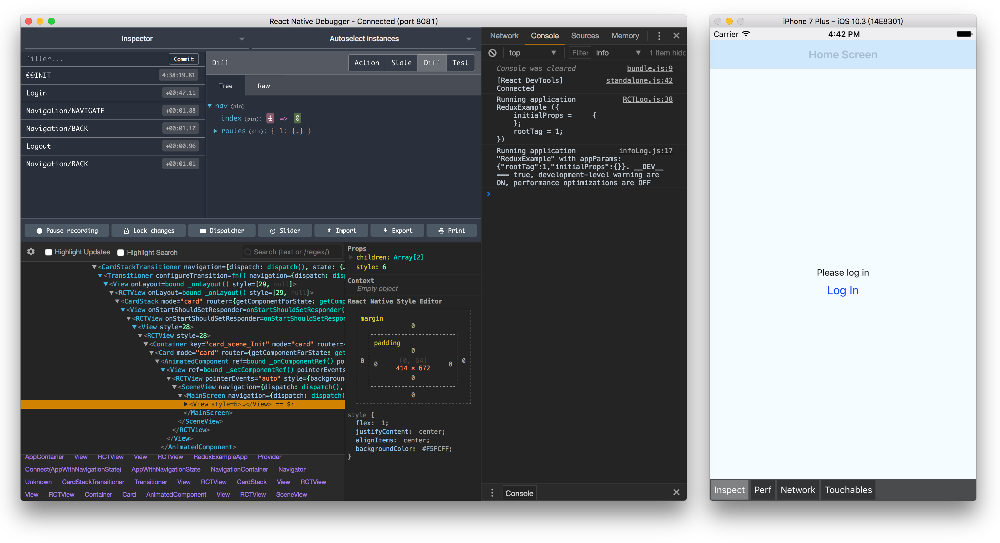
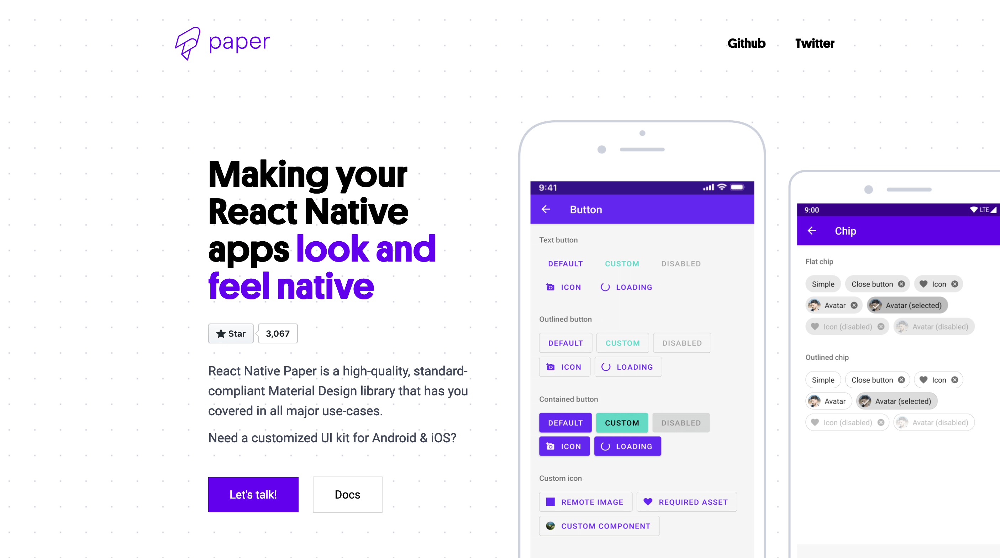

As a React Native developer, having the right tools in your toolkit can make all the difference in your productivity and the quality of your work. In this post, we'll be looking at 7 must-have tools that every React Native developer should consider using.

## [React Native Debugger](https://github.com/jhen0409/react-native-debugger)

This is an incredibly useful tool for debugging your React Native app. It allows you to inspect the state of your app, view the hierarchy of your components, and even change the state of your app in real-time.

## [Redux DevTools](https://github.com/reduxjs/redux-devtools)

If you're using Redux to manage the state of your React Native app, Redux DevTools is a must-have. It allows you to inspect the state of your Redux store, view the actions that are being dispatched, and even revert state changes if needed.

## [ESLint](https://eslint.org/)

Proper code formatting is important for the readability and maintainability of any codebase. ESLint is a tool that helps enforce consistent code formatting by identifying and fixing style issues in your code.

## [Metro Bundler](https://facebook.github.io/metro/)

Metro Bundler is the default bundler for React Native projects. It allows you to bundle your code and assets, and serve them to your app during development. It also has hot reloading capabilities, which allows you to see your changes in the app instantly.

## [Reactotron](https://github.com/infinitered/reactotron)

Reactotron is a powerful debugging tool for React Native apps. It allows you to view the state of your app, view network requests, track global errors, and much more.

## [Axios](https://github.com/axios/axios)

Axios is a popular JavaScript library for making HTTP requests. In a React Native app, it's often used for making API calls to a backend server. Axios makes it easy to send and receive data, and it has built-in support for error handling and request cancellation.

## [React Native Paper](https://callstack.github.io/react-native-paper/)

React Native Paper is a UI component library for React Native. It provides a wide range of customizable components that you can use to build beautiful and functional user interfaces for your app.

## Conclusion

These are just some of the many tools available to React Native developers. As you continue to work with React Native, you may find other tools that you find particularly useful. The important thing is to find the tools that work best for you and your workflow.
