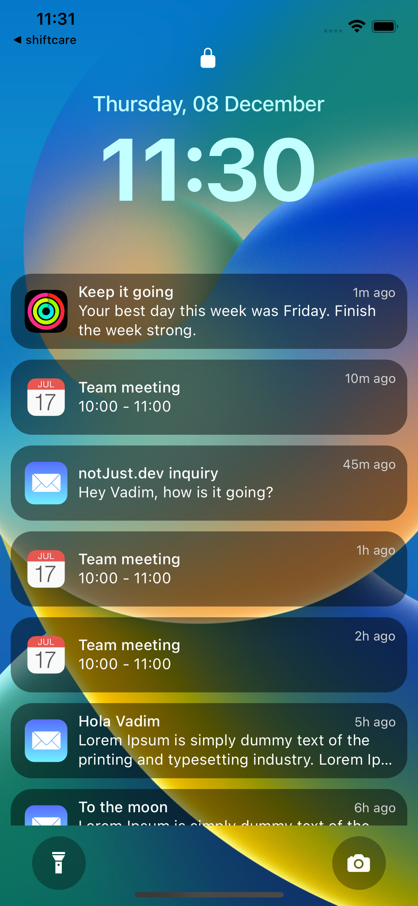

import YoutubeVideo from "../../../src/components/shared/YoutubeVideo/YoutubeVideo";
import Snack from '../../../src/components/shared/Snack/Snack';
import VideoPlayer from '../../../src/components/shared/VideoPlayer/VideoPlayer';

In this blog post, we are going to dive into the world of react native animations with the awesome [react-native-reanimated](https://docs.swmansion.com/react-native-reanimated/) library. After reading the blog post, you will have a fair amount of knowledge on the following topics.

1. Layout Animation with reanimated.
2. Custom Animation with reanimated.

If you love video format, we have that covered as well! Check out this [link](https://www.youtube.com/watch?v=ffMQ_R2Q9pk&t=4s). Without further delay, Let’s jump into it!

### Kick-off

Before we get into the real stuff, let’s download the starter project and run it on our machine. Clone the repo first,

```jsx
git clone https://github.com/Saad-Bashar/ios16-lock-screen-dynamic-time
```

After cloning, don’t forget to run `npm install`. Once you run the project in your expo go application, you should be able to see the following preview,



## Get started with reanimated

We will first get the awesome reanimated library into our project. To install the reanimated library let’s run the command in our terminal,

### Step 1: Install the library

```bash
npx expo install react-native-reanimated
```

### Step 2: Add the babel plugin

After the installation is completed, we will add the Babel plugin to **`babel.config.js`**:

```
module.exports = function(api) {
  api.cache(true);
  return {
    presets: ['babel-preset-expo'],
    plugins: ['react-native-reanimated/plugin'],
  };
};
```

In your case, you most probably will need to just add this line “`plugins: ['react-native-reanimated/plugin']`" to your already existing **`babel.config.js`** file.

### Step 3: Clear cache and start again

Finally, we will need to stop the current running server (if it is running), clear the cache and start the server back again.

```bash
npm start -- --clear
```

## Layout Animations

We will first learn about the layout animation from react native reanimated. It is the easiest way to animate the entering/exiting effect of our components.**[](https://docs.swmansion.com/react-native-reanimated/docs/fundamentals/layout_animations/#layout-animations---the-easiest-way-to-animate-the-enteringexitinglayout-of-your-components)**

In React Native every component appears instantly whenever we add it to the component hierarchy. It's not something we are used to in the real world. Layout Animations are here to address the problem and help you animate the appearance of any view.

At the same time, when unmounting a component from the hierarchy of views, it just disappears in the next frame. However, you can beautify this process using Exiting Animations. Reanimated includes gorgeous exit animations for your components.

For example, let’s say we want to change the appearance of our header and footer on the screen. When the application loads we want our footer to appear "sliding from the bottom" and at the same time we want our header component to "slide in from the top to our screen".

It may sound difficult but we can do that very easily by importing `SlideInDown` and `SlideInUp` from reanimated. Let’s check how to implement this.

First, import the necessary items into our App.js.

`import Animated, { SlideInDown, SlideInUp } from "react-native-reanimated";`

Second, we will need to convert our header’s view and footer’s view from the react native’s `View` to `Animated View`. We can achieve that by replacing our intended `<View />` to `<Animated.View />`.

Finally, when our view is an animated view. We can use `entering` and `exiting` props and pass different animation styles to it. Since we want our components to enter by sliding in from top and bottom we can use `SlideInUp` and `SlideInDown` from reanimated and pass them to the `entering` props to our header and footer’s views. As simple as that!

```jsx
.....
import Animated, { SlideInDown, SlideInUp } from "react-native-reanimated";

export default function App() {
  ......
  return (
    <ImageBackground source={wallpaper} style={StyleSheet.absoluteFill}>
	    {/* header */}
      <Animated.View entering={SlideInUp} style={styles.header}>
        .....
      </Animated.View>

      {/* Notification List */}
      <NotificationsList />

      {/* footer */}
      <Animated.View entering={SlideInDown} style={styles.footer}>
	      ......
      </Animated.View>
    </ImageBackground>
  );
}
```

Note here:

1. The header will appear from the top to its original position. Hence, we have added `<Animated.View entering={SlideInUp} style={styles.header}>` in our header’s view.
2. Similarly, the footer will appear from the bottom to its original position. That’s why we have added, `<Animated.View entering={SlideInDown} style={styles.footer}>`

We can play around with different types of animation styles by passing them to `entering` and `exiting` props. Head over to the [official documentation](https://docs.swmansion.com/react-native-reanimated/docs/fundamentals/layout_animations) to find out the other cool things that you can do with Layout Animation!

## Custom Animations

Alright, the Layout animation is great. But what if we want to have more control over our animation besides just controlling the appearance and disappearance of a component? Worry not, we can do all sorts of custom animation with the help of react-native-reanimated.

In this step, we are going to take a real-world example of custom animation and create it together, step by step. Let’s first check out the preview of what we want to achieve.

<VideoPlayer height={180} width={500} url="/videos/posts/2022-12-12-react-native-custom-animations/swo.mp4" />

We want to recreate the above iOS 16 swipe-up to open animation with react native reanimated. Let’s first break it down, piece by piece.

1. First, the “swipe up to open“ text appears from the bottom. It moves up a bit from its original position.
2. When it reaches the top position, it stays there for a while.
3. After staying visible for a period of time, it starts to move down. At the same time, the text disappears smoothly.

**Creating the component without animation:**

Before we animate our component, let’s first create the component. Create a file called `SwipeUpToOpen` inside our components folder and paste the following.

```jsx
import { Text } from 'react-native';

const SwipeUpToOpen = () => {
  return (
    <Text
      style={[
        {
          color: 'white',
          fontWeight: '600',
          alignSelf: 'flex-end',
          letterSpacing: 0.5,
        },
      ]}
    >
      Swipe up to open
    </Text>
  );
};

export default SwipeUpToOpen;
```

Then, import this component in `App.js` and put it in our footer.

```jsx
.....
import SwipeUpToOpen from "./src/components/SwipeUpToOpen";

export default function App() {
  ....
  return (
    <ImageBackground source={wallpaper} style={StyleSheet.absoluteFill}>
	     ......
      {/* footer */}
      <Animated.View entering={SlideInDown} style={styles.footer}>
        {/* flashlight icon */}
        <View style={styles.icon}>
          <MaterialCommunityIcons name="flashlight" size={24} color="white" />
        </View>

        <SwipeUpToOpen />

        {/* camera icon */}
        <View style={styles.icon}>
          <Ionicons name="ios-camera" size={24} color="white" />
        </View>
      </Animated.View>
    </ImageBackground>
  );
```

With this, we will get a static Text in our footer that says “Swipe up to open”

**\*\***\*\***\*\***Move up and down the text:**\*\***\*\***\*\***

We will first tackle the moving of our text. As we can see that our text moves a bit up from its original position and then comes back down again. In order to do that, we will need to import a few hooks from react native reanimated. Let’s first import them,

```jsx
import Animated, {
  useAnimatedStyle,
  withTiming,
  withRepeat,
  withSequence,
  withDelay,
} from 'react-native-reanimated';
```

Using all these hooks, we can animate our `Text`. Let’s create an animated style and pass it to our Text component. We will first look at the code and then we will try to understand it. Here is the full code:

```jsx
const SwipeUpToOpen = () => {
  const animatedStyles = useAnimatedStyle(() => ({
    transform: [
      {
        translateY: withRepeat(
          withSequence(
            withTiming(-15),
            withDelay(1500, withTiming(0)),
            withTiming(-15),
          ),
          -1,
        ),
      },
    ],
  }));

  return (
    <Animated.Text
      style={[
        {
          color: 'white',
          fontWeight: '600',
          alignSelf: 'flex-end',
          letterSpacing: 0.5,
        },
        animatedStyles,
      ]}
    >
      Swipe up to open
    </Animated.Text>
  );
};

export default SwipeUpToOpen;
```

**useAnimatedStyle:** `useAnimatedStyle` is a hook from react native reanimated that takes a callback function and returns the needed animated styles to the view. That’s what we did in the first line of our component.

```jsx
const animatedStyles = useAnimatedStyle(() => ({
  ....
}));
```

Please note that we also needed to convert our `<Text>` to `<Animated.Text>` so that it can consume the animated styles.

```jsx
<Animated.Text
    style={[
      ......
      animatedStyles,
    ]}
  >
    .......
  </Animated.Text>
);
```

Here comes the main part where we are doing the logic of actual animation with the help of the following modifiers from reanimated library

- withTiming
- withRepeat
- withSequence
- withDelay

Let’s focus on our `transform` array inside `useAnimatedStyle`

```jsx
transform: [
  {
    translateY: withRepeat(
      withSequence(
        withTiming(-15),
        withDelay(1500, withTiming(0)),
        withTiming(-15)
      ),
      -1
    ),
  },
],
```

You can see that we are trying to animate our component’s `Y` position. So that it can go up and down. In order to animate we are using `withTiming` hooks. We have a sequence of animations and that’s why we are using `withSequence` we want to repeat this sequence of animations. Hence, we are using `withRepeat` hooks. Let’s break them down one by one.

```jsx
withTiming(-15), withDelay(1500, withTiming(0)), withTiming(-15);
```

1. `withTiming(-15)` → Our text component first moves 15 points up.
2. `withDelay(1500, withTiming(0)` → It goes back to its original position but with a 1.5 secs delay. We want to keep our text visible at the top for 1.5 secs.
3. `withTiming(-15)` will move the text 15 spaces up again.

We want to do them in sequence, one after another. So we are wrapping them with `withSequence` hooks

```jsx
withSequence(withTiming(-15), withDelay(1500, withTiming(0)), withTiming(-15));
```

Finally, we want to repeat this sequence. We are wrapping this sequence of animations with a `withRepeat` hook. The second argument will decide how many times we want to repeat. We have given the value as `-1` which will repeat this animation indefinitely.

```jsx
 withRepeat(
  withSequence(
    withTiming(-15),
    withDelay(1500, withTiming(0)),
    withTiming(-15)
  ),
  -1
),
```

Our `trasnlateY` animation is done. You should be seeing the following preview now!

<VideoPlayer height={180} width={500} url="/videos/posts/2022-12-12-react-native-custom-animations/move-up-down.mp4" />

**\*\***\*\*\*\***\*\***\*\***\*\***\*\*\*\***\*\***Opacity Animation**\*\***\*\*\*\***\*\***\*\***\*\***\*\*\*\***\*\***

We will do the opacity animation now. As we mentioned above, we want to make the text disappear from the screen when the text is moving down from the top. By animating the opacity we can have that effect. Let’s add the opacity animation inside our `animatedStyles` first and then we will explain.

```jsx
const animatedStyles = useAnimatedStyle(() => ({
    transform: [....],
      {
		    opacity: withRepeat(
		      withSequence(
		        withDelay(1500, withTiming(0)),
		        withDelay(300, withTiming(1))
		      ),
		      -1
	    ),
  }));
```

We have already explained all of the above hooks before. So now we will be able to understand it better. With the opacity, we are trying the following,

```jsx
withDelay(1500, withTiming(0)), withDelay(300, withTiming(1));
```

First, wait for 1.5 seconds. Why 1.5 secs? Because we do not want to make the opacity 0 in the beginning rather we want to make it disappear when the text is moving down and we know from the `translateY` animation that the text will move down after 1.5 secs. So we need to time it like this. Be careful with this value as the wrong value of the delay will break the animation. The next line `withDelay(300, withTiming(1))` will make the opacity again back to 1 to make it visible and we will be able to see the text when the text is moving up.

Similar to what we did for translating the Y position of the text, we want to animate them one after another and we also want to repeat this whole animation process indefinitely. You guessed it right! We will again use the `withSequence` and `withRepeat` functions. Final version of our opacity animation code will look like the following:

```jsx
 opacity: withRepeat(
      withSequence(
        withDelay(1500, withTiming(0)),
        withDelay(300, withTiming(1))
      ),
      -1
  ),
```

Awesome! We have also learned to make custom animation with react native reanimated. Pat yourself on the back now! We have learned the basics and I am sure by playing around more with reanimated we can make the UX of our app a lot better from now on.

## Snack link

<Snack snackId="@saad-bashar/21805c" height={700} />
