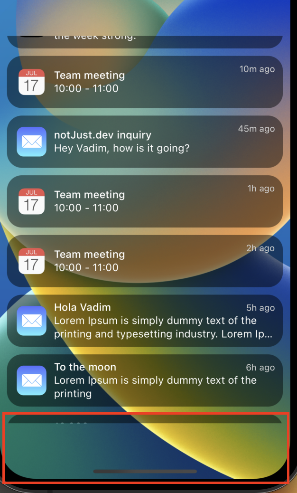

import YoutubeVideo from "../../../src/components/shared/YoutubeVideo/YoutubeVideo";
import Snack from '../../../src/components/shared/Snack/Snack';
import VideoPlayer from '../../../src/components/shared/VideoPlayer/VideoPlayer';

In this blog post, we are going to learn to create beautiful animation with FlatList. The skill of creating animation in your project can set you apart as a react native developer. A lot of the real use cases of the animations in a project depends on integrating with FlatList. We will learn step by step and eventually, we will come up with a complete and complex UX together. As always we will be tackling a real-life exercise to learn a new topic! We will make the iOS 16 lock screen list animation together. Let’s first check out the preview so that we have a clear idea.

<VideoPlayer height={500} width={300} url="/videos/posts/2022-12-14-react-native-flatlist-animations/main-preview.mp4" />

If you want to follow along by watching the video head over to this youtube [link](https://www.youtube.com/watch?v=JcVt63qAt4o&t=182s).

### Kick-off

Before we get into the real stuff, let’s download the starter project and run it on our machine. Clone the repo first,

```jsx
git clone https://github.com/Saad-Bashar/ios16-lock-screen-dynamic-time
```

After cloning, don’t forget to run `npm install`. Once you run the project in your expo go application, you should be able to see the following preview,


## Get started with reanimated

We will first get the awesome reanimated library into our project. To install the reanimated library let’s run the command in our terminal,

### Step 1: Install the library

```bash
npx expo install react-native-reanimated
```

### Step 2: Add the babel plugin

After the installation is completed, we will add the Babel plugin to **`babel.config.js`**:

```
module.exports = function(api) {
  api.cache(true);
  return {
    presets: ['babel-preset-expo'],
    plugins: ['react-native-reanimated/plugin'],
  };
};
```

In your case, you most probably will need to just add this line “`plugins: ['react-native-reanimated/plugin']`" to your already existing **`babel.config.js`** file.

### Step 3: Clear cache and start again

Finally, we will need to stop the current running server (if it is running), clear the cache and start the server back again.

```bash
npm start -- --clear
```

With that, we are ready to rock and roll!

## Task 1: Showing and Hiding the Footer

Let’s first work on hiding and showing the footer whenever we scroll the list. From the preview, we can first deduce the logic of hiding and showing the footer. It depends on our scroll position in the FlatList.

1. Whenever the FlatList is at the top position, our footer is visible. We can also say whenever our scroll position is 0 the footer will be visible.
2. Whenever we scroll a bit down and pass a certain threshold value we will hide the footer.

It’s understood from the above deduction that we will need to track the scroll position of our FlatList to implement the above logic.

To do so, let’s add `onScroll` props to the `FlatList` inside our `NotificationList` component. After that, we will use `useAnimatedScrollHandler` from `reanimated` to track the scroll position of our FlatList. `useAnimatedScrollHandler` hook gives us a lot of details but we are particularly interested in `onScroll` function as of now. Go to the `NotificationList` component and add the following code.

Since we are using the handler from reanimated we need to convert our FlatList to `Animated.FlatList`. We can achieve that very easily by using `Animated` from the reanimated package. Remember to import `Animated` from the reanimated package.

```jsx
..............
import { useAnimatedScrollHandler } from "react-native-reanimated";
import Animated, { useAnimatedScrollHandler } from "react-native-reanimated";


const NotificationsList = ({ ...flatListProps }) => {
  .......
  const handler = useAnimatedScrollHandler({
    onScroll: (event) => {
		// event.contentOffset.y will give us the scroll position
      	console.log(event.contentOffset.y);
    }
  })

  return (
    <Animated.FlatList
		.......
     	onScroll={handler}
    />
  );
};
```

At this phase, we will be able to know the scroll position of our FlatList using our handler. We know that we get the scroll position from `event.contentOffset.y`, we can have a condition in our handler to show and hide the footer,

```jsx
const handler = useAnimatedScrollHandler({
  onScroll: (event) => {
    // event.contentOffset.y will give us the scroll position
    console.log(event.contentOffset.y);
    const y = event.contentOffset.y;
    if (y < 10) {
      // show the footer
    } else {
      // hide the footer
    }
  },
});
```

We also want to minimize the call that our handler gets on scrolling. Right now it gets triggered for every interaction which is pretty huge and unnecessary for us. As phones have a max of 60fps refresh rate, we can add `scrollEventThrottle={16}` props to our FlatList and that will do the trick for us.

Cool, with that being set up, let’s go to our `App.js` file and work on the footer. By working with the opacity of our footer we can show and hide the footer.

Let’s declare the footer opacity value using reanimated as we want to smoothly hide and show the footer. We can use `useSharedValue` hook from reanimated and return an animated style to our footer using `useAnimatedStyle` hook. Go to `App.js` and add the following code.

```jsx
.......
import { useSharedValue } from "react-native-reanimated";

export default function App() {
	.......
	const footerVisibility = useSharedValue(1) // 1 because the footer is visible initially
	.......
	const animatedFooterStyle = useAnimatedStyle(() => {
    return {
      opacity: footerVisibility.value,
    };
  });

  return (
    <ImageBackground source={wallpaper} style={StyleSheet.absoluteFill}>
      .......
      {/* footer */}
      <Animated.View style={[styles.footer, animatedFooterStyle]}> {/* animatedStyle */}
        {/* flashlight icon */}
        <View style={styles.icon}>
          <MaterialCommunityIcons name="flashlight" size={24} color="white" />
        </View>
        {/* camera icon */}
        <View style={styles.icon}>
          <Ionicons name="ios-camera" size={24} color="white" />
        </View>
      </Animated.View>
    </ImageBackground>
  );
}

const styles = StyleSheet.create({
  .......
  footer: {
    flexDirection: "row",
    justifyContent: "space-between",
    marginTop: "auto",
    paddingVertical: 10,
    paddingHorizontal: 30,
    height: 75,
  },
  .......
});
```

We will pass our `footerVisiblity` value to our `NotificationList` component. From the beginning, our idea was to show or hide the footer according to the scroll position of our `NotifcationList`.

```jsx
.......
export default function App() {
  .......
  return (
    <ImageBackground source={wallpaper} style={StyleSheet.absoluteFill}>
		.......
		{/* Notification List */}
		<NotificationsList footerVisibility={footerVisibility} />
		.....
      	......
    </ImageBackground>
  );
}
```

In our `NotificationList` component, we need to grab this value and make it either 0 or 1 depending on our scroll position. In order to smoothly change the opacity of the footer we will use `withTiming` hook from reanimated.

```jsx

import Animated, {
  useAnimatedScrollHandler,
  withTiming,
} from "react-native-reanimated";
.......
.......
const NotificationsList = ({ footerVisibility, ...flatListProps }) => {
  const handler = useAnimatedScrollHandler({
    onScroll: event => {
      if (event.contentOffset.y < 10) {
		// hide the footer
        footerVisibility.value = withTiming(0);
      } else {
		// show the footer
        footerVisibility.value = withTiming(1);
      }
    },
  });

  return (
    <Animated.FlatList
      .........
    />
  );
};

export default NotificationsList;
```

Check out the preview of what we have done so far.
<VideoPlayer height={500} width={300} url="/videos/posts/2022-12-14-react-native-flatlist-animations/hide-show-footer-anim.mp4" />

Even though right now we are hiding or showing the footer based on the opacity, it brings a new problem. We can observe that when the footer is not visible meaning when the opacity is 0, there is a blank space at the bottom. That space basically is the footer’s height which is set to 75 plus the marginTop 10, so there are 85dp spaces at the bottom that still remains when the footer opacity is 0.



Let’s fix the above issue. We will need to give the available space to our FlatList when the footer is not visible. We can fill up that empty space by providing a negative `marginTop: -85` value. It is also mentionable that this `marginTop` value maps to our footer’s opacity value. When the opacity is 1, we want to show the footer so our marginTop should be nothing in that case, whereas when the opacity is 0 we want to hide the footer and give the available space to our FlatList we want to add the negative `marginTop` value.

In order to map values in reanimated, we can use `interpolate` function. It takes an animated value and maps output values to a certain input value.

```jsx
interpolate(animatedValue, [], []);
```

Note: The first `[]` argument will be the input values and the second `[]` argument will be the output values.

Let’s implement our interpolate function and return marginTop from our `animatedFooterStyle`.

```jsx
// When the footerVisibility.value is 0 our marginTop will be -85
// When footerVisibility.value is 1 our marginTop will be 0

const animatedFooterStyle = useAnimatedStyle(() => {
  return {
    opacity: footerVisibility.value,
    marginTop: interpolate(footerVisibility.value, [0, 1], [-85, 0]),
  };
});
```

You will be able to see that our space is filling up nicely when we scroll down and there is no gap.

## Task 2. Animating the Notification List Items

Next task is to animate the notification list items. Before we implement the animation, let’s take a look at following preview of what we are going to achieve.

<VideoPlayer height={500} width={300} url="/videos/posts/2022-12-14-react-native-flatlist-animations/hide-show-list.mp4" />

Let’s tackle the hiding and showing of the list items our FlatList with reanimated. As you can see from the preview we need to handle the following cases:

1. When a user is at the top of the `NotificationList`, the user can pull down further to dismiss the items of the FlatList. The item of the FlatList smoothly goes out of the screen one after another. You will notice that the items on that list do not go away together at the same time. The speed of the items moving out of the screen is different from each other. This will generate a very pleasing experience for the user when they dismiss the FlatList. We will come to the calculation of the speed later.
2. At the same time, when the `NotificationList` is not visible, the user can pull up the FlatList by scrolling or pulling from the bottom of the screen.

**Moving the FlatList Items out of the screen**

We want to individually move the items out of the screen, so let’s go to our `NotificationItem` component and animate the items so that they can smoothly go out of the screen,

```jsx
// other imports
......
......
import Animated, {
  useAnimatedScrollHandler,
  useAnimatedStyle,
  withTiming,
} from "react-native-reanimated";

export const NOTIFICATION_HEIGHT = 80;

const NotificationItem = ({ data, index }) => {
  const animatedStyle = useAnimatedStyle(() => {
    return {
      transform: [
        {
          translateY: withTiming(500, { duration: 3000 }),
        },
      ],
    };
  });
  return (
    <Animated.View style={[styles.container, animatedStyle]}>
     	.......
    </Animated.View>
  );
};

export default NotificationItem;
```

With this code above you will see that your items or the FlatList slowly moves out of the screen,

We created an `animatedStyle` using `useAnimatedStyle` hook from reanimated. That returns the animation that we want to achieve. Inside the `useAnimatedStyle` we are moving our items on the Y axis. That’s why we added, `transform: [{ translateY: withTiming(500, { duration: 3000 })}]` The duration is just for demo purposes for us to see that the translateY is really working as intended. We can remove that after testing.

Alright, at this point we can move our items from the screen. But this movement of the items depends on the user’s scrolling. We will now go to our NotificationList component and add the logic of showing and hiding the items based on the user's scroll.

Similar to our footer visibility we can create a shared value that goes from 0 to 1 depending on the list’s visibility. We will use the same `scrollHandler` function to make it happen. Instead of the previous `onScroll` function, we will use `onBeginDrag` and `onEndDrag`

**onEndDrag:** This function gets called when the user stops dragging the list. We want to check if the user has stopped dragging and if the scroll position is less than 0. If that’s the case we want to hide the list.

**onBeginDrag:** This function gets called when the user starts dragging the list. We want to check if the list is hidden when the user starts dragging. If that’s the case we want to show the list.

Putting these all together,

```jsx
.......
.......
import Animated, {
  useAnimatedScrollHandler,
  useSharedValue,
  withTiming,
} from "react-native-reanimated";

const NotificationsList = ({ footerVisibility, ...flatListProps }) => {
  const listVisibility = useSharedValue(0);

  const handler = useAnimatedScrollHandler({
    onScroll: event => {
	   ......
    },
    onEndDrag: event => {
      if (event.contentOffset.y < 10) {
        listVisibility.value = withTiming(0);
      }
    },
    onBeginDrag: event => {
      if (listVisibility.value <= 0) {
        listVisibility.value = withTiming(1);
      }
    },
  });

  return (
    <Animated.FlatList
	    ....
      listVisibility={listVisibility}
    />
  );
};
export default NotificationsList;
```

Great, we will be able to use this `listVisibility.value` inside our `NotificationItem`. We can map the value from 0 to 1 and 1 to 0. Let’s change the `animatedStyle` so that it can use the `listVisibility` value and interpolate `translateY` value.

```jsx
const animatedStyle = useAnimatedStyle(() => {
  return {
    transform: [
      {
        translateY: interpolate(listVisibility.value, [0, 1], [500, 0]),
      },
    ],
  };
});
```

It means that when the list is not visible, the Y value of the list is 500 so the list is out of the screen, and when the list is visible again the Y value of the list is 0. As of now, we are using a fixed value of `500`, so all the items in our list go to a fixed position. This will make us feel that all the items are moving down together at the same speed.

However, we want to generate an effect that the items go down one after another at different speeds. In order to achieve that, we can make the distance between our first item and the distance that it needs to travel bigger. And the distance will be shorter consecutively for the next items. This means that our last item will travel the shortest distance.

How do we know the item’s distance in this case? We do have an index for each item in our `NoitificationItem` component and we have a fixed height of `80` for each item. Hence we can derive the `startPosition` for each item,

```jsx
const startPosition = index * NOTIFICATION_HEIGHT;
```

Now we will figure out the distance that the item needs to travel from their `startPosition`. We can change the value of that fixed 500 to `500 - startPosition`. It will look like the following,

```jsx
const animatedStyle = useAnimatedStyle(() => {
  return {
    transform: [
      {
        translateY: interpolate(
          listVisibility.value,
          [0, 1],
          [500 - startPosition, 0],
        ),
      },
    ],
  };
});
```

With this, we should already be seeing that our items are moving out of the screen and also moving into the screen one after another smoothly. But you will notice that our flatlist’s first item is still slightly visible when we dismiss the list. Because of that fixed value of 500.

We will be giving a dynamic value to make it work properly. The value should be,

`value = screenHeight - (headerHeight - footerHeight)`, we already know the `headerHeight` and `footerHeight`. We will use `useWindowDimension` hook from react native to calculate the `screenHeight`.

Our NotificationComponent should look like the following at this point,

```jsx
import {
	.....
  useWindowDimensions,
} from "react-native";
import Animated, {
  interpolate,
  useAnimatedScrollHandler,
  useAnimatedStyle,
  withTiming,
} from "react-native-reanimated";

const NotificationItem = ({ data, index, listVisibility }) => {
  const { height } = useWindowDimensions(); // screen height
  const startPosition = index * NOTIFICATION_HEIGHT;
  const containerHeight = height - (250 - 85);
  const animatedStyle = useAnimatedStyle(() => {
    return {
      transform: [
        {
          translateY: interpolate(
            listVisibility.value,
            [0, 1],
            [containerHeight - startPosition, 0]
          ),
        },
      ],
    };
  });
  return (
    <Animated.View style={[styles.container, animatedStyle]}>
     ......
    </Animated.View>
  );
};
```

Awesome! We have done a good amount of work and managed to animate out list items depending on the user’s scroll! This looks great!

We have 2 remaining animations to make the hiding of the list of our items smoother.

1. When the items are going down and eventually going out of the screen, we want to shrink the item’s size by animating the scale of the items.
2. At the same time, we want to make the opacity of the items either 0 or 1 depending on the list visibility.

To animate the size of the items, we can add the following into our `animdatedStyle`:

```jsx
const animatedStyle = useAnimatedStyle(() => {
    return {
      transform: [
        ....
        {
          scale: interpolate(
            listVisibility.value,
            [0, 1],
            [0.5, 1],
          ),
        },
      ],
    };
  });
```

To animate the opacity we will add opacity animation into the same `animdatedStyle` after our `transform` array.

```jsx
const animatedStyle = useAnimatedStyle(() => {
    return {
      transform: [
	      ....
      ],
      opacity: listVisibility.value,
    };
  });
```

Phew! We have done a lot of work and we have a nice looking notification list. Let’s take a look at the demo of the result.

<VideoPlayer height={500} width={300} url="/videos/posts/2022-12-14-react-native-flatlist-animations/scale-opacity-list-anim.mp4" />

## Task 3: Animate the last visible item in our list

Let’s start with our next task. We want to animate the last visible item in our list just like what happens in iOS 16.

**Removing the footer and list animation first**

We will need to remove some of the noises from our code to work on the last item specifically. We will comment out the current `animatedStyle` which animates the list for now. As it will be very hard to see the list animation and the last item’s animation together at this point. Both of these animations depend on `listVisibility` Let’s comment it out inside `NotificationItem` component and create a new `animatedStyle`. We will write the animation of our last item inside it.

At the same time, we will disable the footer animation or we can say we will comment out our footer at this point to focus on the last item.

Don’t worry, after we are done animating our last item we will merge the footer and list item’s animation together to have our beautiful animation.

**Tracking scrollY value:**

From the preview, we understand that our last item’s animation depends on the user’s scroll. First thing first, we will pass the `scrollY` value to our `NotificationItem` component from our list component.

Inside our `NotificationList` component, let’s add the following to track the `scrollY value`

```jsx
// declare scrollY
const scrollY = useSharedValue(0);

// give value to our scrollY when user's scroll
const handler = useAnimatedScrollHandler({
    onScroll: event => {
      const y = event.contentOffset.y;
      scrollY.value = y;
	    .....
    },
    onEndDrag: event => {
	    .....
    },
    onBeginDrag: event => {
	    ......
    },
  });

// pass scrollY value to our NotificationItem component
return (
    <Animated.FlatList
      data={notifications}
      renderItem={({ item, index }) => (
        <NotificationItem
			......
          scrollY={scrollY}
        />
      )}
		.....
    />
  );
```

**Calculating our first item’s position and our last visible item’s position in the list**

We know our FlatList’s container height `(const containerHeight = height - 250 - 85)` and we also know our items’ individual heights `(NOTIFICATION_HEIGHT = 80)`. From these values, we could offset the position in a way that the animation starts to happen when the last item is appearing from the bottom.

```jsx
const animatedStyle = useAnimatedStyle(() => {
  const pos1 = startPosition - containerHeight;
  const pos2 = startPosition + NOTIFICATION_HEIGHT - containerHeight;
  return {
    opacity: interpolate(scrollY.value, [pos1, pos2], [0, 1]),
  };
});
```

Focus on the `pos1` and `pos2` values, The last item is appearing from `pos1` and we interpolate the opacity from 0. The opacity was 0. When we scroll up, it slowly came to `pos2` which means it came to the visible viewport. Then we made the opacity 1. Altogether we get a nice opacity animation

<VideoPlayer height={500} width={300} url="/videos/posts/2022-12-14-react-native-flatlist-animations/last-item-opacity-anim.mp4" />

Now that we have determined the position, it is easy to animate other properties as well. Let’s animate the scale and translateY properties.

```jsx
const animatedStyle = useAnimatedStyle(() => {
  const pos1 = startPosition - containerHeight;
  const pos2 = startPosition + NOTIFICATION_HEIGHT - containerHeight;
  return {
    opacity: interpolate(scrollY.value, [pos1, pos2], [0, 1]),
    transform: [
      {
        translateY: interpolate(
          scrollY.value,
          [pos1, pos2],
          [-NOTIFICATION_HEIGHT / 2, 0],
          Animated.Extrapolate.CLAMP,
        ),
      },
      {
        scale: interpolate(
          scrollY.value,
          [pos1, pos2],
          [0.8, 1],
          Animated.Extrapolate.CLAMP,
        ),
      },
    ],
  };
});
```

Awesome, we have `opacity`, `trasnlateY`, and `scale` animation working together very nicely to beautifully animate our last item of the list. Checkout the demo below.

<VideoPlayer height={500} width={300} url="/videos/posts/2022-12-14-react-native-flatlist-animations/last-item-scale-translate-anim.mp4" />

## Task 4: Merge back the animated styles together

We have previously commented out the `animatedStyle` which was animating the full list. At this point we can bring that animation back.

1. When our list is visible, in that case, we can animate our last item.
2. When our list is not visible then we only care about the list animation.

Let’s add that logic in our animatedStyle now,

```jsx
const animatedStyle = useAnimatedStyle(() => {
  const pos1 = startPosition - containerHeight;
  const pos2 = startPosition + NOTIFICATION_HEIGHT - containerHeight;
  if (listVisibility.value >= 1) {
    // animate the last item
    return {
      opacity: interpolate(scrollY.value, [pos1, pos2], [0, 1]),
      transform: [
        {
          translateY: interpolate(
            scrollY.value,
            [pos1, pos2],
            [-NOTIFICATION_HEIGHT / 2, 0],
            Animated.Extrapolate.CLAMP,
          ),
        },
        {
          scale: interpolate(
            scrollY.value,
            [pos1, pos2],
            [0.8, 1],
            Animated.Extrapolate.CLAMP,
          ),
        },
      ],
    };
  } else {
    // animate all items to hide them
    return {
      transform: [
        {
          translateY: interpolate(
            listVisibility.value,
            [0, 1],
            [containerHeight - startPosition, 0],
          ),
        },
        {
          scale: interpolate(
            listVisibility.value,
            [0, 1],
            [0.5, 1],
            Animated.Extrapolate.CLAMP,
          ),
        },
      ],
      opacity: listVisibility.value,
    };
  }
});
```

## Task 5: Dynamic height to the footer

There is one last piece of the puzzle to make this animation complete. We have already got our list animation working properly but when the footer is not visible you will see there is an empty space at the bottom of the list. However, we want our items to appear properly from the bottom without any empty space.

Right now we are setting a fixed footer height of 85 in our `App.js` . Let’s calculate this value using `useDerivedValue` . Why useDerivedValue? Because our `footerHeight` depends on the `footerVisibility` value which is a shared value.

```jsx
// declare footer height
// when footer is not visible height is 0, when visible height is 85
const footerHeight = useDerivedValue(() => {
    return interpolate(footerVisibility.value, [0, 1], [0, 85]);
});

.....

// pass footer height to NotificationList
<NotificationsList
	footerVisibility={footerVisibility}
	footerHeight={footerHeight} />

```

We will need to pass this `footerHeight` down to the `NotificatioItem` component from the `NotificationList.`

Once we get the footerHeight in our NotificationItem, we will need to replace the fixed 85 value with footerHeight. We will also need to convert our containerHeight value to a derived value as it needs the footerHeight.

```jsx
const NotificationItem = ({
  ....
  footerHeight,
}) => {
	.....
  const containerHeight = useDerivedValue(
    () => height - 250 - footerHeight.value
  );

const animatedStyle = useAnimatedStyle(() => {
    const pos1 = startPosition - containerHeight.value;
    const pos2 = startPosition + NOTIFICATION_HEIGHT - containerHeight.value;
		....
		})
	....
  return (
    <Animated.View style={[styles.container, animatedStyle]}>
      ....
    </Animated.View>
  );
};
```

Remember to use `continerHeight.value` instead of simply `containerHeight` as it is a derived value now.

We are done, finally! By giving dynamic height to our footer, the full animation is complete and we will see that our list is playing nicely with the footer. Even though the post is long, I hope you enjoyed the read.

## Snack link

<Snack snackId="@git/github.com/Saad-Bashar/iOS16FlatListAnimation" height={700} />
