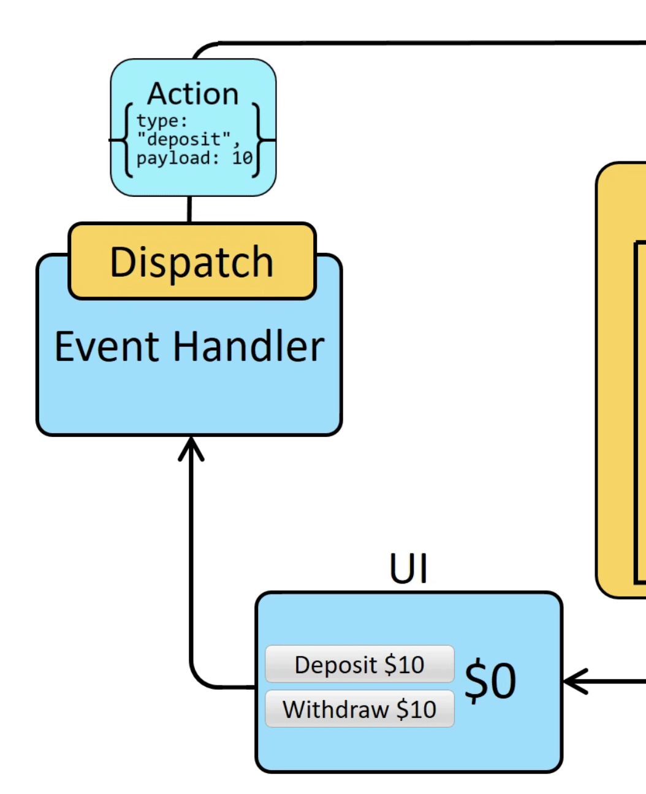
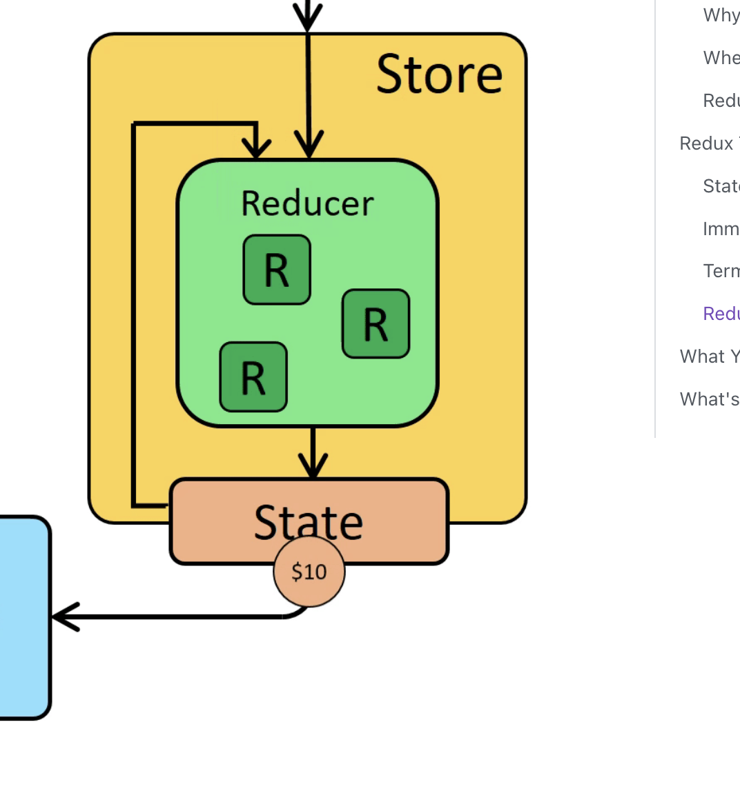
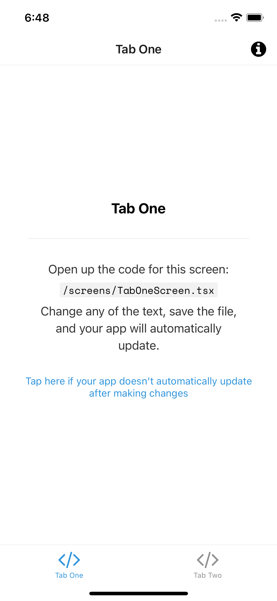

import YoutubeVideo from "../../../src/components/shared/YoutubeVideo/YoutubeVideo";
import Snack from '../../../src/components/shared/Snack/Snack';
import VideoPlayer from '../../../src/components/shared/VideoPlayer/VideoPlayer';

It's very rare to find a react native app without a global state management library. It's also very rare to find a react native app without redux. Redux is one of the most used state management libraries in React / React Native. If you wanted an easy explanation of what redux is, you are in luck! In this article, we will dive into the world of redux and learn how to get started with redux in react native.

## Understanding Redux

Before we go into the implementation of redux in react native, let's first understand what redux is. Redux is a state management library that helps you manage the state of your react native app. It is a predictable state container for JavaScript apps. It helps you write applications that behave consistently, run in different environments (client, server, and native), and are easy to test.

Chances are you have come across a lot of negative comments on Redux. But thanks to the awesome maintainers of Redux, they have made it easier and simpler to use Redux. They come up with `Redux-Toolkit` aka **Modern Redux** which is a package that helps you write Redux logic in a very simple manner. It is intended to be the standard way to write Redux logic. It was originally created to help address three common concerns about Redux:

1. "Configuring a Redux store is too complicated"
2. "I have to add a lot of packages to get Redux to do anything useful"
3. "Redux requires too much boilerplate code"

In this blog post, we will be using `Redux-Toolkit` to get started with Redux in React Native. Let's get started!

### High Level Architecture of Redux

Before we describe the terms and concepts of Redux, let's first see the high level architecture of Redux. The following diagram shows the high level architecture of Redux.


Imagine that you have an app, the app has two buttons. **Deposit** and **Withdraw**. When you click on the **Deposit** button, the amount is added to the balance. When you click on the **Withdraw** button, the amount is subtracted from the balance. You want your balance to be available throught the whole app. You want to be able to access the balance from any components/screens in the app. Basically, you want to have a global state that is available throughout the app. This is where Redux comes in.

The diagram has mainly three parts.

1. The first part is the **Store**. The store is the global state of the app. It is the single source of truth.
2. The second part is the **Actions**. Actions are the things that happen in the app.
3. The third part is the **Reducers**. Reducers are the functions that take the current state and an action as arguments, and return a new state result.

### Actions

Now if you look at the diagram again, you will see that at the bottom there is the UI part which has the buttons. This is typically the React Native part of the app. When the users click on the buttons. Something gets triggered. Depending on which button is clicked, the trigger will be different. This is what we call an **Action**. An action is a plain JavaScript object that has a type property. The type property describes the type of action that happened. For example, if the user clicks on the **Deposit** button, the action will be something like this:

```js
{
  type: 'deposit',
  payload: 10
}
```

The type property is a string that describes the type of action that happened. In this case, the type is **deposit**. The payload property is the amount that the user wants to deposit. In this case, the payload is **10**.

Similarly, if the user clicks on the **Withdraw** button, the action will be something like this:

```js
{
  type: 'withdraw',
  payload: 10
}
```



### Reducers

Now that we have the actions, we need to have a way to handle these actions. This is where the reducers come in. Reducers are the functions that take the current state and an action as arguments, and return a new state result. The reducer is a pure function that takes the previous state and an action, and returns the next state. (previousState, action) => newState

Let's see how the reducer will look like for the deposit action. The reducer will take the current state and the action as arguments. The current state will be the current balance. The action will be the deposit action. The reducer will return the new balance. The new balance will be the current balance plus the amount that the user wants to deposit.

```js
const reducer = (state, action) => {
  switch (action.type) {
    case 'deposit':
      return state + action.payload;
    case 'withdraw':
      return state - action.payload;
    default:
      return state;
  }
};
```


### Store

Now that we have the actions and the reducers, we need to have a way to store the state. This is where the store comes in. The store is the global state of the app. It is the single source of truth. The store can have mutiple reuder functions.



## Getting Started with Redux in React Native

Now that we have a basic understanding of what Redux is, let's get started with Redux in React Native. We will be using `Redux-Toolkit` to get started with Redux in React Native. Let's get started!

### Create a new React Native App

First, let's create a new React Native app. We will be using `expo` to create a new React Native app. If you don't have `expo` installed, you can install it by running the following command:

```bash
npm install -g expo-cli
```

Now let's create a new React Native app. Run the following command:

```bash
expo init redux-demo
```

When it asks for the template, select `tabs (TypeScript)`. We have selected the `tabs (TypeScript)` template because it comes with a tab navigation and we get mutiple screens to work with.

This will create a new React Native app called `redux-demo`. Now let's go into the `redux-demo` directory and run the following command:

```bash
cd redux-demo
npm start
```

This will start the metro bundler. Now you can open the app in the iOS simulator or Android emulator. If you want to run the app on your device, you can download the expo app from the app store or play store and scan the QR code.

### Install Redux Toolkit

Now that we have a new React Native app, let's install Redux toolkit. Run the following command:

```bash
npm install @reduxjs/toolkit react-redux
```

With that set up, you should be able to see the following preview in your app.



### Create the UI

Let's open up the `TabOneScreen` component. We will be adding the UI for the Redux demo app in this component. Let's remove everything from the `TabOneScreen` component and add the following code:

```tsx
import { StyleSheet, Button } from 'react-native';
import { Text, View } from '../components/Themed';
import { RootTabScreenProps } from '../types';

const styles = StyleSheet.create({
  container: {
    flex: 1,
    alignItems: 'center',
    justifyContent: 'center',
  },
  title: {
    fontSize: 20,
    fontWeight: 'bold',
  },
});
export default function TabOneScreen({}: RootTabScreenProps<'TabOne'>) {
  return (
    <View style={styles.container}>
      <Text style={styles.title}>Tab One</Text>
      <View style={{ marginVertical: 40 }}>
        <Button title="Deposit 10$" onPress={() => {}} />
        <Button title="Withdraw 10$" onPress={() => {}} />
      </View>
      <View style={{ marginTop: 20 }}>
        <Text style={{ fontSize: 20 }}>Current Balance: 0$</Text>
      </View>
    </View>
  );
}
```

This is the UI that we will be working with. We have two buttons, one for deposit and one for withdraw. We also have a text that shows the current balance.


### Create the Redux Store

Create a file named store.js. Import the `configureStore` API from Redux Toolkit. We'll start by creating an empty Redux store, and exporting it:

```js
import { configureStore } from '@reduxjs/toolkit';

export const store = configureStore({
  reducer: {},
});
```

This creates a Redux store. In order to create the store we need to pass a reducer function to the `configureStore` API. We will be creating the reducer function in the next step.

### Provide the Store to the App

Go to `App.tsx` and import the `Provider` component from `react-redux`. Wrap the `SafeAreaProvider` component with the `Provider` component. Pass the `store` prop to the `Provider` component.

```tsx
import { store } from './store'
import { Provider } from 'react-redux'
......
export default function App() {
  ......
  if (!isLoadingComplete) {
    return null;
  } else {
    return (
        <Provider store={store}>
            <SafeAreaProvider>
                <Navigation colorScheme={colorScheme} />
                <StatusBar />
            </SafeAreaProvider>
        </Provider>
    );
  }
}
```

Great, our app is now connected to the Redux store. Now let's come to the fun part where we will be adding the actions and the reducers for our `balance` state.

### Create the `Balance` Slice

Create a file named `balanceSlice.js`. Import the `createSlice` API from Redux Toolkit. We will be using the `createSlice` API to create a slice of the Redux store. A slice is a collection of reducer functions and actions for a specific part of the store. We will be creating a slice for the `balance` state.

Creating a slice requires a string name to identify the slice, an initial state value, and one or more reducer functions to define how the state can be updated. Once a slice is created, we can export the generated Redux action creators and the reducer function for the whole slice.

Redux requires that we write all state updates immutably, by making copies of data and updating the copies. However, Redux Toolkit's createSlice and createReducer APIs use Immer inside to allow us to write "mutating" update logic that becomes correct immutable updates. So we don't really need to worry about immutability.

Let's create a slice for the `balance` state. Add the following code to the `balanceSlice.js` file:

```js
// Import the createSlice API from Redux Toolkit
import { createSlice } from '@reduxjs/toolkit';

// This is the initial state of the slice
const initialState = {
  value: 0,
};

export const balanceSlice = createSlice({
  name: 'balance', // This is the name of the slice, we will later use this name to access the slice from the store
  initialState: initialState, // This is the initial state of the slice
  reducers: {
    // All the reducers go here
    deposit: (state, action) => {
      // This is the reducer function for the deposit action
      state.value += action.payload;
    },
    withdraw: (state, action) => {
      // This is the reducer function for the withdraw action
      state.value -= action.payload;
    },
  },
});

// Action creators are generated for each case reducer function
export const { deposit, withdraw } = balanceSlice.actions;

// We export the reducer function so that it can be added to the store
export default balanceSlice.reducer;
```

We have created a slice for the `balance` state. We have also created two action creators, one for deposit and one for withdraw. We have also exported the reducer function so that it can be added to the store.

### Add the Reducer to the Store

Go to `store.js` and import the `balanceSlice` reducer. Add the `balanceSlice` reducer to the `reducer` object.

```js
import { configureStore } from '@reduxjs/toolkit';
import balanceReducer from './balanceSlice';

export const store = configureStore({
  reducer: {
    balance: balanceReducer,
  },
});
```

At this point, our `balance` state is now managed by Redux as a global state. We can access the balance state from anywhere in the app. Let's see how we can access the balance state from the `TabOneScreen` component.

### Access the Balance State

Go to `TabOneScreen` component and import the `useSelector` hook from `react-redux`. We will be using the `useSelector` hook to access the `balance` state from the store.

`useSelector` is a hook that allows you to extract data from the Redux store state, using a selector function. The selector function will be called with the entire Redux store state as its only argument. The selector will be run whenever the function component renders. The selector will also be run whenever the store state changes.

```tsx
......
import { useSelector } from 'react-redux';

export default function TabOneScreen({}: RootTabScreenProps<'TabOne'>) {
  // We use the useSelector hook to access the balance state from the store
  const balance = useSelector((state) => state.balance.value);

  return (
    <View style={styles.container}>
        .....
        .....
        <View style={{ marginTop: 20 }}>
            <Text style={{ fontSize: 20 }}>Current Balance: {balance}$</Text>
        </View>
    </View>
  );
}
```

You will see that the balance state is now being displayed on the screen as 0$. This is because we have set the initial state of the `balance` state to 0.

### Dispatch Actions

Go to `TabOneScreen` component and import the `useDispatch` hook from `react-redux`. We will be using the `useDispatch` hook to dispatch actions to the store.

`useDispatch` is a hook that returns a reference to the dispatch function from the Redux store. You may use it to dispatch actions as needed.

```tsx
......
import { useSelector, useDispatch } from 'react-redux';

export default function TabOneScreen({}: RootTabScreenProps<'TabOne'>) {
  ......
  // We use the useDispatch hook to dispatch actions to the store
  const dispatch = useDispatch();

  return (
    <View style={styles.container}>
        .....
        .....
        <View style={{ marginTop: 20 }}>
            <Text style={{ fontSize: 20 }}>Current Balance: {balance}$</Text>
        </View>
        <View style={{ marginTop: 20 }}>
            <Button
                title="Deposit"
                onPress={() => {
                    // We dispatch the deposit action to the store with payload 10
                    dispatch(deposit(10));
                }}
            />
        </View>
        <View style={{ marginTop: 20 }}>
            <Button
                title="Withdraw"
                onPress={() => {
                    // We dispatch the withdraw action to the store with payload 10
                    dispatch(withdraw(10));
                }}
            />
        </View>
    </View>
  );
}
```

Awesome! Now we can dispatch actions to the store. Let's see how the balance state is updated when we dispatch the actions.

### Update the Balance State

Go to the app and click on the `Deposit` button. You will see that the balance state is updated to 10$. Click on the `Withdraw` button. You will see that the balance state is updated to 0$.

When we dispatch the `deposit` action, the `deposit` reducer function is called with payload value as 10. The `deposit` reducer function updates the `balance` state by adding the payload to the current balance. Similarly, when we dispatch the `withdraw` action, the `withdraw` reducer function is called. The `withdraw` reducer function updates the `balance` state by subtracting the payload from the current balance.

Every time the `balance` state is updated, the `TabOneScreen` component is re-rendered. This is because we are using the `useSelector` hook to access the `balance` state. The `useSelector` hook is called every time the `balance` state is updated. The `useSelector` hook returns the updated `balance` state and the `TabOneScreen` component is re-rendered with the updated `balance` state.

To check if our `balance` state is available in other components, go to `TabTwoScreen` component and add the following code:

```tsx
import { useSelector } from 'react-redux';

export default function TabTwoScreen({}: RootTabScreenProps<'TabTwo'>) {
  // We use the useSelector hook to access the balance state from the store
  const balance = useSelector((state) => state.balance.value);

  return (
    <View style={styles.container}>
      <Text style={styles.title}>Tab Two</Text>
      <View style={{ marginTop: 20 }}>
        <Text style={{ fontSize: 20 }}>Current Balance: {balance}$</Text>
      </View>
    </View>
  );
}
```

Go to the app and click on the `Deposit` button. You will see that the balance state is updated to 10$ in both the `TabOneScreen` and `TabTwoScreen` components. Click on the `Withdraw` button. You will see that the balance state is updated to 0$ in both the `TabOneScreen` and `TabTwoScreen` components.

## Conclusion

In this tutorial, we have learned how to use Redux Toolkit to manage the state of our React Native app. We have created a slice for the `balance` state. We have also created two action creators, one for deposit and one for withdraw. We have also exported the reducer function so that it can be added to the store. We have also accessed the `balance` state from the store and dispatched actions to the store. We have also seen how the `balance` state is updated when we dispatch the actions and at the same time the components are re-rendered with the updated `balance` state.

## Source Code

You can find the source code for this tutorial on [GitHub](https://github.com/notJust-dev/react-native-redux-toolkit)
