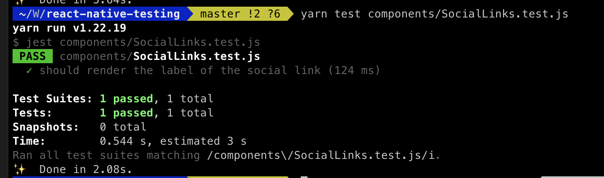
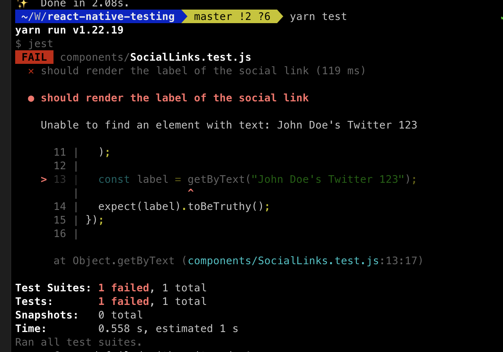
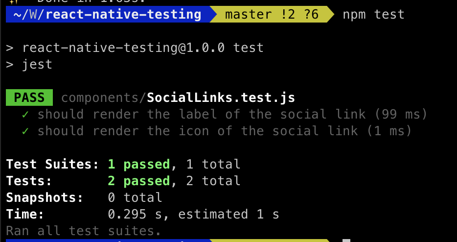
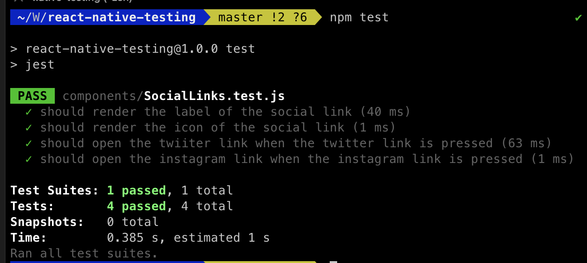
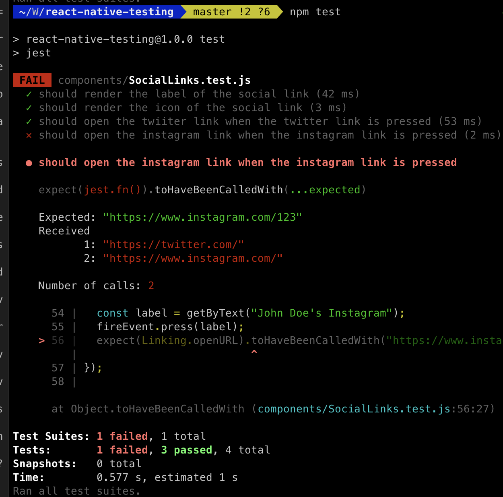

Testing is an important part of any software development process. It helps you to ensure that your code is working as expected and that you are not introducing any bugs. In this article, we will learn how to test our React Native app with Jest and React Native Testing Library. There are many variations of testing methods. In this article we will focus on unit testing by providing a simple example of how to test a React Native component. This article is intended for anyone who is very new to testing in React Native.

## Setting up the project

As always we will try learning by real life example. So let's create a simple React Native app and then we will add testing to it. We will use expo to create our app.

```bash
npx create-expo-app react-native-testing
```

This will create a new expo app in a folder called react-native-testing. Now we can run the following command to start our app:

```bash
cd react-native-testing
npm run ios
```

This will start our app in the iOS simulator. You can also run the following command to start the app in the Android simulator:

```bash
npm run android
```

## Configuring the React Native Testing Library

We will be using React Native Testing Library to test our React Native app. This is the most popular and the go to testing library for React Native. Let's setup this awesome library in our app. Shall we? ;)

React Native Testing Library (RNTL) requires some other libraries to work. If you don't have them installed, you will get errors. So we will first install the required ones. We need to install the following libraries:

1. react-test-renderer
2. jest

Run the following commands to install these libraries:

```bash
npm install --save-dev react-test-renderer jest
```

Once those libraries are integrated, we can install React Native Testing Library by running the following command:

```bash
npm install --save-dev @testing-library/react-native
```

Next, in order to use addtional React Native-specific jest matchers, we will need `@testing-library/jest-native` package.

```bash
npm install --save-dev @testing-library/jest-native
```

Cool, done with the libraries! The final step is to configure jest before we write some code. Let's now create a `jest.config.js` file in the root of our project. This file will contain the configuration for jest. We will add the following code to this file:

```js
module.exports = {
  preset: 'react-native',
  setupFiles: ['./node_modules/@testing-library/jest-native/extend-expect'],
};
```

Now the question is, how do we even run the test in our app? We need to add a script to our `package.json` file. Let's add the following code to the `scripts` section of our `package.json` file:

```json
"scripts": {
  "test": "jest"
}
```

If we run the following command now, it will run the test:

```bash
npm run test
```

However if we run the above command at this point, you will get an error. This is because we don't have any test file in our project.

We will create a simple screen so that we have a real life example to test. Let's create a new file called `ProfileScreen.js` in the `screens` folder. This file will contain the following code:

```js
import React from 'react';
import { View, Text, Image, StyleSheet, SafeAreaView } from 'react-native';
import SocialLinks from '../components/SocialLinks';

const Profile = () => {
  return (
    <SafeAreaView style={styles.container}>
      <Image
        style={styles.avatar}
        source={{
          uri: 'https://randomuser.me/api/portraits/lego/0.jpg',
        }}
      />
      <View style={styles.info}>
        <Text style={styles.name}>John Doe</Text>
        <Text style={styles.bio}>
          Lorem ipsum dolor sit amet, consectetur adipiscing elit, sed do
          eiusmod tempor incididunt ut labore et dolore magna aliqua. Ut enim ad
          minim veniam, quis nostrud exercitation ullamco laboris nisi ut
          aliquip ex ea commodo consequat.
        </Text>
        // This is our components to be tested
        <SocialLinks
          type="twitter"
          label="John Doe's Twitter"
          link="https://twitter.com/"
        />
        <SocialLinks
          type="instagram"
          label="John Doe's Instagram"
          link="https://www.instagram.com/"
        />
      </View>
    </SafeAreaView>
  );
};

const styles = StyleSheet.create({
  container: {
    flex: 1,
    flexDirection: 'row',
    marginTop: 40,
    margin: 20,
  },
  avatar: {
    width: 100,
    height: 100,
    borderRadius: 50,
    marginRight: 20,
  },
  info: {
    flex: 1,
  },
  name: {
    fontSize: 24,
    fontWeight: 'bold',
    marginBottom: 10,
  },
  bio: {
    fontSize: 16,
    marginBottom: 10,
  },
});

export default Profile;
```

Now in the `components` folder, Add `SocialLinks.js` and the following code to it:

```js
import React from 'react';
import {
  View,
  Text,
  StyleSheet,
  TouchableOpacity,
  Linking,
  Image,
} from 'react-native';

const Icons = {
  twitter: require('../assets/twitter.png'),
  instagram: require('../assets/instagram.png'),
};

const SocialLinks = ({ label, type, link }) => {
  const onSocialLinkPress = () => {
    Linking.openURL(link);
  };
  return (
    <View style={styles.social}>
      <Image
        source={Icons[type]}
        style={styles.icon}
        accessibilityRole="image"
      />
      <TouchableOpacity onPress={onSocialLinkPress}>
        <Text style={styles.label}>{label}</Text>
      </TouchableOpacity>
    </View>
  );
};

const styles = StyleSheet.create({
  icon: {
    width: 20,
    height: 20,
  },
  social: {
    flexDirection: 'row',
    alignItems: 'center',
    marginBottom: 10,
  },
  label: {
    marginLeft: 10,
  },
});

export default SocialLinks;
```

You also need the assets in the `assets` folder. You will be able to get the asssets from this [repo](https://github.com/notJust-dev/react-native-testing)

You should be able to see the following screen in your app now:


## Test if the social links' labels are rendered properly

The component that we will be testing is the `<SocialLinks />`.It's always best to plan out the test. As a rule of the best practices, we should test the cases that our users see and interact. Let's dissect our `SocialLinks` component and see what are the cases that our users will see.

1. The user will see the label of the social link.
2. The user will see the icon of the social link.

Also what will be some of the interactions / behaviors that our users will do with the component?

1. Clicking on the twiiter link will open the twitter link in the browser.
2. Similarly clicking on the instagram link will open the instagram link in the browser.

We are ready to write some test cases now on above mentioned cases. Let's create a new file called `SocialLinks.test.js` in the `components` folder. First import the neccessary dependencies:

```js
import React from 'react';
import { render, fireEvent } from '@testing-library/react-native';
import SocialLinks from './SocialLinks';
```

We will be testing the first case that the user will see the label of the social link. Let's add the following code to the test file and we will explain the code in the next section:

```js
import React from 'react';
import { render, fireEvent } from '@testing-library/react-native';
import SocialLinks from './SocialLinks';

test('should render the label of the social link', () => {
  const { getByText } = render(
    <SocialLinks
      type="twitter"
      label="John Doe's Twitter"
      link="https://twitter.com/"
    />,
  );

  const label = getByText("John Doe's Twitter");
  expect(label).toBeTruthy();
});
```

As you can see, we are using the `render` method from `@testing-library/react-native` to render the component. We are passing the props to the component. We are then using the `getByText` method to get the label of the social link. We are then using the `toBeTruthy` matcher to check if the label is present or not. If the label is present, the test will pass. If the label is not present, the test will fail.

Our first test is completed. Run the following command in the terminal:

```bash
npm test
```

You will see the following output:



It's so satisfying to see the test pass with a green tick. Isn't it? ;) However, it's always a good idea to fail the test as well to see if the test is working or not. However, let's say a new developer came in and he hardcoded the label as "Twitter" in the component. Let's see what will happen if we run the test again:

```js
test('should render the label of the social link', () => {
  const { getByText } = render(
    <SocialLinks
      label={"John Doe's Twitter"}
      type="twitter"
      link="https://twitter.com/"
    />,
  );

  const label = getByText("John Doe's Twitter");
  expect(label).toBeTruthy();
});
```



Why did the test fail? Because in our test function we are expecting the label to be "John Doe's Twitter" but in the component we are having a hardcoded label "Twitter". So the test failed. This is how we can test the first case that the user will see the right label of the social link.

## Test if the social links' icons are rendered properly

Let's now test the second case that the user will see the icon of the social link. Let's add the following code to the test file:

```js
test('should render the icon of the social link', () => {
  const { getByRole } = render(
    <SocialLinks
      type="twitter"
      label="John Doe's Twitter"
      link="https://twitter.com/"
    />,
  );

  const icon = getByRole('image');
  expect(icon).toBeTruthy();
});
```

Again, let's break down the code. We are using the `getByRole` method to get the icon of the social link. Why `getByRole`? Because we have set the `accessibilityRole` to `image` in the component. We are then using the same `toBeTruthy` matcher to check if the icon is present or not. If the icon is present, the test will pass. If the icon is not present, the test will fail.

If you run the test now, you will see the following output:



Great, we have now made sure that our SocialLinks component is rendering the label and the icon of the social link.

## Testing user interactions

Now onto our third & fourth case. We will be testing if users go to twitter.com when they click on the twitter link. Let's add the following code to the test file:

```js
import { Linking } from 'react-native'; // remember to import Linking

test('should open the twiiter link when the twitter link is pressed', () => {
  const { getByText } = render(
    <SocialLinks
      type="twitter"
      label="John Doe's Twitter"
      link="https://twitter.com/"
    />,
  );

  const label = getByText("John Doe's Twitter");
  fireEvent.press(label);
  expect(Linking.openURL).toHaveBeenCalledWith('https://twitter.com/');
});
```

Similarly to the previous test cases, let's break down the code. We are using the `fireEvent` method to fire the `press` event on the label. We are then using the `toHaveBeenCalledWith` matcher to check if the `Linking.openURL` method is called with the correct link. If the link is correct, the test will pass. If the link is not correct, the test will fail. Here we are using Linking.openURL in our test to imitate the user clicking on the link.

We can do exactly the same thing for the instagram link as well. Let's add the following code to the test file:

```js
test('should open the instagram link when the instagram link is pressed', () => {
  const { getByText } = render(
    <SocialLinks
      type="instagram"
      label="John Doe's Instagram"
      link="https://instagram.com/"
    />,
  );

  const label = getByText("John Doe's Instagram");
  fireEvent.press(label);
  expect(Linking.openURL).toHaveBeenCalledWith('https://instagram.com/');
});
```

If you run the test now, you will see the following output:



You can make sure if the test is working or not by changing the link to something else. Let's change our instagram link to `https://instagram.com/123` and run the test again. You will see the following output:



## GitHub repository

You can find the GitHub repository for this article [here](https://github.com/notJust-dev/react-native-testing).

## Conclusion

We have now properly tested our SocialLinks component. We have made sure that the component is rendering the label and the icon of the social link. We have also made sure that the component is opening the correct link when the user clicks on the social link.

Even though the test cases were fairly simple in this article, you can use the same approach to test more complex components as well. I hope you enjoyed this aritcle and get a better understanding of how to test your React Native components.
